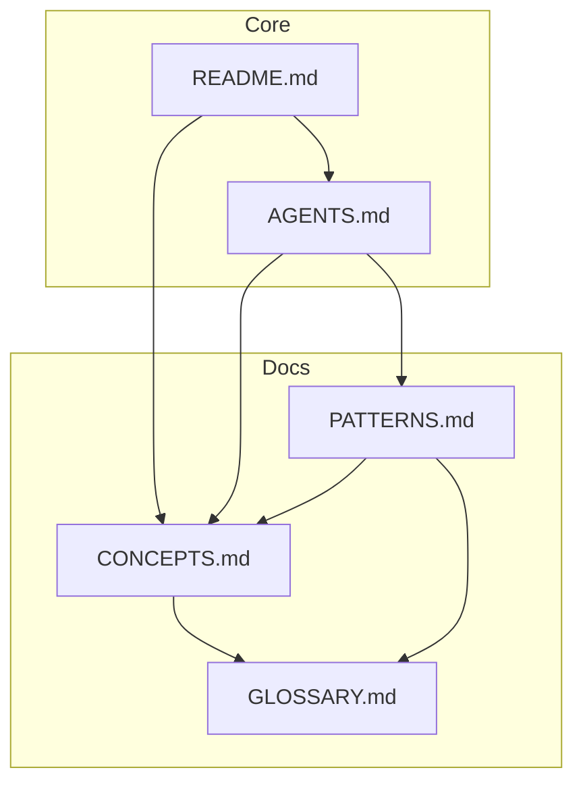

# Cross-Reference Agent

## Overview

Specialized agent for managing cross-references between documents and ensuring content interconnection.

## Capabilities

| Capability | Description |
|------------|-------------|
| Reference Mapping | Track all document links |
| Orphan Detection | Find unlinked content |
| Bidirectional Links | Ensure two-way references |
| Reference Validation | Verify references are accurate |
| Relationship Visualization | Map document connections |

## Mode

`reference-management` - This agent manages cross-references.

## Tools

| Tool | Purpose |
|------|---------|
| `grep` | Extract references |
| `read` | Analyze documents |
| `bash` | Build reference maps |

## Reference Types

| Type | Pattern | Example |
|------|---------|---------|
| Document link | `[text](file.md)` | See [CONCEPTS](CONCEPTS.md) |
| Section link | `[text](file.md#section)` | See [Overview](README.md#overview) |
| Inline reference | `[text]` + `[text]: url` | Reference-style links |
| See also | `See also: [doc]` | Related content |
| Related terms | Glossary cross-refs | Term → Definition |

## Workflow

### Phase 1: Extract References

```bash
# Find all markdown links
grep -rohE '\[.*\]\([^)]+\.md[^)]*\)' docs/*.md | sort | uniq -c

# Find all reference-style links
grep -rohE '^\[.*\]:' docs/*.md

# Map source → target
for f in docs/*.md; do
  echo "=== $f ==="
  grep -ohE '\]\([^)]+\.md' "$f" | sed 's/\](\///'
done
```

### Phase 2: Build Reference Map



### Phase 3: Validate

| Check | Command | Expected |
|-------|---------|----------|
| No orphans | Count incoming links | Every doc has ≥1 |
| No dead links | Test file exists | All targets exist |
| Bidirectional | Compare maps | Related docs link both ways |

## Reference Density Guidelines

| Document Type | Min References | Max References |
|---------------|----------------|----------------|
| Overview (README) | 5 | 15 |
| Concept doc | 3 | 10 |
| Pattern doc | 2 | 8 |
| Glossary | 0 | 5 |
| Agent guide | 2 | 6 |

## Orphan Detection

### Definition

An orphan is a document with no incoming links from other documents.

### Detection Command

```bash
# List all docs
find docs -name "*.md" > /tmp/all_docs.txt

# Find referenced docs
grep -rohE '\]\([^)]+\.md' docs/*.md | \
  sed 's/\](//; s/)$//' | sort -u > /tmp/referenced.txt

# Find orphans
comm -23 /tmp/all_docs.txt /tmp/referenced.txt
```

### Resolution

| Situation | Action |
|-----------|--------|
| Important content | Add links from related docs |
| Outdated content | Archive or delete |
| New content | Add to index and related docs |

## Quality Criteria

- [ ] No orphan documents
- [ ] All links resolve
- [ ] Related content cross-linked
- [ ] Index reflects all content
- [ ] Reference density appropriate

## Anti-Patterns

| Anti-Pattern | Why Avoid |
|--------------|-----------|
| Orphan documents | Undiscoverable content |
| Circular-only links | No entry point |
| Over-linking | Distracting, hard to read |
| Broken references | Frustrating navigation |

## Reference Report Template

```markdown
## Cross-Reference Report

**Date**: YYYY-MM-DD
**Files Analyzed**: N

### Reference Summary
| Document | Outgoing | Incoming |
|----------|----------|----------|
| doc.md | X | Y |

### Orphans Found
- orphan1.md
- orphan2.md

### Broken Links
- source.md → missing.md

### Recommendations
- Add link from X to Y
- Remove or archive orphan.md
```
