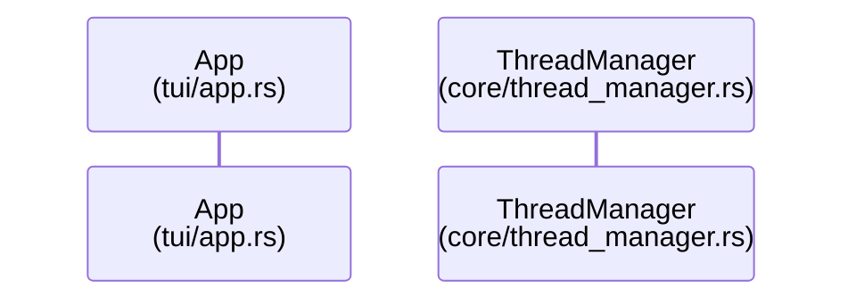
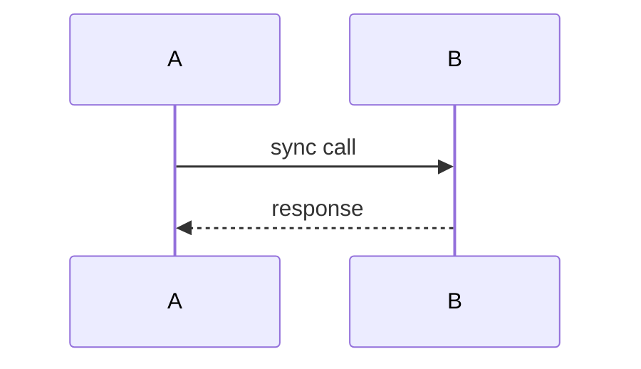
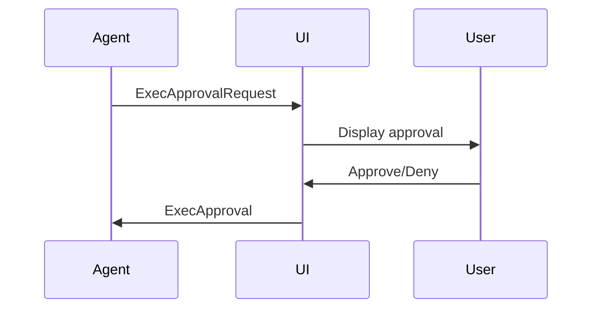

# Diagram Agent Guide

> Specialized guide for AI agents creating Mermaid diagrams

---

## Role

You create and maintain Mermaid diagrams that document the Codex-RS architecture.

## Diagram Types

| Type | Use For | File Location |
|------|---------|---------------|
| sequenceDiagram | Communication flows | docs/architecture-diagram.md |
| flowchart | Process flows | docs/architecture-diagram.md |
| stateDiagram-v2 | State machines | docs/architecture-diagram.md |

## Diagram Standards

### Participant Labels

Always include file paths:


### Naming Conventions

| Element | Convention |
|---------|------------|
| Participants | PascalCase with file path |
| Messages | snake_case or camelCase |
| Notes | Descriptive sentences |

## Validation

```bash
# Always validate before committing
./scripts/render-diagrams.sh

# Test individually
mmdc -i docs/architecture-diagram.md -o /tmp/test.png
```

## Common Patterns

### Communication Flow


### Approval Flow


## Quality Checklist

- [ ] Renders without errors
- [ ] File paths in participant labels
- [ ] Consistent with existing diagrams
- [ ] Accurate to source code
- [ ] Indexed in llms.txt
