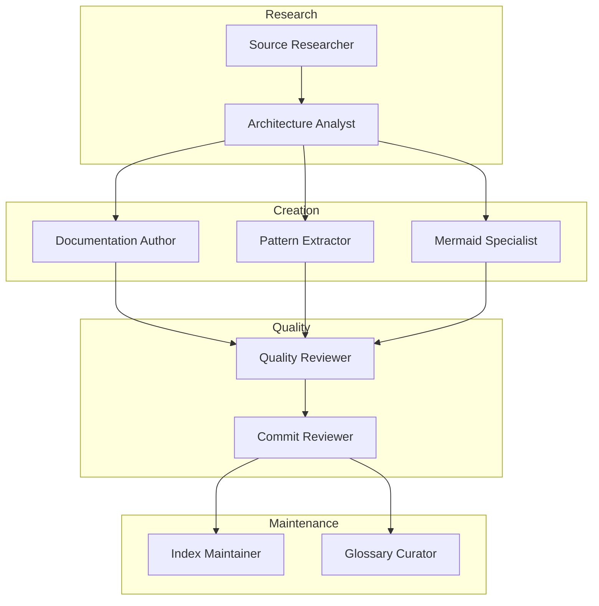

# Agent Guide Index

> Specialized guides for AI agents working on this documentation repository

---

## Overview

This directory contains specialized instructions for AI agents. Each guide defines a specific role with capabilities, workflows, and quality criteria.

## Agent Roles

| Agent | Guide | Purpose |
|-------|-------|---------|
| Architecture Analyst | [architecture-analyst.md](architecture-analyst.md) | Analyze and document software architecture |
| Commit Reviewer | [commit-reviewer.md](commit-reviewer.md) | Review commits and PRs |
| Diagram Specialist | [diagram.md](diagram.md) | Create Mermaid diagrams |
| Documentation Author | [documentation.md](documentation.md) | Write and update documentation |
| Glossary Curator | [glossary-curator.md](glossary-curator.md) | Maintain terminology consistency |
| Index Maintainer | [index-maintainer.md](index-maintainer.md) | Keep llms.txt indexes current |
| Mermaid Specialist | [mermaid-specialist.md](mermaid-specialist.md) | Advanced Mermaid diagram creation |
| Pattern Extractor | [pattern-extractor.md](pattern-extractor.md) | Identify and document patterns |
| Quality Reviewer | [quality-reviewer.md](quality-reviewer.md) | Ensure documentation quality |
| Research Agent | [research.md](research.md) | Research external sources |
| Review Agent | [review.md](review.md) | Review documentation changes |
| Source Researcher | [source-researcher.md](source-researcher.md) | Research external codebases |
| Template Generator | [template-generator.md](template-generator.md) | Create documentation templates |
| Workflow Designer | [workflow-designer.md](workflow-designer.md) | Design task workflows |

## Agent Selection

### By Task Type

| Task | Primary Agent | Supporting Agents |
|------|---------------|-------------------|
| New diagram | Mermaid Specialist | Architecture Analyst |
| Document pattern | Pattern Extractor | Documentation Author |
| Update glossary | Glossary Curator | Quality Reviewer |
| Research source | Source Researcher | Architecture Analyst |
| Review PR | Commit Reviewer | Quality Reviewer |
| Create template | Template Generator | Documentation Author |
| Update indexes | Index Maintainer | Quality Reviewer |

### By Expertise

| Domain | Agents |
|--------|--------|
| Visual Documentation | Diagram, Mermaid Specialist |
| Content Creation | Documentation Author, Pattern Extractor |
| Quality Assurance | Quality Reviewer, Commit Reviewer |
| Research | Source Researcher, Research Agent |
| Maintenance | Index Maintainer, Glossary Curator |
| Process | Workflow Designer, Template Generator |

## Workflow Integration

## Common Patterns

### Handoff Protocol

When passing work between agents:

1. Complete current task fully
2. Update relevant indexes
3. Document what was done
4. Note any pending work
5. Specify next agent

### Quality Gates

All agents must verify:

- [ ] Content accurate
- [ ] Links valid
- [ ] Diagrams render
- [ ] Indexes updated
- [ ] Style consistent

## Adding New Agents

1. Copy agent template from `template-generator.md`
2. Fill in all sections
3. Add to this index
4. Update agent selection tables
5. Document integration points

## Resources

| Resource | Location |
|----------|----------|
| Agent template | [template-generator.md](template-generator.md) |
| Quality standards | [quality-reviewer.md](quality-reviewer.md) |
| Diagram standards | [mermaid-specialist.md](mermaid-specialist.md) |
| Index format | [index-maintainer.md](index-maintainer.md) |
