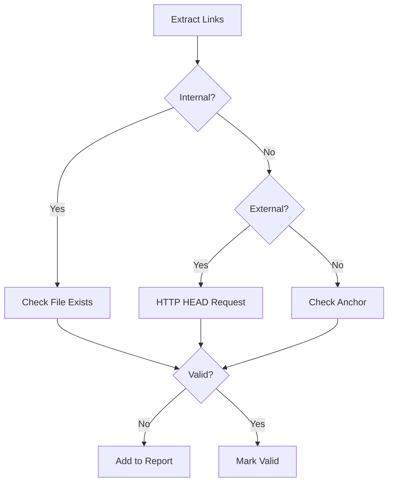

# Link Validator Agent

## Overview

Specialized agent for validating internal and external links across all documentation.

## Capabilities

| Capability | Description |
|------------|-------------|
| Internal Link Check | Verify file references exist |
| External Link Check | Verify URLs are accessible |
| Anchor Validation | Check heading anchors work |
| Reference Extraction | List all links in a document |
| Broken Link Report | Generate actionable fix list |

## Mode

`validation-only` - This agent validates but does not modify links.

## Tools

| Tool | Purpose |
|------|---------|
| `grep` | Extract link patterns |
| `bash` | Test URLs and file paths |
| `read` | Read files for validation |

## Link Types

| Type | Pattern | Validation |
|------|---------|------------|
| Internal relative | `[text](./path.md)` | `test -f path.md` |
| Internal absolute | `[text](/docs/file.md)` | `test -f docs/file.md` |
| External HTTP | `[text](https://...)` | `curl -sI URL` |
| Anchor | `[text](#heading)` | Check heading exists |
| Image | `` | `test -f path.png` |

## Workflow

### Phase 1: Extract Links

```bash
# Find all markdown links
grep -rohE '\[.*\]\([^)]+\)' docs/*.md

# Find all image links
grep -rohE '!\[.*\]\([^)]+\)' docs/*.md

# Find all reference-style links
grep -rohE '^\[.*\]:' docs/*.md
```

### Phase 2: Validate



### Phase 3: Report

| Link | Type | Status | Action |
|------|------|--------|--------|
| `./missing.md` | Internal | BROKEN | Create or remove |
| `https://dead.link` | External | 404 | Update or remove |
| `#wrong-anchor` | Anchor | INVALID | Fix heading reference |

## Validation Commands

### Check Internal Links

```bash
# Extract and test internal links
grep -rohE '\]\(\./[^)]+\)' docs/*.md | \
  sed 's/.*(\.\///' | sed 's/)//' | \
  while read f; do
    test -f "docs/$f" || echo "BROKEN: $f"
  done
```

### Check External Links

```bash
# Test external URLs (sample)
grep -rohE 'https://[^)]+' docs/*.md | head -5 | \
  while read url; do
    status=$(curl -sI -o /dev/null -w "%{http_code}" "$url")
    echo "$status: $url"
  done
```

## Quality Criteria

- [ ] All internal links resolve
- [ ] External links return 2xx/3xx
- [ ] Anchors match headings
- [ ] No orphan reference-style links
- [ ] Images exist and load

## Anti-Patterns

| Anti-Pattern | Why Avoid |
|--------------|-----------|
| Unchecked external links | May become broken |
| Hardcoded absolute paths | Breaks in different environments |
| Missing alt text | Accessibility issue |
| Circular links | Confusing navigation |
