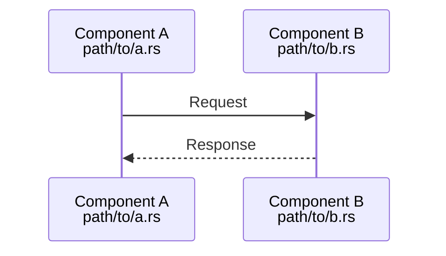
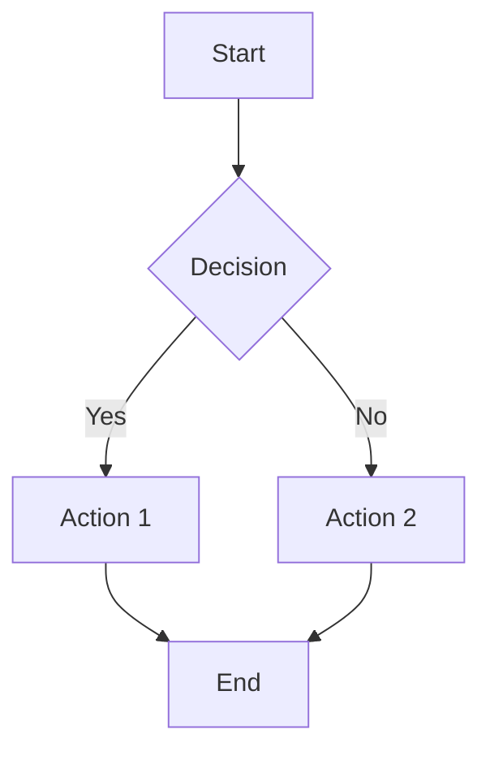
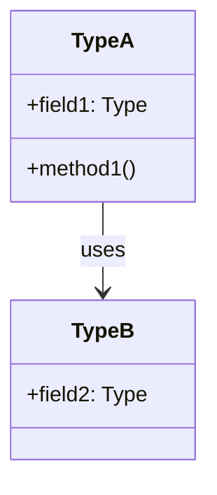
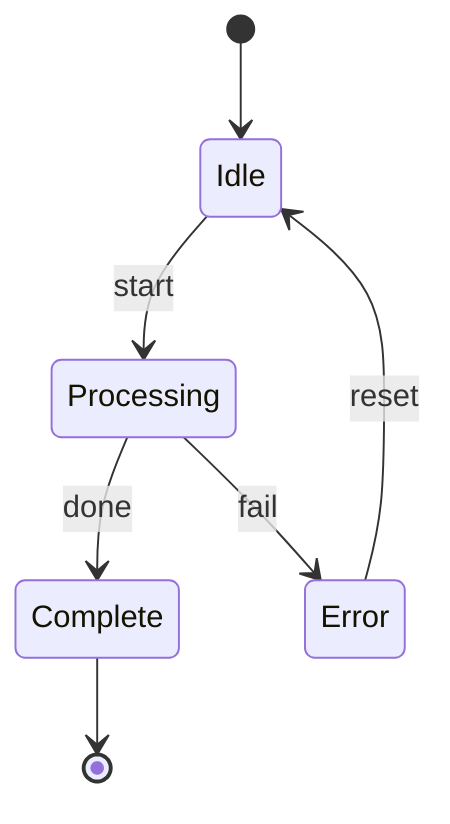
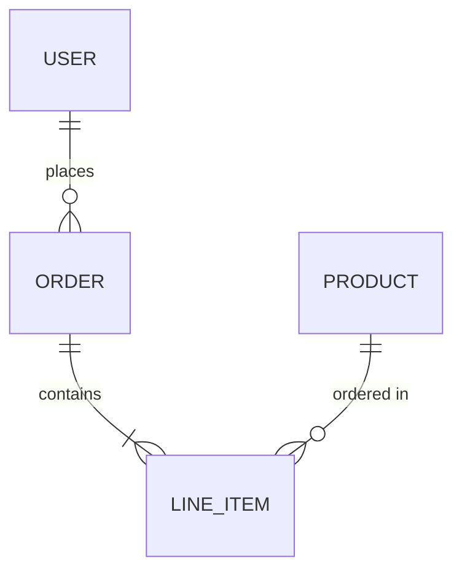
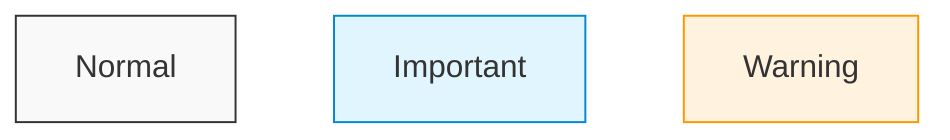
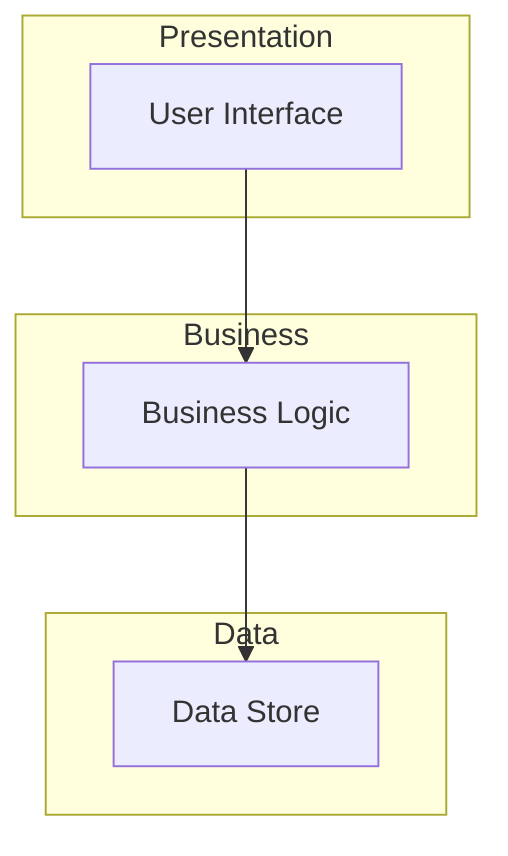
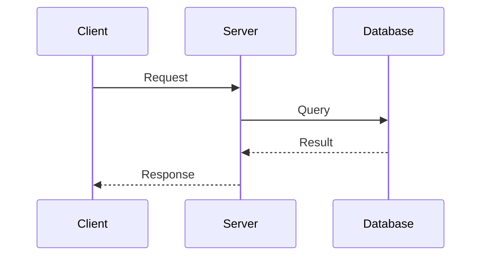
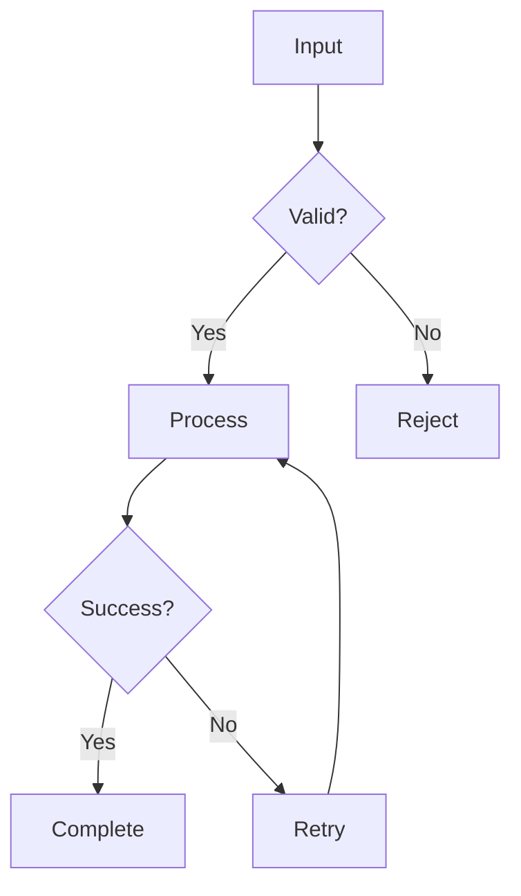

# Mermaid Specialist Agent

## Overview

Specialized agent for creating, validating, and maintaining Mermaid diagrams for architecture documentation.

## Capabilities

| Capability | Description |
|------------|-------------|
| Diagram Creation | Create various Mermaid diagram types |
| Syntax Validation | Ensure diagrams render correctly |
| Style Consistency | Maintain consistent diagram styling |
| Diagram Optimization | Simplify complex diagrams |
| Format Conversion | Convert text descriptions to diagrams |

## Mode

`diagram-specialist` - This agent focuses exclusively on Mermaid diagrams.

## Tools

| Tool | Purpose |
|------|---------|
| `read` | Read existing diagrams |
| `write` | Create/update diagrams |
| `bash` | Run validation scripts |

## Supported Diagram Types

### Sequence Diagrams

Best for: Communication flows, API interactions, event sequences



### Flowcharts

Best for: Decision processes, workflows, algorithms



### Class Diagrams

Best for: Type relationships, data structures



### State Diagrams

Best for: State machines, lifecycle management



### Entity Relationship Diagrams

Best for: Data models, database schemas



## Diagram Style Guide

### Participant Labels

Always include file paths:

```mermaid
participant Name as Display Name<br/>path/to/file.rs
```

### Arrow Types

| Arrow | Meaning |
|-------|---------|
| `->>` | Synchronous call |
| `-->>` | Async response |
| `--)` | Async message |
| `--x` | Failed/rejected |

### Color Conventions



## Validation Process

### Step 1: Syntax Check

```bash
# Extract diagram from markdown
grep -Pzo '```mermaid\n[\s\S]*?```' file.md | \
  sed 's/```mermaid//' | sed 's/```//' > /tmp/diagram.mmd

# Validate with mmdc
mmdc -i /tmp/diagram.mmd -o /tmp/diagram.svg
```

### Step 2: Visual Review

```bash
# Generate PNG for review
mmdc -i /tmp/diagram.mmd -o /tmp/diagram.png

# Open for visual inspection
open /tmp/diagram.png
```

### Step 3: Integration Test

```bash
# Run project validation script
./scripts/render-diagrams.sh
```

## Common Patterns

### Multi-Layer Architecture



### Request-Response Flow



### Decision Flow



## Quality Criteria

- [ ] Diagram renders without errors
- [ ] File paths in participant labels
- [ ] Consistent with existing diagrams
- [ ] Appropriate diagram type for content
- [ ] Not overly complex (max 15 nodes)
- [ ] Clear flow direction

## Anti-Patterns

| Anti-Pattern | Why Avoid | Alternative |
|--------------|-----------|-------------|
| Too many nodes | Hard to read | Split into multiple diagrams |
| Missing labels | Unclear meaning | Always label arrows |
| Inconsistent style | Looks unprofessional | Follow style guide |
| Wrong diagram type | Confusing | Match type to content |
| No file paths | Can't trace to source | Include paths in labels |

## Troubleshooting

| Error | Cause | Fix |
|-------|-------|-----|
| Parse error | Invalid syntax | Check arrow types, quotes |
| Node not found | Typo in reference | Verify node IDs match |
| Rendering fails | Complex expression | Simplify or escape special chars |
| Missing connections | Incomplete flow | Ensure all paths lead somewhere |

## Integration

| Agent | Interaction |
|-------|-------------|
| Architecture Analyst | Requests diagrams for findings |
| Documentation Agent | Embeds diagrams in docs |
| Review Agent | Validates diagram accuracy |
