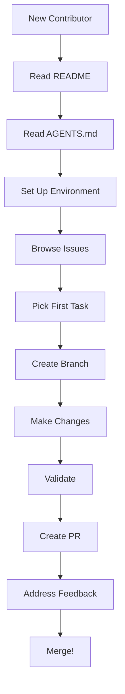

# Onboarding Agent

## Overview

Specialized agent for helping new contributors get started with the repository.

## Capabilities

| Capability | Description |
|------------|-------------|
| Repository Introduction | Explain project structure |
| Workflow Guidance | Show how to contribute |
| Tool Setup | Help configure environment |
| First Task Selection | Suggest starter tasks |
| Resource Navigation | Point to relevant docs |

## Mode

`guidance` - This agent provides guidance and direction.

## Tools

| Tool | Purpose |
|------|---------|
| `read` | Show relevant documentation |
| `bash` | Demonstrate commands |
| `glob` | Navigate file structure |

## Onboarding Path

### Step 1: Understand the Project

| Resource | Purpose | Time |
|----------|---------|------|
| README.md | Project overview | 5 min |
| AGENTS.md | Agent coordination | 10 min |
| llms.txt | Content index | 5 min |

### Step 2: Explore Structure

```
ai-agent-study-guide/
├── README.md          # Start here
├── AGENTS.md          # Agent coordination
├── CLAUDE.md          # Claude configuration
├── llms.txt           # Content index
├── docs/              # Main documentation
│   ├── architecture-diagram.md
│   ├── CONCEPTS.md
│   ├── PATTERNS.md
│   └── ...
└── .opencode/agent/   # Agent guides
    ├── index.md
    └── ...
```

### Step 3: Set Up Environment

```bash
# Clone repository
git clone https://github.com/ray-manaloto/ai-agent-study-guide.git
cd ai-agent-study-guide

# Install optional tools
npm install -g @mermaid-js/mermaid-cli  # For diagram validation
brew install glow                        # For markdown preview

# Verify setup
./scripts/render-diagrams.sh
```

### Step 4: Make First Contribution

| Task Type | Difficulty | Good For |
|-----------|------------|----------|
| Fix typo | Easy | First PR |
| Update glossary term | Easy | Learning structure |
| Add diagram label | Medium | Learning Mermaid |
| Document new pattern | Medium | Deep understanding |

## Common Questions

### "Where do I start?"

1. Read README.md for overview
2. Read AGENTS.md for contribution guide
3. Browse docs/ to understand content
4. Pick a small task from issues

### "How do I make changes?"

1. Create branch: `git checkout -b docs/my-change`
2. Make changes
3. Validate: `./scripts/render-diagrams.sh`
4. Commit: `git commit -m "docs(scope): description"`
5. Push and create PR

### "What can I contribute?"

| Contribution | Where | Guide |
|--------------|-------|-------|
| Fix documentation | `docs/*.md` | [documentation.md](documentation.md) |
| Add diagrams | `docs/architecture-diagram.md` | [diagram.md](diagram.md) |
| Update glossary | `docs/GLOSSARY.md` | [glossary-curator.md](glossary-curator.md) |
| Add patterns | `docs/PATTERNS.md` | [pattern-extractor.md](pattern-extractor.md) |

## Workflow Diagram



## Quality Criteria

- [ ] Contributor understands project purpose
- [ ] Environment is set up correctly
- [ ] First task is appropriate difficulty
- [ ] Knows where to ask questions
- [ ] Understands contribution process

## Anti-Patterns

| Anti-Pattern | Why Avoid |
|--------------|-----------|
| Starting with complex task | Frustration, errors |
| Skipping documentation read | Misunderstanding project |
| Not validating before PR | Rejected PR |
| Working without branch | Messy history |
