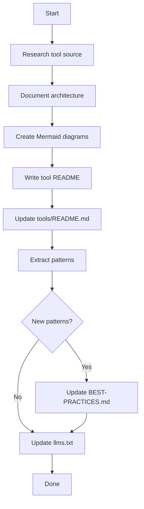
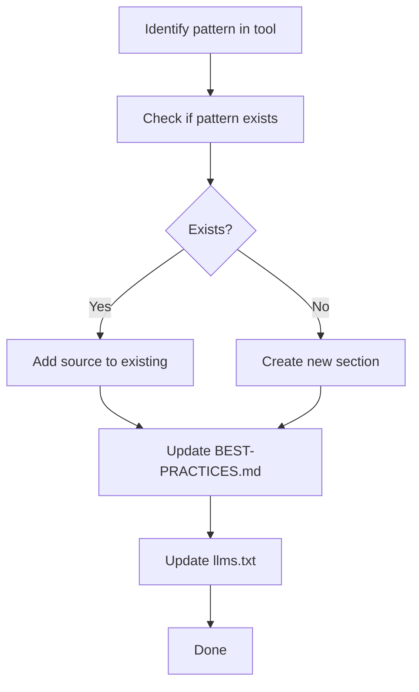

# AGENTS.md

> AI Agent Study Guide - Learn to build coding agents by studying 8 production implementations

---

## Project Overview

This repository documents the architecture of 8 leading AI coding agent implementations. By studying these production tools, we extract patterns and insights for building similar systems.

| Attribute | Value |
|-----------|-------|
| Repository Type | Documentation only |
| Implementation Code | **NONE** (reference architecture only) |
| Tools Studied | Aider, Codex, Claude Code, OpenCode, Kata, Get-Shit-Done, Oh-My-OpenCode, Kimi K2 |
| Primary Focus | Multi-agent orchestration patterns |

### Tools Covered

| Tool | Type | Source | Key Contribution |
|------|------|--------|------------------|
| Aider | CLI | [paul-gauthier/aider](https://github.com/paul-gauthier/aider) | Repository Map, Architect/Editor |
| Codex | CLI/TUI | [openai/codex](https://github.com/openai/codex) | Channel-based architecture |
| Claude Code | CLI | Anthropic (Closed) | MCP integration, subagents |
| OpenCode | CLI/TUI | [anomalyco/opencode](https://github.com/anomalyco/opencode) | Multi-provider abstraction |
| Kata | Orchestrator | [gannonh/kata](https://github.com/gannonh/kata) | Spec-driven phases |
| Get-Shit-Done | Framework | [glittercowboy/get-shit-done](https://github.com/glittercowboy/get-shit-done) | Context engineering |
| Oh-My-OpenCode | Framework | [sizzldev/oh-my-opencode](https://github.com/sizzldev/oh-my-opencode) | Category delegation |
| Kimi K2 | Model+API | [kimi.com](https://kimi.com) | PARL, 100-agent swarms |

### Purpose

1. **Learn** - Understand how production AI coding agents work
2. **Document** - Create clear architecture diagrams with source references
3. **Extract** - Identify reusable patterns for agent development
4. **Synthesize** - Combine best practices into unified guidance
5. **Template** - Provide tools for LLM-optimizing other projects

---

## Agent Roles

AI agents working on this repository have specific roles:

| Role | Responsibility | Allowed Actions |
|------|----------------|-----------------|
| Documentation Author | Create/update docs | Edit markdown, create diagrams |
| Architecture Analyst | Study tool sources | Read source, document findings |
| Index Maintainer | Keep indexes current | Update llms.txt, llms-full.txt |
| Quality Reviewer | Verify documentation | Check links, validate Mermaid |
| Pattern Synthesizer | Extract common patterns | Create BEST-PRACTICES.md content |

### Not Allowed Roles

| Role | Why Forbidden |
|------|---------------|
| Code Implementer | Documentation-only repository |
| Build Engineer | No build system |
| Test Engineer | No testing framework |
| DevOps Engineer | No deployment |

---

## Entry Points

### Reading Order

| Priority | File | Purpose | Read When |
|----------|------|---------|-----------|
| 1 | `AGENTS.md` | This file - agent coordination | Always first |
| 2 | `docs/tools/README.md` | Tools overview | Understanding tools |
| 3 | `docs/tools/BEST-PRACTICES.md` | Combined patterns | Learning best practices |
| 4 | `docs/tools/UNIFIED-HARNESS.md` | Harness architecture | Designing systems |
| 5 | `llms.txt` | Documentation index | Quick reference |
| 6 | Individual tool READMEs | Deep dives | Tool-specific study |

### Quick Start

```bash
# Clone repository
git clone https://github.com/ray-manaloto/ai-agent-study-guide.git
cd ai-agent-study-guide

# Read documentation index
cat llms.txt

# View tools overview
glow docs/tools/README.md

# View best practices
glow docs/tools/BEST-PRACTICES.md
```

---

## File Organization

### Root Directory

```
ai-agent-study-guide/
├── AGENTS.md              # Agent coordination (this file)
├── CLAUDE.md              # Claude Code configuration
├── .cursorrules           # Cursor AI rules
├── llms.txt               # Documentation index
├── llms-full.txt          # Complete context dump
├── README.md              # Project overview
└── scripts/
    └── render-diagrams.sh # Mermaid validation
```

### docs/tools/ Directory (Primary)

```
docs/tools/
├── README.md              # Landing page with comparison matrix
├── BEST-PRACTICES.md      # Combined best practices (10 categories)
├── UNIFIED-HARNESS.md     # Multi-provider harness architecture
├── codex/README.md        # Codex deep-dive
├── claude-code/README.md  # Claude Code deep-dive
├── opencode/README.md     # OpenCode deep-dive
├── kata/README.md         # Kata deep-dive
├── get-shit-done/README.md # Get-Shit-Done deep-dive
├── oh-my-opencode/README.md # Oh-My-OpenCode deep-dive
└── kimi-k2/README.md      # Kimi K2 deep-dive
```

### docs/ Directory (Reference)

```
docs/
├── AGENTS.md              # Subdirectory agent context
├── architecture-diagram.md # Mermaid diagrams (Codex-focused)
├── CONCEPTS.md            # Core concepts
├── GLOSSARY.md            # Term definitions
├── PATTERNS.md            # Implementation patterns
├── WORKFLOWS.md           # Task workflows
├── TOOLS-RESEARCH.md      # AI tools research
└── templates/
    ├── LLM-OPTIMIZATION-TEMPLATE.md
    └── llm-project-optimization/
        └── SKILL.md
```

### File Purposes

| File | Purpose | Update Frequency |
|------|---------|------------------|
| `docs/tools/BEST-PRACTICES.md` | Combined best practices | When discovering new patterns |
| `docs/tools/UNIFIED-HARNESS.md` | Harness architecture | When improving design |
| `docs/tools/*/README.md` | Tool deep-dives | When studying tools |
| `docs/CONCEPTS.md` | Communication patterns | When identifying patterns |
| `docs/PATTERNS.md` | Implementation patterns | When extracting patterns |

---

## Key Best Practices (Quick Reference)

From [docs/tools/BEST-PRACTICES.md](docs/tools/BEST-PRACTICES.md):

### 1. Thin Orchestrator Pattern (CRITICAL)

```
Main context: 30-40% capacity
Subagent context: Fresh 200k window
Returns: Summary only (not full output)
```

### 2. Category-Based Delegation

```
visual-engineering → Best at UI/UX
ultrabrain → Most capable (complex logic)
quick → Fastest (typo fixes)
deep → Thorough (research)
```

### 3. Wave-Based Execution

```
Wave 1: [Task A, B, C] ← Independent, parallel
Wave 2: [Task D, E]    ← Depend on Wave 1
Wave 3: [Task F]       ← Depends on Wave 2
```

### 4. Approval Queue Pattern

```
Process one approval at a time
Never parallel approvals
Queue pending requests
```

---

## Allowed Tasks

### Task: Add New Tool Documentation

**When**: Documenting a new AI coding agent tool.

**Steps**:
1. Research the tool's architecture
2. Create `docs/tools/[tool-name]/README.md`
3. Follow existing README template (overview, diagrams, patterns)
4. Update `docs/tools/README.md` comparison matrix
5. Update `llms.txt` with new entries
6. Consider updating `BEST-PRACTICES.md` if new patterns found

### Task: Update Best Practices

**When**: Discovering new patterns from tool analysis.

**Steps**:
1. Identify the pattern and its source(s)
2. Add to appropriate section in `BEST-PRACTICES.md`
3. Include code examples if applicable
4. Update `llms.txt` if significant addition

### Task: Update Unified Harness

**When**: Improving the multi-provider harness design.

**Steps**:
1. Identify the improvement
2. Update `UNIFIED-HARNESS.md`
3. Ensure consistency with BEST-PRACTICES.md
4. Update llms.txt if significant

### Task: Verify Repository Integrity

**When**: Before committing or after major changes.

**Steps**:
```bash
# 1. Validate Mermaid diagrams
./scripts/render-diagrams.sh

# 2. Check file structure
ls -la docs/tools/

# 3. Verify all tool READMEs exist
ls docs/tools/*/README.md

# 4. Check indexes are current
head -100 llms.txt

# 5. Preview documentation
glow docs/tools/BEST-PRACTICES.md
```

---

## Forbidden Actions

| Action | Reason | Alternative |
|--------|--------|-------------|
| Create implementation code | Documentation-only repository | Document reference architecture |
| Modify HTML directly | Must regenerate from Mermaid | Edit source markdown |
| Add dependencies | No package manager | Document external tools |
| Skip index updates | Breaks discoverability | Always update llms.txt |
| Delete tool documentation | Loses research | Archive or update instead |

---

## Task Workflows

### Workflow 1: New Tool Analysis



### Workflow 2: Pattern Synthesis



---

## Quality Standards

### Documentation Quality

| Standard | Requirement |
|----------|-------------|
| Accuracy | Verify against tool source |
| Completeness | Include architecture, diagrams, patterns |
| Clarity | Concise, tables over prose |
| Consistency | Follow existing README template |
| References | Include source URLs |

### Best Practices Quality

| Standard | Requirement |
|----------|-------------|
| Attribution | Cite source tools |
| Code examples | Include when applicable |
| Comparison | Show tool-specific variations |
| Actionable | Provide implementation guidance |

---

## Subdirectory Agents

When working in subdirectories, additional context files exist:

| Directory | Agent File | Purpose |
|-----------|------------|---------|
| `docs/` | `docs/AGENTS.md` | Documentation-specific instructions |

---

## Templates

### For LLM-Optimizing Other Projects

| Template | Location | Use Case |
|----------|----------|----------|
| Manual Template | `docs/templates/LLM-OPTIMIZATION-TEMPLATE.md` | Step-by-step manual process |
| Agent Skill | `docs/templates/llm-project-optimization/SKILL.md` | Installable agent skill |

---

## Agent Coordination

### Multi-Agent Work

When multiple agents work on this repository:

| Concern | Guideline |
|---------|-----------|
| File conflicts | One agent per file at a time |
| Index updates | Coordinate llms.txt changes |
| Large changes | Break into focused commits |
| Cross-references | Update all related files |

### Handoff Protocol

When passing work between agents:

1. Complete current task fully
2. Update all indexes
3. Document what was done
4. Note any pending work

---

## Anti-Patterns

### Documentation Anti-Patterns

| Anti-Pattern | Problem | Solution |
|--------------|---------|----------|
| Verbose prose | Hard to scan | Use tables, bullets |
| Missing sources | Can't verify | Always cite source tools |
| Inconsistent format | Confusing | Follow README template |
| Orphaned content | Undiscoverable | Update indexes |

### Process Anti-Patterns

| Anti-Pattern | Problem | Solution |
|--------------|---------|----------|
| Skip validation | Broken diagrams | Always run render-diagrams.sh |
| Forget indexes | Content lost | Update llms.txt every time |
| Large changes | Hard to review | Break into focused updates |
| Duplicate patterns | Fragmented knowledge | Consolidate in BEST-PRACTICES.md |

---

## Resources

| Resource | URL | Purpose |
|----------|-----|---------|
| Codex Source | https://github.com/openai/codex | Rust TUI reference |
| OpenCode Source | https://github.com/anomalyco/opencode | Multi-provider reference |
| Kata Source | https://github.com/gannonh/kata | Orchestration reference |
| Get-Shit-Done Source | https://github.com/glittercowboy/get-shit-done | Context engineering |
| Oh-My-OpenCode | https://github.com/sizzldev/oh-my-opencode | Swarm orchestration |
| Kimi K2 | https://kimi.com | PARL reference |
| Mermaid Docs | https://mermaid.js.org/ | Diagram syntax |
| llms.txt Standard | https://llmstxt.org/ | Index format |

---

## Checklist

Before completing any task, verify:

- [ ] No implementation code created
- [ ] Mermaid diagrams validate
- [ ] Source URLs included
- [ ] `llms.txt` updated
- [ ] Tool comparison matrix updated (if new tool)
- [ ] BEST-PRACTICES.md updated (if new pattern)
- [ ] Consistent with existing style
- [ ] All cross-references valid
- [ ] Quality standards met
