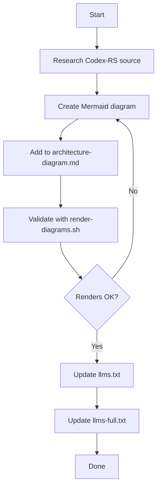
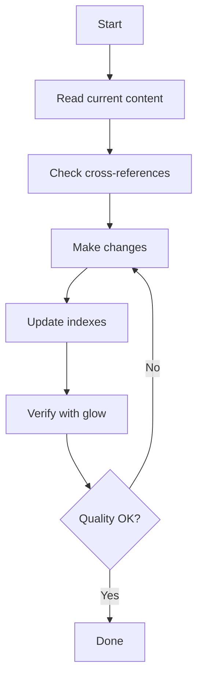
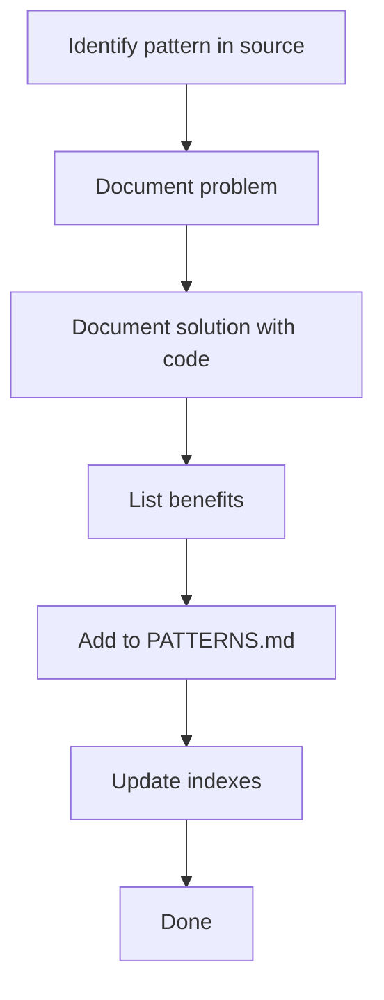

# AGENTS.md

> AI Agent Study Guide - Learn to build coding agents by studying OpenAI Codex-RS

---

## Project Overview

This repository documents the architecture of OpenAI's Codex-RS TUI implementation. By studying this production AI coding agent, we extract patterns and insights for building similar systems.

| Attribute | Value |
|-----------|-------|
| Repository Type | Documentation only |
| Implementation Code | **NONE** (forbidden) |
| Source Being Studied | https://github.com/openai/codex |
| Primary Focus | TUI ↔ Agent communication patterns |

### Purpose

1. **Learn** - Understand how production AI coding agents work
2. **Document** - Create clear architecture diagrams with source references
3. **Extract** - Identify reusable patterns for agent development
4. **Template** - Provide tools for LLM-optimizing other projects

---

## Agent Roles

AI agents working on this repository have specific roles:

| Role | Responsibility | Allowed Actions |
|------|----------------|-----------------|
| Documentation Author | Create/update docs | Edit markdown, create diagrams |
| Architecture Analyst | Study Codex-RS source | Read source, document findings |
| Index Maintainer | Keep indexes current | Update llms.txt, llms-full.txt |
| Quality Reviewer | Verify documentation | Check links, validate Mermaid |

### Not Allowed Roles

| Role | Why Forbidden |
|------|---------------|
| Code Implementer | Documentation-only repository |
| Build Engineer | No build system |
| Test Engineer | No testing framework |
| DevOps Engineer | No deployment |

---

## Entry Points

### Reading Order

| Priority | File | Purpose | Read When |
|----------|------|---------|-----------|
| 1 | `AGENTS.md` | This file - agent coordination | Always first |
| 2 | `llms.txt` | Documentation index | Quick reference |
| 3 | `llms-full.txt` | Complete context | Deep understanding |
| 4 | `docs/WORKFLOWS.md` | Task execution steps | Before making changes |
| 5 | `docs/architecture-diagram.md` | Technical diagrams | Understanding architecture |
| 6 | `docs/CONCEPTS.md` | Core concepts | Learning patterns |
| 7 | `docs/PATTERNS.md` | Implementation patterns | Reusable code |

### Quick Start

```bash
# Clone repository
git clone https://github.com/ray-manaloto/ai-agent-study-guide.git
cd ai-agent-study-guide

# Read documentation index
cat llms.txt

# View main diagrams
glow docs/architecture-diagram.md
# or
open docs/codex-architecture.html
```

---

## File Organization

### Root Directory

```
ai-agent-study-guide/
├── AGENTS.md              # Agent coordination (this file)
├── CLAUDE.md              # Claude Code configuration
├── .cursorrules           # Cursor AI rules
├── llms.txt               # Documentation index
├── llms-full.txt          # Complete context dump
├── README.md              # Project overview
└── scripts/
    └── render-diagrams.sh # Mermaid validation
```

### docs/ Directory

```
docs/
├── AGENTS.md              # Subdirectory agent context
├── architecture-diagram.md # Mermaid diagrams (PRIMARY)
├── codex-architecture.html # Generated HTML (DO NOT EDIT)
├── CONCEPTS.md            # Core concepts
├── GLOSSARY.md            # Term definitions
├── PATTERNS.md            # Implementation patterns
├── WORKFLOWS.md           # Task workflows
├── TOOLS-RESEARCH.md      # AI tools research
└── templates/
    ├── LLM-OPTIMIZATION-TEMPLATE.md
    └── llm-project-optimization/
        └── SKILL.md
```

### File Purposes

| File | Purpose | Update Frequency |
|------|---------|------------------|
| `architecture-diagram.md` | Primary technical reference | When studying new components |
| `CONCEPTS.md` | Communication and safety patterns | When identifying new patterns |
| `GLOSSARY.md` | Term definitions | When encountering new terms |
| `PATTERNS.md` | Reusable implementation patterns | When extracting patterns |
| `WORKFLOWS.md` | Task execution guides | When processes change |
| `TOOLS-RESEARCH.md` | External AI tools | When discovering tools |

---

## Allowed Tasks

### Task: Add New Diagram

**When**: Documenting a new Codex-RS component or flow.

**Steps**:
1. Research component in Codex-RS source
2. Add Mermaid diagram to `docs/architecture-diagram.md`
3. Include file paths in participant labels
4. Validate: `./scripts/render-diagrams.sh`
5. Update `llms.txt` with new content reference
6. Update `llms-full.txt` with details

**Quality Criteria**:
- [ ] Diagram renders without errors
- [ ] File paths in participant labels
- [ ] Consistent with existing diagram style
- [ ] Indexes updated

### Task: Update Documentation

**When**: Improving or correcting existing documentation.

**Steps**:
1. Read current content
2. Check cross-references: `grep -l "[topic]" *.txt docs/*.md`
3. Make changes maintaining style consistency
4. Update all cross-references
5. Verify with `glow docs/[file].md`

**Quality Criteria**:
- [ ] Consistent with existing style
- [ ] All cross-references updated
- [ ] No broken links

### Task: Add New Concept

**When**: Documenting a communication pattern, safety pattern, or architectural concept.

**Steps**:
1. Choose correct file:
   - Communication pattern → `docs/CONCEPTS.md`
   - Implementation pattern → `docs/PATTERNS.md`
   - Term definition → `docs/GLOSSARY.md`
2. Follow existing format
3. Include source file reference
4. Update indexes

**Quality Criteria**:
- [ ] Correct file chosen
- [ ] Follows existing format
- [ ] Source reference included
- [ ] Indexes updated

### Task: Verify Repository Integrity

**When**: Before committing or after major changes.

**Steps**:
```bash
# 1. Validate Mermaid diagrams
./scripts/render-diagrams.sh

# 2. Check file structure
ls -la docs/

# 3. Verify indexes are current
head -50 llms.txt

# 4. Check for broken links
grep -r "github.com/openai/codex" docs/ | head -20

# 5. Preview documentation
glow docs/architecture-diagram.md
```

---

## Forbidden Actions

| Action | Reason | Alternative |
|--------|--------|-------------|
| Create implementation code | Documentation-only repository | Document patterns instead |
| Modify HTML directly | Must regenerate from Mermaid | Edit source markdown |
| Add dependencies | No package manager | Document external tools |
| Create test files | No testing framework | Document test patterns |
| Add build configuration | No build system | Use existing scripts |
| Skip index updates | Breaks discoverability | Always update llms.txt |

---

## Task Workflows

### Workflow 1: New Architecture Component



### Workflow 2: Documentation Update



### Workflow 3: Pattern Extraction



---

## Verification Commands

| Command | Purpose | When to Run |
|---------|---------|-------------|
| `./scripts/render-diagrams.sh` | Validate Mermaid | After diagram changes |
| `glow docs/[file].md` | Preview markdown | After any doc change |
| `open docs/codex-architecture.html` | View rendered diagrams | Visual verification |
| `wc -l docs/*.md` | Check doc coverage | Periodic review |
| `grep -r "TODO" docs/` | Find incomplete items | Before completing work |

---

## Subdirectory Agents

When working in subdirectories, additional context files exist:

| Directory | Agent File | Purpose |
|-----------|------------|---------|
| `docs/` | `docs/AGENTS.md` | Documentation-specific instructions |

### docs/AGENTS.md Content

The `docs/AGENTS.md` file contains:
- Local file descriptions
- Editing rules for docs
- Subdirectory-specific constraints

---

## Templates

### For LLM-Optimizing Other Projects

This repository includes templates to help apply AI-first patterns to other projects:

| Template | Location | Use Case |
|----------|----------|----------|
| Manual Template | `docs/templates/LLM-OPTIMIZATION-TEMPLATE.md` | Step-by-step manual process |
| Agent Skill | `docs/templates/llm-project-optimization/SKILL.md` | Installable agent skill |

### Template Usage

1. Copy template to target project
2. Customize for project specifics
3. Create project-specific AGENTS.md
4. Add llms.txt index

---

## Agent Coordination

### Multi-Agent Work

When multiple agents work on this repository:

| Concern | Guideline |
|---------|-----------|
| File conflicts | One agent per file at a time |
| Index updates | Coordinate llms.txt changes |
| Large changes | Break into focused commits |
| Cross-references | Update all related files |

### Handoff Protocol

When passing work between agents:

1. Complete current task fully
2. Update all indexes
3. Document what was done
4. Note any pending work

---

## Quality Standards

### Documentation Quality

| Standard | Requirement |
|----------|-------------|
| Accuracy | Verify against Codex-RS source |
| Completeness | Include all relevant details |
| Clarity | Concise, no filler words |
| Consistency | Match existing style |
| References | Include source file paths |

### Diagram Quality

| Standard | Requirement |
|----------|-------------|
| Renders | Must validate with render-diagrams.sh |
| Labels | Include file paths in participants |
| Style | Consistent with existing diagrams |
| Accuracy | Reflects actual source code |

### Index Quality

| Standard | Requirement |
|----------|-------------|
| Current | Updated after every change |
| Complete | All content referenced |
| Accurate | Descriptions match content |

---

## Anti-Patterns

### Documentation Anti-Patterns

| Anti-Pattern | Problem | Solution |
|--------------|---------|----------|
| Verbose prose | Hard to scan | Use tables, bullets |
| Missing sources | Can't verify | Always cite source files |
| Outdated content | Misleading | Verify against current source |
| Orphaned content | Undiscoverable | Update indexes |

### Process Anti-Patterns

| Anti-Pattern | Problem | Solution |
|--------------|---------|----------|
| Skip validation | Broken diagrams | Always run render-diagrams.sh |
| Forget indexes | Content lost | Update llms.txt every time |
| Large changes | Hard to review | Break into focused updates |
| No cross-refs | Fragmented knowledge | Link related content |

---

## Codex-RS Architecture Summary

### Key Insight

**TUI communicates directly with ThreadManager, NOT through MessageProcessor.**

```
CORRECT:  TUI App → ThreadManager → CodexThread → Codex
WRONG:    TUI App → MessageProcessor → ThreadManager
```

MessageProcessor is only for external JSON-RPC clients (VS Code, etc.).

### Key Types

| Type | Direction | Purpose |
|------|-----------|---------|
| `Op` | User → Agent | Operations (UserTurn, ExecApproval) |
| `EventMsg` | Agent → User | Events (TurnStarted, AgentMessage) |
| `Event` | Wrapper | Contains id + EventMsg |

### Layer Architecture

```
┌─────────────────────────────┐
│  TUI Layer (presentation)   │
├─────────────────────────────┤
│  Core Layer (business)      │
├─────────────────────────────┤
│  Protocol Layer (contract)  │
├─────────────────────────────┤
│  App Server (external only) │
└─────────────────────────────┘
```

---

## Resources

| Resource | URL | Purpose |
|----------|-----|---------|
| Codex-RS Source | https://github.com/openai/codex | Primary source |
| Protocol Types | `.../codex-rs/protocol/src/protocol.rs` | Op, EventMsg definitions |
| TUI Implementation | `.../codex-rs/tui/` | UI components |
| Core Implementation | `.../codex-rs/core/` | Agent logic |
| Mermaid Docs | https://mermaid.js.org/ | Diagram syntax |
| llms.txt Standard | https://llmstxt.org/ | Index format |

---

## Checklist

Before completing any task, verify:

- [ ] No implementation code created
- [ ] Mermaid diagrams validate
- [ ] Source file paths included
- [ ] GitHub links are valid
- [ ] `llms.txt` updated
- [ ] `llms-full.txt` updated (if significant)
- [ ] Consistent with existing style
- [ ] All cross-references valid
- [ ] Quality standards met
