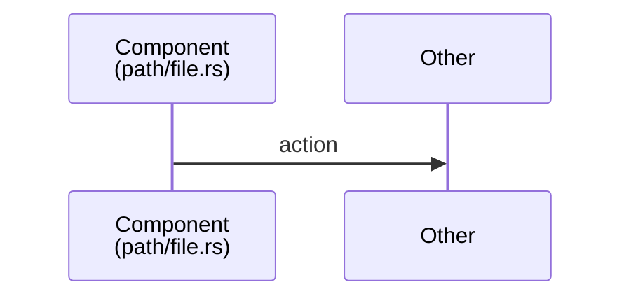

# AGENTS.md

> AI Agent Study Guide - Learn to build coding agents by studying OpenAI Codex-RS

## Quick Context

**What**: Documentation repository analyzing OpenAI Codex-RS TUI architecture.
**Why**: Teach developers how to build AI coding assistants.
**Type**: Documentation only - NO implementation code.

## Immediate Context Files

| Priority | File | Purpose |
|----------|------|---------|
| 1 | `llms-full.txt` | Complete context dump |
| 2 | `docs/architecture-diagram.md` | Primary architecture reference |
| 3 | `docs/WORKFLOWS.md` | Step-by-step task workflows |
| 4 | `docs/CONCEPTS.md` | Core concepts explained |

## Setup

```bash
git clone https://github.com/ray-manaloto/ai-agent-study-guide.git
cd ai-agent-study-guide

# View diagrams
open docs/codex-architecture.html

# Optional: Install diagram renderer
npm install -g @mermaid-js/mermaid-cli
```

## Repository Structure

```
ai-agent-study-guide/
├── AGENTS.md              # AI agent instructions (this file)
├── CLAUDE.md              # Claude-specific config
├── llms.txt               # LLM documentation index
├── llms-full.txt          # Complete LLM context
├── docs/
│   ├── architecture-diagram.md  # Mermaid diagrams
│   ├── codex-architecture.html  # Interactive HTML
│   ├── CONCEPTS.md              # Core concepts
│   ├── GLOSSARY.md              # Term definitions
│   ├── PATTERNS.md              # Implementation patterns
│   └── WORKFLOWS.md             # AI agent workflows
├── scripts/
│   └── render-diagrams.sh       # Mermaid → PNG
├── .cursorrules                  # Cursor AI
├── .windsurfrules                # Windsurf AI
├── .aider.conf.yml               # Aider config
├── .continue/config.json         # Continue.dev
├── .github/copilot-instructions.md  # GitHub Copilot
└── .mcp.json                     # MCP servers
```

---

## Task Execution

### Allowed Tasks

| Task | Files to Modify | Workflow |
|------|-----------------|----------|
| Add diagram | `docs/architecture-diagram.md`, `llms.txt`, `llms-full.txt` | [Workflow 1](docs/WORKFLOWS.md#workflow-1-add-new-architecture-diagram) |
| Update docs | `docs/*.md`, `llms.txt`, `llms-full.txt` | [Workflow 2](docs/WORKFLOWS.md#workflow-2-update-existing-documentation) |
| Add concept | `docs/CONCEPTS.md` or `docs/PATTERNS.md` | [Workflow 3](docs/WORKFLOWS.md#workflow-3-add-new-concept-documentation) |
| Add term | `docs/GLOSSARY.md` | [Workflow 3](docs/WORKFLOWS.md#workflow-3-add-new-concept-documentation) |

### Forbidden Tasks

- Creating implementation/source code files
- Adding npm/cargo/pip dependencies
- Modifying `docs/codex-architecture.html` directly
- Running build or test commands (none exist)

### Verification Commands

```bash
# Verify Mermaid diagrams render
./scripts/render-diagrams.sh

# Check file structure
find . -type f | grep -v ".git/" | sort

# View in terminal
glow docs/architecture-diagram.md
```

---

## Code Style

### Documentation Format

```markdown
## Section Title

> One-line summary

### Subsection

| Column 1 | Column 2 |
|----------|----------|
| data     | data     |

Location: `codex-rs/path/to/file.rs`
```

### Mermaid Diagram Format

```markdown

```

### Quality Standards

- Concise - no filler words
- Tables for mappings
- Source file links always included
- Rust code snippets for types

---

## Key Architecture Facts

### Critical Understanding

```
TUI → ThreadManager → CodexThread → Codex
          ↑
    NOT through MessageProcessor
```

MessageProcessor is ONLY for external JSON-RPC clients (VS Code).

### Layer Map

| Layer | Path | Key Structs |
|-------|------|-------------|
| TUI | `codex-rs/tui/` | App, ChatWidget, ApprovalOverlay |
| Core | `codex-rs/core/` | ThreadManager, CodexThread, Codex |
| Protocol | `codex-rs/protocol/` | Op, EventMsg, Event |
| App Server | `codex-rs/app-server/` | MessageProcessor |

### Key Types

| Type | Purpose | Variants |
|------|---------|----------|
| `Op` | Input to agent | UserTurn, ExecApproval, Interrupt, Undo |
| `EventMsg` | Output from agent | TurnStarted, TurnComplete, AgentMessage |
| `Event` | Wrapper | `{ id: String, msg: EventMsg }` |

---

## Completion Checklist

Before marking any task complete:

- [ ] Changes match existing style
- [ ] Mermaid diagrams render (`./scripts/render-diagrams.sh`)
- [ ] `llms.txt` updated if docs changed
- [ ] `llms-full.txt` updated if docs changed
- [ ] No implementation code created
- [ ] Source file links included where relevant

---

## External References

| Resource | URL |
|----------|-----|
| Codex Repository | https://github.com/openai/codex |
| TUI Source | https://github.com/openai/codex/tree/main/codex-rs/tui |
| Core Source | https://github.com/openai/codex/tree/main/codex-rs/core |
| Protocol Source | https://github.com/openai/codex/tree/main/codex-rs/protocol |

---

## AI Tool Configurations

This repository includes configurations for:

| Tool | Config File |
|------|-------------|
| Claude Code | `CLAUDE.md`, `.claude/settings.json` |
| Cursor | `.cursorrules`, `.cursor/rules/*.mdc` |
| Windsurf | `.windsurfrules` |
| Aider | `.aider.conf.yml` |
| Continue.dev | `.continue/config.json` |
| GitHub Copilot | `.github/copilot-instructions.md` |
| MCP Servers | `.mcp.json` |
| Gitingest | `.gitingest` |
