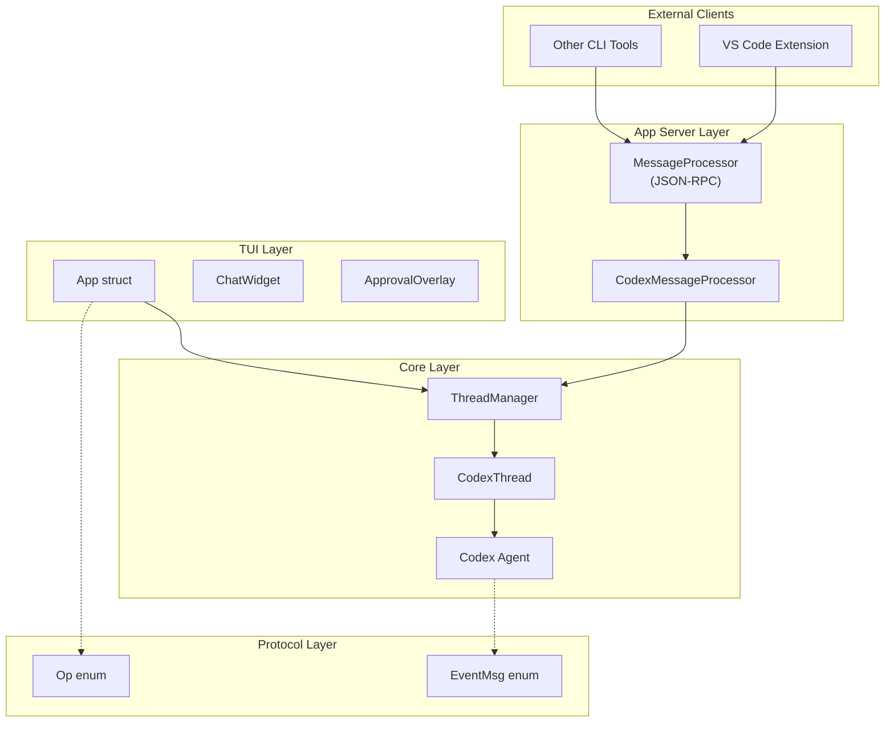
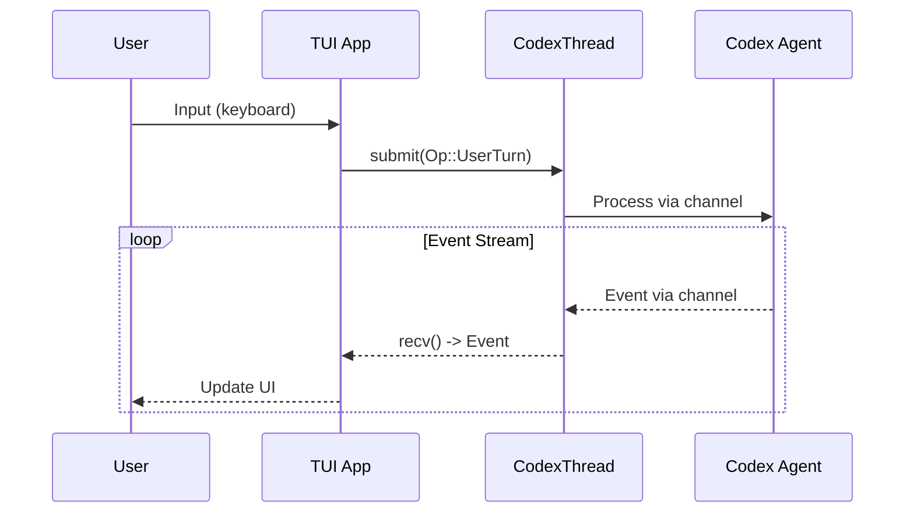
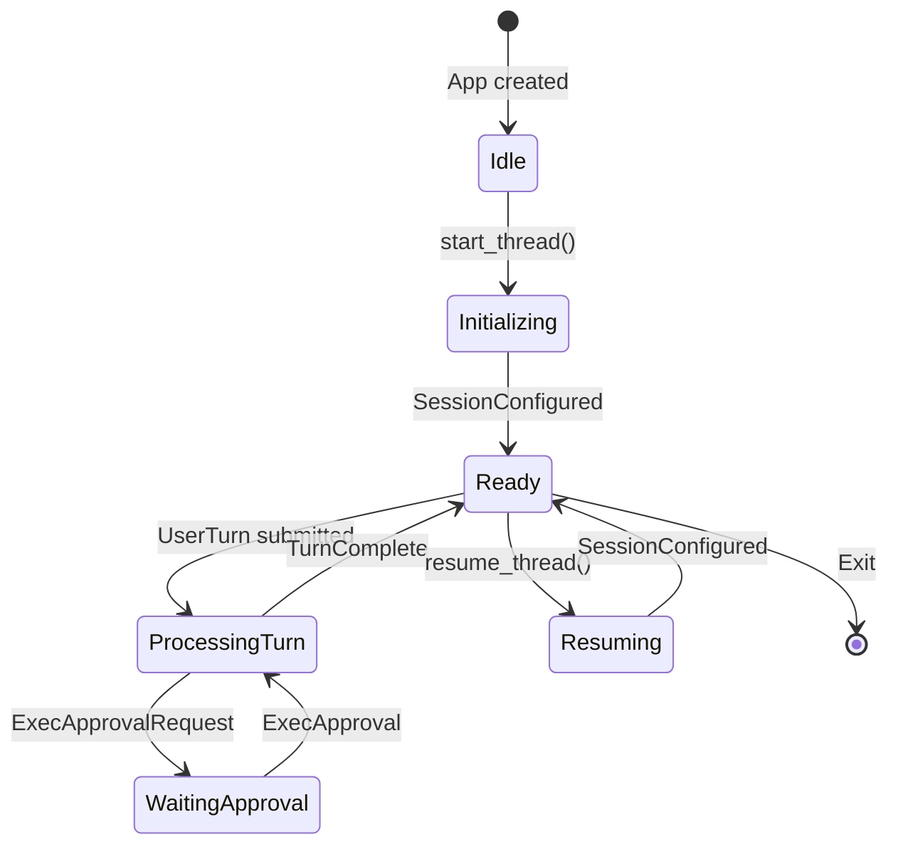
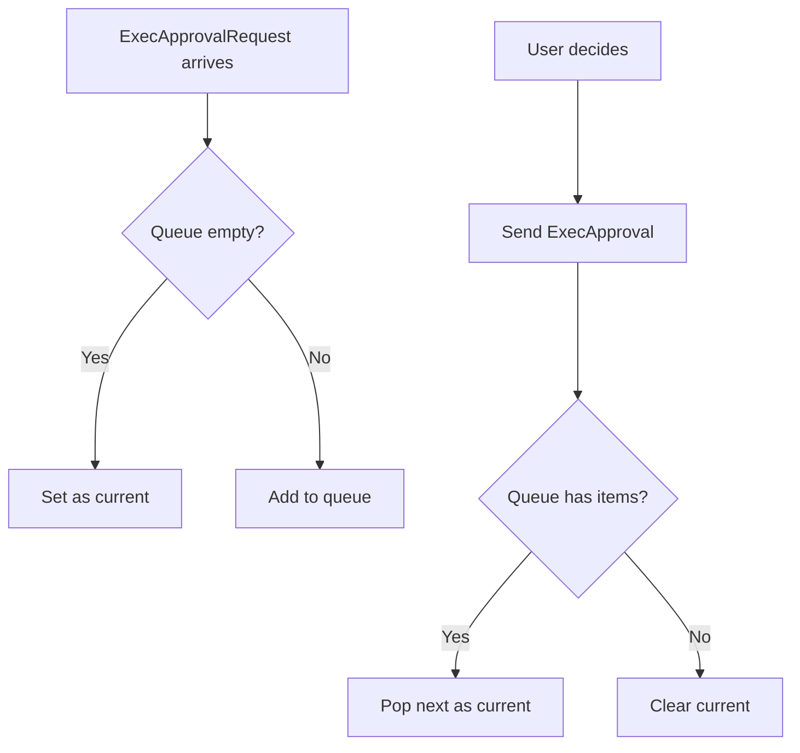
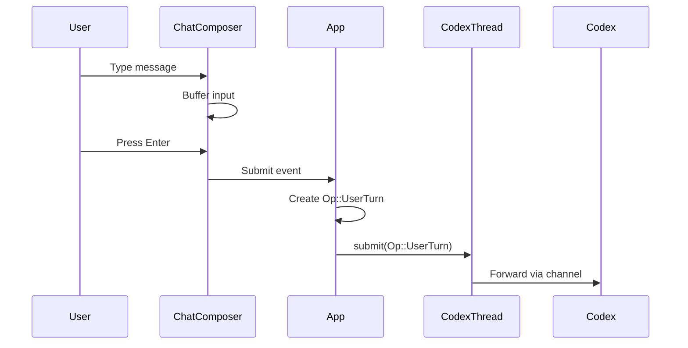
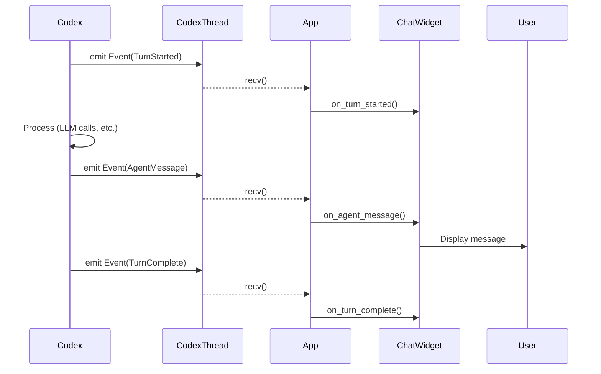
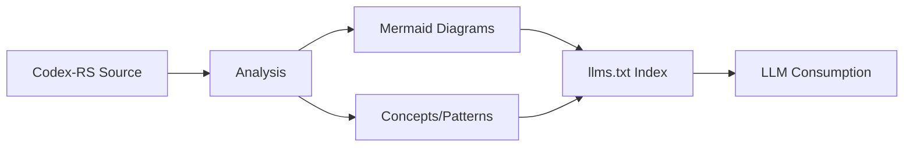
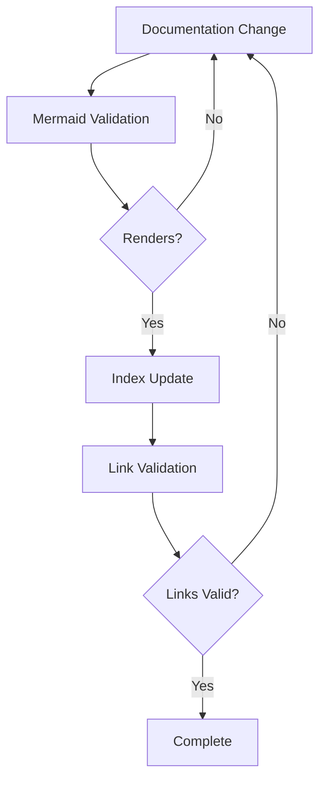

# Architecture

> AI Agent Study Guide - System architecture for documentation repository

---

## Overview

This document describes the architecture of the AI Agent Study Guide repository and the Codex-RS system it documents.

### Repository Architecture

```
┌─────────────────────────────────────────────────────────────┐
│                    AI Agent Study Guide                      │
├─────────────────────────────────────────────────────────────┤
│  Entry Layer                                                 │
│  ├── AGENTS.md (coordination)                               │
│  ├── CLAUDE.md (Claude Code config)                         │
│  ├── .cursorrules (Cursor config)                           │
│  └── llms.txt (index)                                       │
├─────────────────────────────────────────────────────────────┤
│  Documentation Layer                                         │
│  ├── docs/architecture-diagram.md (diagrams)                │
│  ├── docs/CONCEPTS.md (patterns)                            │
│  ├── docs/PATTERNS.md (implementations)                     │
│  ├── docs/WORKFLOWS.md (tasks)                              │
│  └── docs/GLOSSARY.md (definitions)                         │
├─────────────────────────────────────────────────────────────┤
│  Template Layer                                              │
│  └── docs/templates/ (LLM optimization templates)           │
├─────────────────────────────────────────────────────────────┤
│  Output Layer                                                │
│  └── docs/codex-architecture.html (generated)               │
└─────────────────────────────────────────────────────────────┘
```

### Design Principles

| Principle | Implementation |
|-----------|----------------|
| Documentation Only | No implementation code |
| Source Verified | All claims verified against Codex-RS source |
| Cross-Referenced | Comprehensive llms.txt index |
| Machine Readable | Structured markdown for LLM consumption |
| Human Readable | Clear diagrams and tables |

---

## Codex-RS Architecture (Subject of Study)

### System Overview

The OpenAI Codex-RS is a production AI coding agent with a TUI interface. This section documents its architecture.



### Critical Architecture Decision

**TUI bypasses App Server layer entirely:**

```
CORRECT PATH (TUI):
  User → TUI App → ThreadManager → CodexThread → Codex

WRONG ASSUMPTION:
  User → TUI App → MessageProcessor → ThreadManager

CORRECT PATH (External Client):
  VS Code → JSON-RPC → MessageProcessor → ThreadManager → CodexThread → Codex
```

**Why this matters:**
- TUI has lower latency (no JSON-RPC overhead)
- TUI maintains type safety (no serialization)
- App Server exists only for external integration

---

## Layer Architecture

### Layer 1: Protocol Layer

**Location**: `codex-rs/protocol/`

**Purpose**: Shared type definitions with no business logic.

**Key Types**:

| Type | Purpose | Direction |
|------|---------|-----------|
| `Op` | Operations submitted to agent | Input |
| `EventMsg` | Events emitted by agent | Output |
| `Event` | Wrapper with id + EventMsg | Output |

**Dependencies**: None (leaf layer)

```rust
// codex-rs/protocol/src/protocol.rs
pub enum Op {
    Interrupt,
    UserTurn { items: Vec<UserInput>, cwd: PathBuf, ... },
    ExecApproval { id: String, decision: ReviewDecision },
    ApplyPatchApproval { id: String, decision: ReviewDecision },
    Undo,
    RunUserShellCommand { command: String },
}

pub enum EventMsg {
    Error(ErrorEvent),
    Warning(WarningEvent),
    SessionConfigured(SessionConfiguredEvent),
    TurnStarted(TurnStartedEvent),
    TurnComplete(TurnCompleteEvent),
    AgentMessage(AgentMessageEvent),
    ExecCommandBegin(ExecCommandBeginEvent),
    ExecCommandEnd(ExecCommandEndEvent),
    ExecApprovalRequest(ExecApprovalRequestEvent),
    ApplyPatchApprovalRequest(ApplyPatchApprovalRequestEvent),
    RequestUserInput(RequestUserInputEvent),
}

pub struct Event {
    pub id: String,
    pub msg: EventMsg,
}
```

### Layer 2: Core Layer

**Location**: `codex-rs/core/`

**Purpose**: Agent implementation and thread management.

**Key Components**:

| Component | File | Responsibility |
|-----------|------|----------------|
| ThreadManager | `thread_manager.rs` | Thread lifecycle management |
| CodexThread | `codex_thread.rs` | Agent wrapper with channels |
| Codex | `codex.rs` | Agent implementation |
| Session | `session.rs` | Session state |

**Dependencies**: Protocol layer

```rust
// codex-rs/core/src/thread_manager.rs
pub struct ThreadManager {
    // Manages multiple agent threads
    threads: HashMap<ThreadId, Arc<CodexThread>>,
}

impl ThreadManager {
    pub fn start_thread(&self, config: ThreadConfig) -> Arc<CodexThread>;
    pub fn stop_thread(&self, id: ThreadId);
}

// codex-rs/core/src/codex_thread.rs
pub struct CodexThread {
    op_tx: UnboundedSender<Op>,
    event_rx: UnboundedReceiver<Event>,
    handle: JoinHandle<()>,
}

impl CodexThread {
    pub fn submit(&self, op: Op);
    pub async fn recv(&mut self) -> Option<Event>;
}
```

### Layer 3: TUI Layer

**Location**: `codex-rs/tui/`

**Purpose**: Terminal user interface.

**Key Components**:

| Component | File | Responsibility |
|-----------|------|----------------|
| App | `app.rs` | Main event loop, holds ThreadManager |
| ChatWidget | `chatwidget.rs` | Message display |
| ChatComposer | `bottom_pane/chat_composer.rs` | Input handling |
| ApprovalOverlay | `bottom_pane/approval_overlay.rs` | Approval queue |
| AppEvent | `app_event.rs` | Internal TUI events |

**Dependencies**: Core layer, Protocol layer

```rust
// codex-rs/tui/src/app.rs
pub(crate) struct App {
    pub(crate) server: Arc<ThreadManager>,  // Direct access!
    pub(crate) otel_manager: OtelManager,
    pub(crate) app_event_tx: AppEventSender,
}

impl App {
    pub async fn run(&mut self) -> Result<()> {
        loop {
            // Poll terminal events
            // Poll agent events (non-blocking)
            // Dispatch to handlers
            // Render
        }
    }
}
```

### Layer 4: App Server Layer

**Location**: `codex-rs/app-server/`

**Purpose**: JSON-RPC interface for external clients.

**Key Components**:

| Component | File | Responsibility |
|-----------|------|----------------|
| MessageProcessor | `message_processor.rs` | JSON-RPC handling |
| CodexMessageProcessor | `codex_message_processor.rs` | Codex-specific handlers |

**Dependencies**: Core layer, Protocol layer

**Note**: TUI does NOT use this layer.

```rust
// codex-rs/app-server/src/message_processor.rs
impl MessageProcessor {
    async fn handle(&self, request: JsonRpcRequest) -> JsonRpcResponse {
        match request.method {
            "thread/start" => self.handle_thread_start(request.params),
            "turn/start" => self.handle_turn_start(request.params),
            // ...
        }
    }
}
```

---

## Communication Architecture

### Channel-Based Communication



### Channel Types

| Channel | Direction | Type | Purpose |
|---------|-----------|------|---------|
| op_tx | App → Thread | `UnboundedSender<Op>` | Submit operations |
| event_rx | Thread → App | `UnboundedReceiver<Event>` | Receive events |

### Non-Blocking Event Loop

```rust
// Simplified event loop structure
loop {
    // 1. Check terminal events (non-blocking)
    if let Ok(true) = crossterm::event::poll(Duration::ZERO) {
        let event = crossterm::event::read()?;
        self.handle_terminal_event(event);
    }

    // 2. Check agent events (non-blocking)
    while let Ok(event) = self.event_rx.try_recv() {
        self.handle_agent_event(event);
    }

    // 3. Render
    self.terminal.draw(|f| self.render(f))?;

    // 4. Small sleep to prevent busy-waiting
    tokio::time::sleep(Duration::from_millis(10)).await;
}
```

---

## State Architecture

### Application State Machine



### State Descriptions

| State | Description | Allowed Operations |
|-------|-------------|-------------------|
| Idle | App created, no thread | start_thread |
| Initializing | Thread starting | Wait |
| Ready | Agent ready | UserTurn, Exit |
| ProcessingTurn | Agent working | Interrupt |
| WaitingApproval | Needs user decision | ExecApproval |
| Resuming | Resuming saved thread | Wait |

---

## Approval Architecture

### Approval Queue Design



### Approval Queue Implementation

```rust
// codex-rs/tui/src/bottom_pane/approval_overlay.rs
pub(crate) struct ApprovalOverlay {
    current_request: Option<ApprovalRequest>,
    current_variant: Option<ApprovalVariant>,
    queue: Vec<ApprovalRequest>,
    app_event_tx: AppEventSender,
    list: ListSelectionView,
}

impl ApprovalOverlay {
    pub fn queue_request(&mut self, request: ApprovalRequest) {
        if self.current_request.is_none() {
            self.current_request = Some(request);
        } else {
            self.queue.push(request);
        }
    }

    pub fn complete_current(&mut self, decision: ReviewDecision) -> Op {
        let request = self.current_request.take().unwrap();
        self.current_request = self.queue.pop();
        
        match request.kind {
            ApprovalKind::Exec => Op::ExecApproval { 
                id: request.id, 
                decision 
            },
            ApprovalKind::Patch => Op::ApplyPatchApproval { 
                id: request.id, 
                decision 
            },
        }
    }
}
```

### Approval Decisions

| Decision | Meaning | Effect |
|----------|---------|--------|
| Approved | Allow execution | Agent proceeds |
| Denied | Reject execution | Agent skips |
| AlwaysApprove | Approve + update policy | Future auto-approval |
| AlwaysDeny | Deny + update policy | Future auto-denial |

---

## Data Flow Architecture

### User Input Flow



### Agent Response Flow



---

## Security Architecture

### Approval Gates

All potentially dangerous operations require explicit approval:

| Operation Type | Approval Event | Decision Type |
|----------------|----------------|---------------|
| Command execution | ExecApprovalRequest | ExecApproval |
| File modification | ApplyPatchApprovalRequest | ApplyPatchApproval |

### Policy System

Users can set persistent policies:

```rust
// Policy amendments allow "always approve" or "always deny"
pub enum ReviewDecision {
    Approved,
    Denied,
    ApprovedWithAmendment { amendment: PolicyAmendment },
    DeniedWithAmendment { amendment: PolicyAmendment },
}

pub struct PolicyAmendment {
    pub pattern: String,      // Command/file pattern
    pub action: PolicyAction, // Allow or Deny
}
```

### Undo Capability

```rust
// Op::Undo allows reverting last action
pub enum Op {
    Undo,
    // ...
}
```

---

## Repository Architecture

### File Organization

```
ai-agent-study-guide/
├── Entry Points
│   ├── AGENTS.md              # Agent coordination
│   ├── CLAUDE.md              # Claude config
│   ├── .cursorrules           # Cursor config
│   └── llms.txt               # Index
│
├── Documentation
│   ├── ARCHITECTURE.md        # This file
│   ├── IMPLEMENTATION.md      # How-to guides
│   ├── TOOLING.md             # Tools reference
│   └── docs/
│       ├── architecture-diagram.md
│       ├── CONCEPTS.md
│       ├── PATTERNS.md
│       ├── WORKFLOWS.md
│       └── GLOSSARY.md
│
├── Templates
│   └── docs/templates/
│       ├── LLM-OPTIMIZATION-TEMPLATE.md
│       └── llm-project-optimization/
│
├── Output
│   └── docs/codex-architecture.html
│
└── Scripts
    └── scripts/render-diagrams.sh
```

### Documentation Flow



---

## Quality Architecture

### Verification Pipeline



### Quality Checkpoints

| Checkpoint | Tool | Command |
|------------|------|---------|
| Mermaid syntax | mermaid-cli | `./scripts/render-diagrams.sh` |
| Markdown preview | glow | `glow docs/[file].md` |
| Link validation | grep | `grep -r "github.com" docs/` |
| Index completeness | manual | Review llms.txt |

---

## Resources

| Resource | URL |
|----------|-----|
| Codex-RS Source | https://github.com/openai/codex |
| Protocol Types | https://github.com/openai/codex/blob/main/codex-rs/protocol/src/protocol.rs |
| TUI Implementation | https://github.com/openai/codex/tree/main/codex-rs/tui |
| Core Implementation | https://github.com/openai/codex/tree/main/codex-rs/core |
| App Server | https://github.com/openai/codex/tree/main/codex-rs/app-server |
