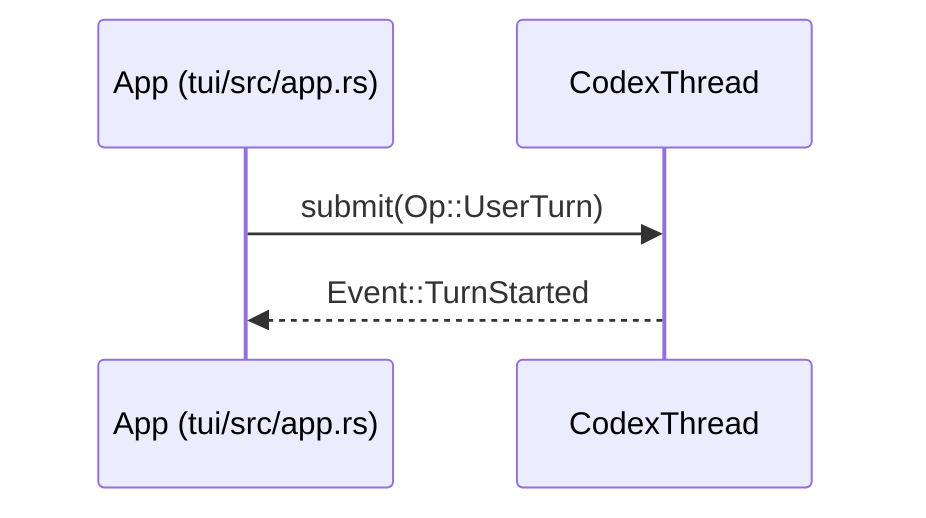

# Contributing to AI Agent Study Guide

Thank you for your interest in contributing! This document provides guidelines for contributing to this documentation-focused repository.

---

## Table of Contents

1. [Code of Conduct](#code-of-conduct)
2. [What We Accept](#what-we-accept)
3. [What We Don't Accept](#what-we-dont-accept)
4. [Getting Started](#getting-started)
5. [Contribution Workflow](#contribution-workflow)
6. [Documentation Standards](#documentation-standards)
7. [Diagram Guidelines](#diagram-guidelines)
8. [AI Agent Contributors](#ai-agent-contributors)
9. [Review Process](#review-process)

---

## Code of Conduct

Please read and follow our [Code of Conduct](CODE_OF_CONDUCT.md). We are committed to providing a welcoming and inclusive environment.

---

## What We Accept

| Contribution Type | Description |
|-------------------|-------------|
| Documentation improvements | Clarifications, corrections, expansions |
| Architecture diagrams | Mermaid diagrams with source references |
| Pattern documentation | Reusable patterns from Codex-RS |
| Glossary additions | New term definitions |
| Workflow guides | Step-by-step task guides |
| Index updates | Updates to llms.txt and llms-full.txt |
| Bug reports | Issues with existing documentation |
| Tool research | Documentation of AI development tools |

---

## What We Don't Accept

| Contribution Type | Reason |
|-------------------|--------|
| Implementation code | Documentation-only repository |
| Build configurations | No build system |
| Test files | No testing framework |
| Dependencies | No package manager |
| Binary files | Text-based documentation only |
| Generated files | Only source markdown |

---

## Getting Started

### Prerequisites

- Git
- Markdown editor (VS Code, Cursor, etc.)
- Mermaid preview capability (optional but helpful)
- Basic understanding of the Codex-RS architecture

### Setup

```bash
# Fork the repository on GitHub

# Clone your fork
git clone https://github.com/YOUR-USERNAME/ai-agent-study-guide.git
cd ai-agent-study-guide

# Add upstream remote
git remote add upstream https://github.com/ray-manaloto/ai-agent-study-guide.git

# Create a branch for your contribution
git checkout -b docs/your-contribution-name
```

### Understanding the Repository

Before contributing, read these files in order:

1. `AGENTS.md` - Agent coordination and repository overview
2. `llms.txt` - Documentation index
3. `docs/WORKFLOWS.md` - Task execution guides
4. `docs/architecture-diagram.md` - Existing diagrams

---

## Contribution Workflow

### 1. Find or Create an Issue

- Check existing issues for something to work on
- Create a new issue if documenting something new
- Wait for issue assignment before starting major work

### 2. Create a Branch

```bash
# Sync with upstream
git fetch upstream
git checkout main
git merge upstream/main

# Create feature branch
git checkout -b docs/description-of-change
```

### 3. Make Changes

- Follow documentation standards below
- Keep changes focused and atomic
- Update indexes after documentation changes

### 4. Validate Changes

```bash
# Validate Mermaid diagrams
./scripts/render-diagrams.sh

# Preview markdown
glow docs/your-file.md

# Check for broken links
grep -r "](.*\.md)" docs/ | head -20
```

### 5. Commit Changes

```bash
# Stage changes
git add .

# Commit with descriptive message
git commit -m "docs: add [component] architecture diagram

- Added sequence diagram for [flow]
- Updated GLOSSARY.md with new terms
- Updated llms.txt index"
```

### 6. Submit Pull Request

```bash
# Push to your fork
git push origin docs/description-of-change
```

Then create a Pull Request on GitHub:
- Use the PR template
- Link related issues
- Describe what was added/changed
- Include screenshots for diagram changes

---

## Documentation Standards

### File Naming

| Type | Convention | Example |
|------|------------|---------|
| Markdown | UPPERCASE.md | `CONCEPTS.md` |
| Diagrams | kebab-case.md | `architecture-diagram.md` |
| Agent guides | kebab-case.md | `mermaid-specialist.md` |

### Markdown Style

```markdown
# Document Title

> Brief description of the document

---

## Section Heading

### Subsection

Content here.

| Column 1 | Column 2 |
|----------|----------|
| Value 1  | Value 2  |

### Code Examples

\`\`\`rust
fn example() {
    // Always include language identifier
}
\`\`\`
```

### Writing Guidelines

| Guideline | Description |
|-----------|-------------|
| Be concise | No filler words or verbose prose |
| Use tables | Prefer tables over long paragraphs |
| Include sources | Always cite Codex-RS file paths |
| Link related content | Cross-reference related documentation |
| Update indexes | Always update llms.txt after changes |

---

## Diagram Guidelines

### Mermaid Syntax

All diagrams use Mermaid syntax. Example:



### Diagram Requirements

| Requirement | Description |
|-------------|-------------|
| File paths | Include in participant labels |
| Consistent style | Match existing diagrams |
| Validation | Must pass render-diagrams.sh |
| Documentation | Add explanation below diagram |

### Diagram Types

| Type | Use Case |
|------|----------|
| Sequence | Communication flows |
| Flowchart | Process workflows |
| Class | Type relationships |
| State | State machines |

---

## AI Agent Contributors

AI agents are welcome contributors! Follow these guidelines:

### Agent Entry Points

| File | Purpose |
|------|---------|
| `AGENTS.md` | Primary coordination file |
| `llms.txt` | Quick reference index |
| `.opencode/agent/` | Specialized agent guides |
| `CLAUDE.md` | Claude-specific configuration |
| `.cursorrules` | Cursor AI rules |

### Agent Guidelines

1. **Read first**: Always read `AGENTS.md` before making changes
2. **Check workflows**: Follow `docs/WORKFLOWS.md` for task execution
3. **Update indexes**: Always update `llms.txt` after changes
4. **Validate diagrams**: Run `./scripts/render-diagrams.sh`
5. **No implementation**: This is documentation-only

### Agent Roles

| Role | Allowed Actions |
|------|-----------------|
| Documentation Author | Edit markdown, create diagrams |
| Architecture Analyst | Document Codex-RS findings |
| Index Maintainer | Update llms.txt, llms-full.txt |
| Quality Reviewer | Check links, validate Mermaid |

---

## Review Process

### Review Criteria

| Criterion | Description |
|-----------|-------------|
| Accuracy | Verified against Codex-RS source |
| Completeness | All relevant details included |
| Clarity | Concise, scannable content |
| Consistency | Matches existing style |
| References | Source file paths included |
| Indexes | llms.txt updated |

### Review Timeline

- Initial review: 1-3 days
- Revision cycle: 1-2 days per round
- Merge: After approval from maintainer

### Merge Requirements

- [ ] All review comments addressed
- [ ] CI checks pass (link validation)
- [ ] Diagrams render correctly
- [ ] Indexes updated
- [ ] No merge conflicts

---

## Getting Help

| Resource | Description |
|----------|-------------|
| Issues | Ask questions, report problems |
| Discussions | General conversation |
| `docs/WORKFLOWS.md` | Task execution guides |
| `docs/GLOSSARY.md` | Term definitions |

---

## Recognition

All contributors are recognized in:
- GitHub contributor graphs
- Release notes (for significant contributions)

Thank you for contributing to AI Agent Study Guide!
