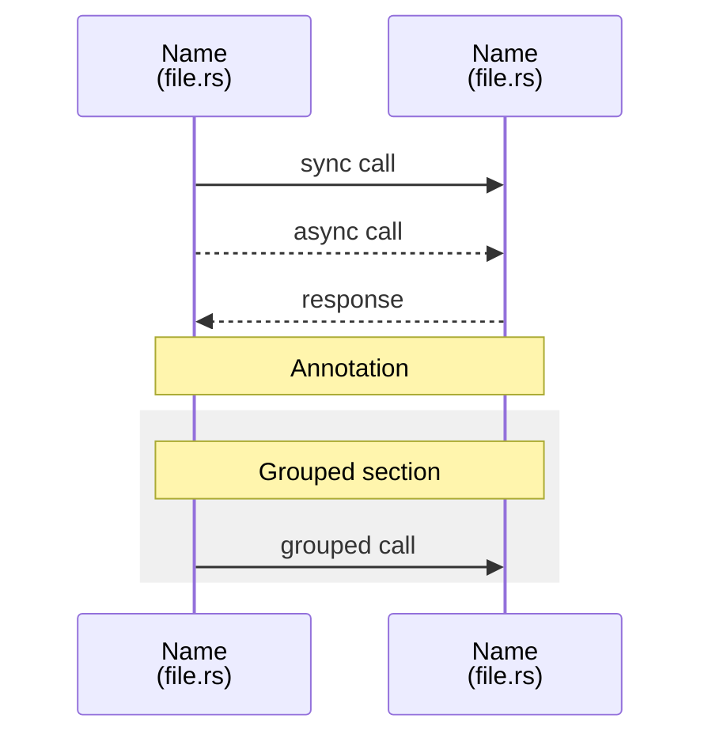
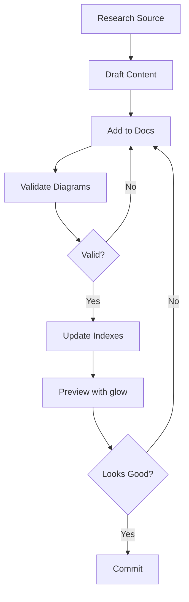
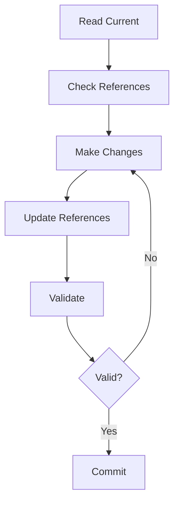

# Tooling Reference

> AI Agent Study Guide - Tools and utilities for documentation work

---

## Overview

This document describes the tools used in this documentation repository.

**Note**: This is a documentation-only repository with minimal tooling requirements.

---

## Required Tools

### glow

**Purpose**: Terminal markdown rendering for documentation preview.

**Installation**:
```bash
# macOS
brew install glow

# Linux
sudo snap install glow

# Windows
choco install glow
```

**Usage**:
```bash
# Preview a file
glow docs/architecture-diagram.md

# Preview with pager
glow -p docs/CONCEPTS.md

# Preview all markdown files
glow docs/
```

**Common Options**:

| Option | Purpose |
|--------|---------|
| `-p` | Use pager for long files |
| `-w 80` | Set width |
| `-s dark` | Dark style |

### mermaid-cli

**Purpose**: Validate and render Mermaid diagrams.

**Installation**:
```bash
npm install -g @mermaid-js/mermaid-cli
```

**Usage**:
```bash
# Render to PNG
mmdc -i docs/architecture-diagram.md -o output.png

# Render to SVG
mmdc -i docs/architecture-diagram.md -o output.svg

# Validate only (check for errors)
mmdc -i docs/architecture-diagram.md -o /tmp/test.png
```

**Common Options**:

| Option | Purpose |
|--------|---------|
| `-i` | Input file |
| `-o` | Output file |
| `-t` | Theme (default, dark, forest, neutral) |
| `-b` | Background color |

### Git

**Purpose**: Version control.

**Common Commands**:
```bash
# Status
git status

# Stage changes
git add docs/[file].md

# Commit
git commit -m "docs: description of change"

# Push
git push origin main
```

---

## Repository Scripts

### render-diagrams.sh

**Location**: `scripts/render-diagrams.sh`

**Purpose**: Validate all Mermaid diagrams in the repository.

**Usage**:
```bash
./scripts/render-diagrams.sh
```

**What It Does**:
1. Finds all Mermaid code blocks in markdown files
2. Validates each diagram with mermaid-cli
3. Reports any errors
4. Generates HTML output

**Expected Output**:
```
Validating docs/architecture-diagram.md...
✓ All diagrams valid
```

**Error Output**:
```
Validating docs/architecture-diagram.md...
✗ Error in diagram at line 45:
  Parse error on line 3: Unexpected token
```

---

## Online Tools

### Mermaid Live Editor

**URL**: https://mermaid.live/

**Purpose**: Interactive Mermaid diagram editing and preview.

**Use Cases**:
- Draft new diagrams before adding to docs
- Debug syntax errors
- Experiment with diagram types
- Share diagrams for review

**Features**:
- Real-time preview
- Multiple themes
- Export to PNG/SVG
- Shareable links

### GitHub

**URL**: https://github.com/openai/codex

**Purpose**: Access Codex-RS source code for reference.

**Useful Views**:
- Code browser: Navigate source files
- Blame: See when code was changed
- History: Track changes over time
- Search: Find specific code

**Quick Links**:

| Component | URL |
|-----------|-----|
| Protocol | `https://github.com/openai/codex/tree/main/codex-rs/protocol` |
| TUI | `https://github.com/openai/codex/tree/main/codex-rs/tui` |
| Core | `https://github.com/openai/codex/tree/main/codex-rs/core` |
| App Server | `https://github.com/openai/codex/tree/main/codex-rs/app-server` |

---

## AI Agent Tools

### agent-browser

**Source**: https://github.com/vercel-labs/agent-browser

**Purpose**: Browser automation CLI for AI agents.

**Installation**:
```bash
npx agent-browser
```

**Relevance**: Example of AI agent tooling patterns.

### skills CLI

**Source**: https://github.com/vercel-labs/skills

**Purpose**: Install and manage Agent Skills.

**Installation**:
```bash
npx skills
```

**Usage**:
```bash
# List available skills
npx skills list

# Install a skill
npx skills install [skill-name]

# View installed skills
npx skills installed
```

### opensrc

**Source**: https://github.com/vercel-labs/opensrc

**Purpose**: Fetch library source code for AI context.

**Installation**:
```bash
npx opensrc
```

**Usage**:
```bash
# Fetch library source
npx opensrc [library-name]
```

---

## File Viewers

### Standard Tools

| Tool | Purpose | Command |
|------|---------|---------|
| cat | View file content | `cat docs/file.md` |
| less | Paged viewing | `less docs/file.md` |
| head | View start of file | `head -50 docs/file.md` |
| tail | View end of file | `tail -50 docs/file.md` |

### Browser

**Purpose**: View rendered HTML diagrams.

**Command**:
```bash
open docs/codex-architecture.html
```

**Notes**:
- HTML files are generated, do not edit directly
- Regenerate with `./scripts/render-diagrams.sh`

---

## Search Tools

### grep

**Purpose**: Search file contents.

**Common Patterns**:
```bash
# Find topic in all docs
grep -r "ThreadManager" docs/

# Find with context
grep -B 2 -A 2 "ThreadManager" docs/CONCEPTS.md

# Count occurrences
grep -c "ThreadManager" docs/*.md

# Find files containing term
grep -l "ThreadManager" docs/*.md
```

### find

**Purpose**: Find files by name or criteria.

**Common Patterns**:
```bash
# Find all markdown files
find docs -name "*.md"

# Find recently modified
find docs -name "*.md" -mtime -1

# Find by content
find docs -name "*.md" -exec grep -l "ThreadManager" {} \;
```

---

## Documentation Standards

### llms.txt Standard

**URL**: https://llmstxt.org/

**Purpose**: Standard format for LLM-readable documentation indexes.

**Format**:
```
# Project Title

> Brief description

## Section Name

- [file.md](path/to/file.md): Description
```

**Key Principles**:
- Plain text with minimal formatting
- Links in markdown format
- Hierarchical sections
- Concise descriptions

### Mermaid Syntax

**URL**: https://mermaid.js.org/

**Diagram Types Used**:

| Type | Purpose | Example |
|------|---------|---------|
| sequenceDiagram | Communication flows | TUI ↔ Core |
| flowchart | Process flows | Approval queue |
| stateDiagram-v2 | State machines | App states |

**Common Patterns**:



---

## Verification Commands

### Quick Verification

```bash
# All-in-one verification
./scripts/render-diagrams.sh && \
  glow docs/architecture-diagram.md && \
  echo "Verification passed"
```

### Full Verification

```bash
# 1. Validate diagrams
./scripts/render-diagrams.sh

# 2. Check file structure
ls -la docs/

# 3. Preview documentation
glow docs/architecture-diagram.md
glow docs/CONCEPTS.md
glow docs/PATTERNS.md

# 4. Check indexes
head -50 llms.txt

# 5. Find incomplete items
grep -r "TODO\|FIXME\|XXX" docs/

# 6. Validate links
grep -r "](.*\.md)" docs/ | head -20
```

---

## Development Workflow

### Adding New Content



### Updating Content



---

## Troubleshooting

### glow Issues

| Problem | Solution |
|---------|----------|
| Not installed | `brew install glow` |
| Rendering broken | Check terminal supports Unicode |
| Slow | Use `glow -p` for pager mode |

### Mermaid Issues

| Problem | Solution |
|---------|----------|
| Syntax error | Test at https://mermaid.live/ |
| Won't render | Check for unescaped characters |
| Wrong output | Verify diagram type |

### Git Issues

| Problem | Solution |
|---------|----------|
| Merge conflicts | Resolve manually, keep both changes if compatible |
| Push rejected | `git pull --rebase` first |
| Wrong branch | `git checkout correct-branch` |

---

## Tool Versions

Recommended minimum versions:

| Tool | Minimum Version | Check Command |
|------|-----------------|---------------|
| glow | 1.5.0 | `glow --version` |
| mermaid-cli | 10.0.0 | `mmdc --version` |
| git | 2.30.0 | `git --version` |
| node | 18.0.0 | `node --version` |

---

## Resources

| Resource | URL |
|----------|-----|
| glow GitHub | https://github.com/charmbracelet/glow |
| mermaid-cli | https://github.com/mermaid-js/mermaid-cli |
| Mermaid Docs | https://mermaid.js.org/ |
| Mermaid Live | https://mermaid.live/ |
| llms.txt Spec | https://llmstxt.org/ |
| agent-browser | https://github.com/vercel-labs/agent-browser |
| skills CLI | https://github.com/vercel-labs/skills |
| opensrc | https://github.com/vercel-labs/opensrc |
