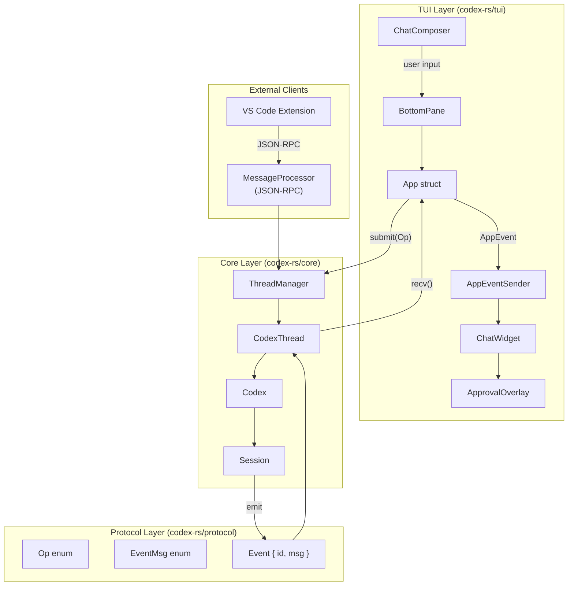
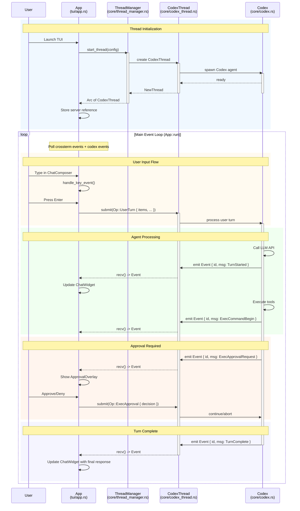
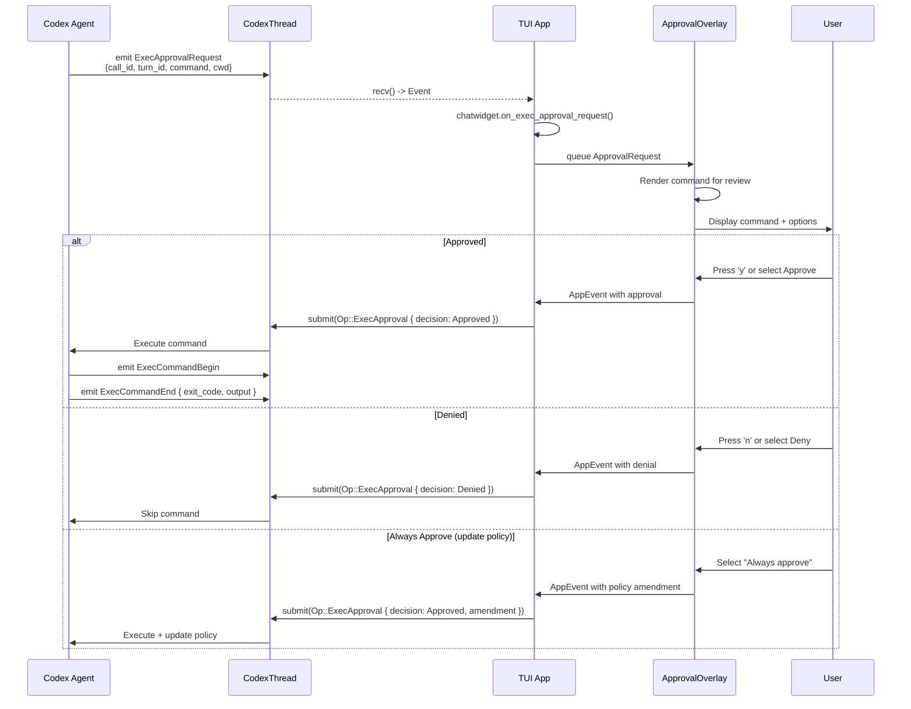
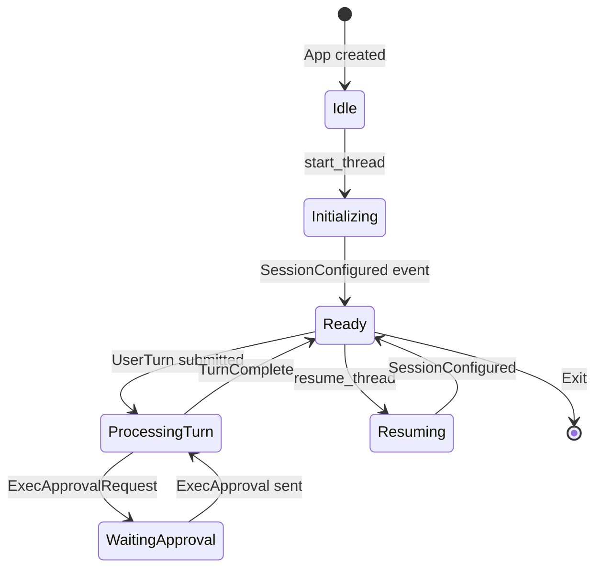
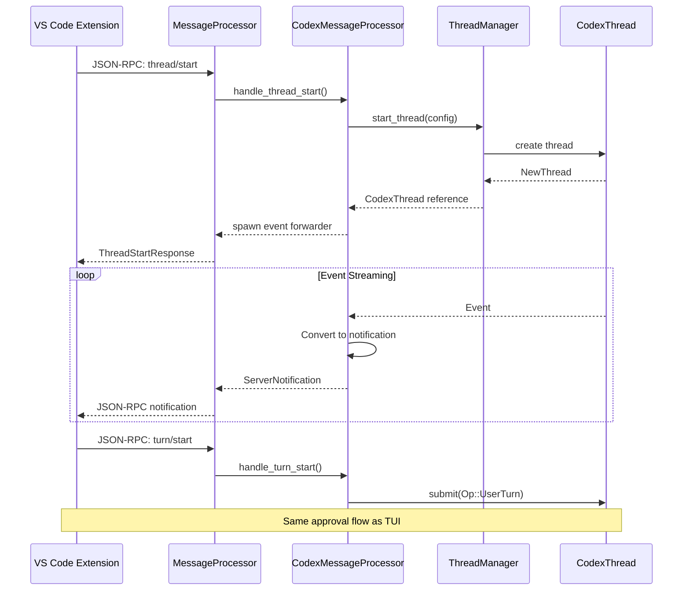

# Codex-RS Architecture Sequence Diagram

> **Validated against**: [openai/codex](https://github.com/openai/codex) codex-rs implementation

## Overview

This document describes the communication flow between the core components of the Codex TUI application.

| Component | Location | Key Structs | Responsibility |
|-----------|----------|-------------|----------------|
| **TUI Layer** | `codex-rs/tui/` | `App`, `ChatWidget`, `ChatComposer`, `ApprovalOverlay` | User interface, event handling, rendering |
| **Core Agent** | `codex-rs/core/` | `ThreadManager`, `CodexThread`, `Codex` | Agent execution, thread lifecycle, LLM interaction |
| **Protocol** | `codex-rs/protocol/` | `Op`, `EventMsg`, `Event` | Message types, operations, events |
| **App Server** | `codex-rs/app-server/` | `MessageProcessor`, `CodexMessageProcessor` | JSON-RPC for external clients (VS Code, etc.) |

---

## Architecture Diagram



---

## TUI ↔ Core Communication Flow



---

## Key Types (from codex-rs/protocol)

### Op Enum (Operations submitted to agent)

```rust
// codex-rs/protocol/src/protocol.rs
pub enum Op {
    /// Abort current task
    Interrupt,
    
    /// User submits a message/turn
    UserTurn {
        items: Vec<UserInput>,
        cwd: PathBuf,
        model: Option<String>,
        // ...
    },
    
    /// Response to exec approval request
    ExecApproval {
        id: String,
        decision: ReviewDecision,
    },
    
    /// Response to patch approval request  
    ApplyPatchApproval {
        id: String,
        decision: ReviewDecision,
    },
    
    /// Undo last action
    Undo,
    
    /// Run user shell command (! prefix)
    RunUserShellCommand { command: String },
    
    // ... more variants
}
```

### EventMsg Enum (Events emitted by agent)

```rust
// codex-rs/protocol/src/protocol.rs
pub enum EventMsg {
    /// Error during execution
    Error(ErrorEvent),
    
    /// Warning (non-fatal)
    Warning(WarningEvent),
    
    /// Session configured (first event)
    SessionConfigured(SessionConfiguredEvent),
    
    /// Turn started
    TurnStarted(TurnStartedEvent),
    
    /// Turn completed
    TurnComplete(TurnCompleteEvent),
    
    /// Agent message (text response)
    AgentMessage(AgentMessageEvent),
    
    /// Command execution started
    ExecCommandBegin(ExecCommandBeginEvent),
    
    /// Command execution ended
    ExecCommandEnd(ExecCommandEndEvent),
    
    /// Approval request for command
    ExecApprovalRequest(ExecApprovalRequestEvent),
    
    /// Approval request for file patch
    ApplyPatchApprovalRequest(ApplyPatchApprovalRequestEvent),
    
    /// Request user input
    RequestUserInput(RequestUserInputEvent),
    
    // ... more variants
}
```

### Event Wrapper

```rust
// codex-rs/protocol/src/protocol.rs
pub struct Event {
    pub id: String,
    pub msg: EventMsg,
}
```

---

## TUI Components (from codex-rs/tui)

### App Struct

```rust
// codex-rs/tui/src/app.rs
pub(crate) struct App {
    pub(crate) server: Arc<ThreadManager>,
    pub(crate) otel_manager: OtelManager,
    pub(crate) app_event_tx: AppEventSender,
    // ...
}
```

### AppEvent Enum

```rust
// codex-rs/tui/src/app_event.rs
pub(crate) enum AppEvent {
    /// Event from CodexThread
    CodexEvent(Event),
    
    /// Open agent picker
    OpenAgentPicker,
    
    /// Switch to different thread
    SelectAgentThread(ThreadId),
    
    /// File search results
    FileSearchResults(Vec<FileMatch>),
    
    // ... more variants
}
```

### ChatWidget

```rust
// codex-rs/tui/src/chatwidget.rs
// Handles:
// - on_exec_approval_request()
// - on_apply_patch_approval_request()
// - on_turn_started()
// - on_turn_complete()
// - on_agent_message()
```

### ApprovalOverlay

```rust
// codex-rs/tui/src/bottom_pane/approval_overlay.rs
pub(crate) struct ApprovalOverlay {
    current_request: Option<ApprovalRequest>,
    current_variant: Option<ApprovalVariant>,
    queue: Vec<ApprovalRequest>,
    app_event_tx: AppEventSender,
    list: ListSelectionView,
}
```

---

## Approval Flow Detail



---

## State Machine



---

## External Client Flow (App Server)

The App Server (`codex-rs/app-server`) provides JSON-RPC for external clients like VS Code:



---

## File Locations

| Component | File Path |
|-----------|-----------|
| App struct | `codex-rs/tui/src/app.rs` |
| ChatWidget | `codex-rs/tui/src/chatwidget.rs` |
| ChatComposer | `codex-rs/tui/src/bottom_pane/chat_composer.rs` |
| ApprovalOverlay | `codex-rs/tui/src/bottom_pane/approval_overlay.rs` |
| AppEvent | `codex-rs/tui/src/app_event.rs` |
| ThreadManager | `codex-rs/core/src/thread_manager.rs` |
| CodexThread | `codex-rs/core/src/codex_thread.rs` |
| Codex | `codex-rs/core/src/codex.rs` |
| Op enum | `codex-rs/protocol/src/protocol.rs` |
| EventMsg enum | `codex-rs/protocol/src/protocol.rs` |
| MessageProcessor | `codex-rs/app-server/src/message_processor.rs` |
| CodexMessageProcessor | `codex-rs/app-server/src/codex_message_processor.rs` |

---

## Key Insights

1. **TUI uses ThreadManager directly** - The TUI doesn't go through MessageProcessor. It holds `Arc<ThreadManager>` and communicates via `submit(Op)` and `recv()` on CodexThread.

2. **MessageProcessor is for external clients** - JSON-RPC interface for VS Code extension and other clients, not the TUI.

3. **Event-driven architecture** - All communication is async via channels:
   - `UnboundedSender<Op>` for submitting operations
   - `Event` stream for receiving agent events

4. **Approval is queue-based** - ApprovalOverlay maintains a queue of pending approval requests, processing them one at a time.

5. **CodexThread wraps Codex** - The actual agent logic lives in `Codex`, which manages sessions, LLM calls, and tool execution.
