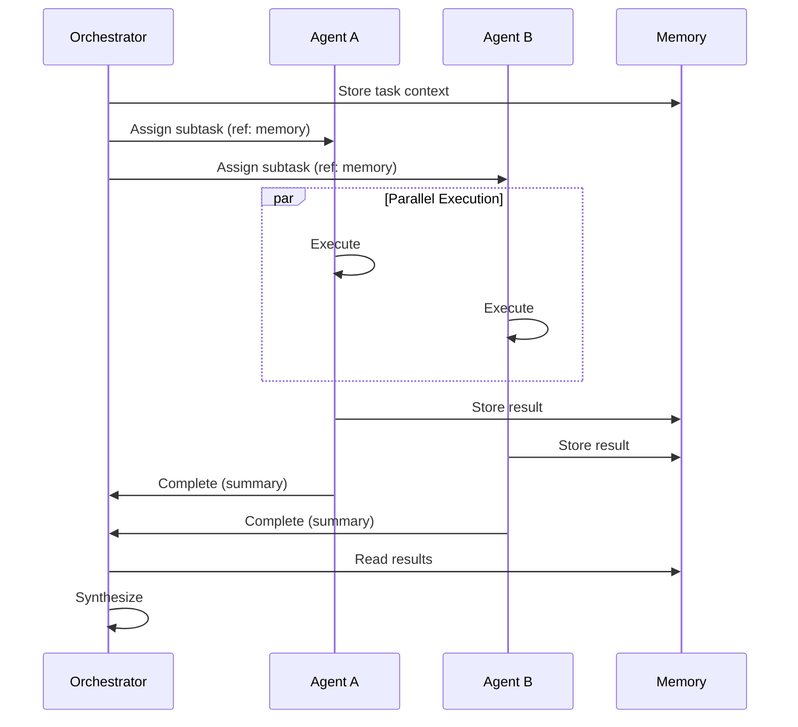

# AI Coding Agent Best Practices

> Combined best practices extracted from 7 production AI coding agent tools

---

## Overview

This document synthesizes the most effective patterns and practices from studying seven leading AI coding agent implementations:

| Tool | Key Contribution |
|------|------------------|
| **Codex** | Channel-based architecture, typed protocols, approval queues |
| **Claude Code** | MCP integration, subagent delegation, permission systems |
| **OpenCode** | Multi-provider abstraction, session management, LSP integration |
| **Kata** | Spec-driven phases, thin orchestrators, XML prompt formatting |
| **Get-Shit-Done** | Context engineering, wave execution, productivity focus |
| **Oh-My-OpenCode** | Category-based delegation, skills injection, wisdom accumulation |
| **Kimi K2** | PARL training, massive parallelism, critical steps optimization |

---

## Table of Contents

1. [Context Management](#1-context-management)
2. [Multi-Agent Orchestration](#2-multi-agent-orchestration)
3. [Delegation Patterns](#3-delegation-patterns)
4. [Prompt Engineering](#4-prompt-engineering)
5. [Approval & Safety](#5-approval--safety)
6. [Session & State Management](#6-session--state-management)
7. [Provider Abstraction](#7-provider-abstraction)
8. [Learning & Adaptation](#8-learning--adaptation)
9. [Performance Optimization](#9-performance-optimization)
10. [Error Handling](#10-error-handling)

---

## 1. Context Management

### 1.1 Thin Orchestrator Pattern

**Sources**: Kata, Get-Shit-Done, Oh-My-OpenCode

The most critical pattern for effective multi-agent systems: keep orchestrators thin and spawn subagents with fresh context.

```
+------------------+     +-------------------+
|   Orchestrator   |     |    Subagent       |
|  (30-40% context)|---->| (Fresh 200k ctx)  |
|  - Routes tasks  |     | - Heavy execution |
|  - Summarizes    |<----| - Returns summary |
+------------------+     +-------------------+
```

**Key Principles**:

| Principle | Benefit |
|-----------|---------|
| Main context at 30-40% capacity | Room for responses and reasoning |
| Fresh context per execution unit | No accumulated cruft |
| Summary-only returns | Compressed knowledge transfer |
| Lazy tool loading | Only load what's needed |

**Implementation**:

```typescript
// GOOD: Thin orchestrator
async function orchestrate(task: Task) {
  const plan = await createPlan(task);  // Minimal context
  
  for (const step of plan.steps) {
    const result = await spawnAgent({
      context: getFreshContext(),  // Fresh 200k window
      task: step,
      returnFormat: "summary"  // Don't return full output
    });
    updatePlan(plan, result.summary);
  }
  
  return synthesize(plan);
}

// BAD: Accumulating orchestrator
async function orchestrateBad(task: Task) {
  let fullHistory = [];  // Grows unbounded
  for (const step of steps) {
    const result = await execute(step, fullHistory);
    fullHistory.push(result);  // Context explosion
  }
}
```

### 1.2 Context Window Management

**Sources**: All tools

| Strategy | Tool | Description |
|----------|------|-------------|
| Automatic compaction | Claude Code, OpenCode | Compress old messages automatically |
| Artifact persistence | Kata, GSD | Store artifacts in `.planning/`, `.sisyphus/` |
| Lazy loading | Oh-My-OpenCode | Load skills/tools on demand |
| Context checkpoints | Kimi K2 | Save/restore context state |

**Recommended Thresholds**:

```
┌─────────────────────────────────────────┐
│  Context Window (200k tokens)           │
├─────────────────────────────────────────┤
│  0-30%   │ Active working context       │
│  30-60%  │ Relevant history/artifacts   │
│  60-80%  │ Buffer for responses         │
│  80-100% │ DANGER ZONE - trigger compact│
└─────────────────────────────────────────┘
```

### 1.3 Knowledge Persistence

**Sources**: Oh-My-OpenCode, Kimi K2

```
Session Start
     │
     ▼
┌─────────────┐     ┌─────────────┐
│ Load from   │────>│ Session     │
│ Long-term   │     │ Memory      │
│ Memory      │     │ (Active)    │
└─────────────┘     └─────────────┘
                          │
                    [Work happens]
                          │
                          ▼
                    ┌─────────────┐
                    │ Extract     │
                    │ Patterns    │
                    └─────────────┘
                          │
                          ▼
Session End         ┌─────────────┐
     │              │ Store to    │
     └─────────────>│ Long-term   │
                    │ Memory      │
                    └─────────────┘
```

---

## 2. Multi-Agent Orchestration

### 2.1 Topology Selection

**Sources**: All multi-agent tools

| Topology | Best For | Trade-offs |
|----------|----------|------------|
| **Hierarchical** | Coordinated complex tasks | Single point of failure |
| **Mesh** | Peer collaboration | Communication overhead |
| **Pipeline** | Sequential processing | No parallelism |
| **Swarm** | Massive parallelism | Coordination complexity |
| **Hierarchical-Mesh** | Large teams (10+) | Most complex |

**Decision Tree**:

```
                    How many agents?
                          │
            ┌─────────────┴─────────────┐
            │                           │
        1-5 agents                  6+ agents
            │                           │
            ▼                           ▼
      Hierarchical              Need peer communication?
            │                           │
            │                ┌──────────┴──────────┐
            │                │                     │
            │               Yes                    No
            │                │                     │
            │                ▼                     ▼
            │        Hierarchical-Mesh      Pure Hierarchical
            │
            └──────────────────────────────────────┘
```

### 2.2 Agent Specialization

**Sources**: Oh-My-OpenCode, Kata, GSD

**Anti-Pattern**: Generic agents doing everything
**Pattern**: Specialized agents with clear boundaries

| Specialist | Responsibility | Context Needs |
|------------|----------------|---------------|
| Researcher | Gather information | Read-only, broad access |
| Architect | Design decisions | System overview, patterns |
| Coder | Implementation | Focused files, tests |
| Reviewer | Quality checks | Diff view, standards |
| Tester | Verification | Test frameworks, coverage |

### 2.3 Communication Patterns

**Sources**: Codex, Claude Code, Kimi K2



---

## 3. Delegation Patterns

### 3.1 Category-Based Delegation

**Source**: Oh-My-OpenCode

Instead of naming specific agents, delegate by semantic category:

| Category | Model Selection | Use Case |
|----------|-----------------|----------|
| `visual-engineering` | Best at UI/UX | Frontend, styling, animation |
| `ultrabrain` | Most capable | Complex logic, architecture |
| `quick` | Fastest | Typo fixes, simple changes |
| `deep` | Thorough | Research, investigation |
| `artistry` | Creative | Novel solutions, refactoring |

**Benefits**:
- Eliminates model selection bias
- Allows model upgrades without code changes
- Enables A/B testing of models
- Self-documenting task complexity

### 3.2 Skill Injection

**Source**: Oh-My-OpenCode

```typescript
// Skills are loaded dynamically based on task
delegate({
  category: "visual-engineering",
  skills: ["frontend-ui-ux", "accessibility"],  // Injected expertise
  task: "Implement responsive navbar"
});
```

**Skill Structure**:

```yaml
name: frontend-ui-ux
description: Designer-turned-developer expertise
triggers:
  - "UI component"
  - "responsive design"
  - "animation"
context:
  - Design system patterns
  - Accessibility guidelines
  - Performance budgets
```

### 3.3 Delegation Prompt Structure

**Sources**: Kata, GSD, Oh-My-OpenCode

Every delegation prompt MUST include:

```markdown
## 1. TASK
[Atomic, specific goal - one action per delegation]

## 2. EXPECTED OUTCOME
[Concrete deliverables with success criteria]

## 3. REQUIRED TOOLS
[Explicit tool whitelist - prevents tool sprawl]

## 4. MUST DO
[Exhaustive requirements - leave NOTHING implicit]

## 5. MUST NOT DO
[Forbidden actions - anticipate and block rogue behavior]

## 6. CONTEXT
[File paths, existing patterns, constraints]
```

---

## 4. Prompt Engineering

### 4.1 XML Prompt Formatting

**Source**: Kata

XML provides structure that LLMs parse reliably:

```xml
<task>
  <goal>Implement user authentication</goal>
  <constraints>
    <constraint>Use existing auth library</constraint>
    <constraint>Follow REST conventions</constraint>
  </constraints>
  <files>
    <file action="create">src/auth/handler.ts</file>
    <file action="modify">src/routes/index.ts</file>
  </files>
</task>
```

**Benefits**:
- Clear hierarchy
- Parseable by both LLM and code
- Self-documenting structure
- Consistent formatting

### 4.2 Specification-Driven Development

**Source**: Kata (8-Phase Workflow)

```
┌─────────────────────────────────────────────────────────────┐
│                    8-Phase Workflow                          │
├─────────────────────────────────────────────────────────────┤
│  1. Clarify    │ Resolve ambiguities with user              │
│  2. Specify    │ Create formal specification                │
│  3. Architect  │ Design system structure                    │
│  4. Plan       │ Break into atomic tasks                    │
│  5. Implement  │ Execute tasks (wave-based)                 │
│  6. Verify     │ Run tests and checks                       │
│  7. Document   │ Update documentation                       │
│  8. Review     │ Final quality check                        │
└─────────────────────────────────────────────────────────────┘
```

### 4.3 Artifact Persistence

**Sources**: Kata, GSD

Store artifacts in dedicated directories:

```
.planning/           # Kata
├── spec.md          # Formal specification
├── architecture.md  # Design decisions
├── plan.md          # Task breakdown
└── status.md        # Current progress

.sisyphus/           # GSD
├── wisdom.md        # Accumulated learnings
├── patterns.md      # Discovered patterns
└── session.json     # Session state
```

---

## 5. Approval & Safety

### 5.1 Approval Queue Pattern

**Source**: Codex

Process approvals sequentially, never in parallel:

```typescript
interface ApprovalQueue {
  current: ApprovalRequest | null;
  queue: ApprovalRequest[];
}

// Process one at a time
async function processApproval(queue: ApprovalQueue) {
  if (queue.current) return;  // Already processing
  
  queue.current = queue.queue.shift();
  if (!queue.current) return;
  
  const decision = await showApprovalUI(queue.current);
  await submitDecision(decision);
  queue.current = null;
  
  processApproval(queue);  // Process next
}
```

### 5.2 Permission Levels

**Source**: Claude Code

```
┌─────────────────────────────────────────┐
│           Permission Levels             │
├─────────────────────────────────────────┤
│  ask      │ Always ask user             │
│  allow    │ Auto-approve safe actions   │
│  deny     │ Always reject               │
│  trust    │ Full autonomy (dangerous)   │
└─────────────────────────────────────────┘
```

**Per-Operation Permissions**:

| Operation | Default | Reason |
|-----------|---------|--------|
| File read | allow | Non-destructive |
| File write | ask | Modifies state |
| Shell command | ask | External effects |
| Network request | ask | Data exfiltration risk |
| Git operations | ask | Can't easily undo push |

### 5.3 Policy Amendments

**Source**: Codex, Claude Code

Allow users to update policies during session:

```typescript
interface PolicyAmendment {
  pattern: string;      // e.g., "npm install *"
  action: "allow" | "deny";
  scope: "session" | "permanent";
  reason?: string;
}

// Examples:
{ pattern: "npm install", action: "allow", scope: "session" }
{ pattern: "rm -rf", action: "deny", scope: "permanent" }
```

---

## 6. Session & State Management

### 6.1 Session Persistence

**Sources**: OpenCode, Claude Code

```typescript
interface Session {
  id: string;
  created: Date;
  lastActive: Date;
  
  // State
  messages: Message[];
  context: ContextWindow;
  approvals: PolicyAmendment[];
  
  // Artifacts
  files: Map<string, FileState>;
  tasks: Task[];
  
  // Metadata
  provider: string;
  model: string;
  settings: Settings;
}

// Persist on every significant change
async function saveSession(session: Session) {
  await storage.set(`session:${session.id}`, session);
  await storage.set('session:latest', session.id);
}
```

### 6.2 Session Forking

**Source**: OpenCode

```
Original Session
       │
       ├──────────────────┐
       │                  │
       ▼                  ▼
  Fork A              Fork B
  (Experiment 1)      (Experiment 2)
       │                  │
       │                  ▼
       │             [Failed]
       │                  │
       ▼                  │
  [Success]               │
       │                  │
       └──────────────────┘
               │
               ▼
         Merge back
```

### 6.3 Thread Management

**Source**: Codex

```typescript
interface ThreadManager {
  threads: Map<string, AgentThread>;
  
  spawn(config: ThreadConfig): AgentThread;
  stop(threadId: string): void;
  send(threadId: string, op: Operation): void;
  receive(threadId: string): AsyncIterator<Event>;
}

// Thread isolation prevents cross-contamination
class AgentThread {
  private channel: Channel<Operation, Event>;
  private agent: Agent;
  
  async run() {
    for await (const op of this.channel.receive()) {
      const events = await this.agent.process(op);
      for (const event of events) {
        this.channel.send(event);
      }
    }
  }
}
```

---

## 7. Provider Abstraction

### 7.1 Multi-Provider Interface

**Sources**: OpenCode, Oh-My-OpenCode

```typescript
interface Provider {
  name: string;
  models: Model[];
  
  // Core operations
  chat(messages: Message[], options: ChatOptions): AsyncIterator<Chunk>;
  embed(text: string): Promise<number[]>;
  
  // Capabilities
  supportsTools: boolean;
  supportsStreaming: boolean;
  supportsVision: boolean;
  maxContextWindow: number;
}

// Provider implementations
const providers: Provider[] = [
  new AnthropicProvider(),
  new OpenAIProvider(),
  new GoogleProvider(),
  new LocalProvider(),  // Ollama, LMStudio
];
```

### 7.2 Model Selection Strategy

**Source**: Oh-My-OpenCode

```typescript
interface ModelSelector {
  select(task: Task, constraints: Constraints): Model;
}

class CategoryBasedSelector implements ModelSelector {
  select(task: Task, constraints: Constraints): Model {
    const category = classifyTask(task);
    
    switch (category) {
      case "quick":
        return getModel({ speed: "fastest", cost: "lowest" });
      case "ultrabrain":
        return getModel({ capability: "highest" });
      case "visual":
        return getModel({ vision: true, creative: true });
      default:
        return getModel({ balanced: true });
    }
  }
}
```

### 7.3 Fallback Chains

**Source**: OpenCode

```typescript
const fallbackChain = [
  { provider: "anthropic", model: "claude-sonnet-4-20250514" },
  { provider: "openai", model: "gpt-4o" },
  { provider: "google", model: "gemini-1.5-pro" },
  { provider: "local", model: "llama-3.1-70b" },
];

async function chatWithFallback(messages: Message[]): Promise<Response> {
  for (const { provider, model } of fallbackChain) {
    try {
      return await providers[provider].chat(messages, { model });
    } catch (error) {
      if (!isRetryable(error)) throw error;
      console.warn(`${provider}/${model} failed, trying next...`);
    }
  }
  throw new Error("All providers failed");
}
```

---

## 8. Learning & Adaptation

### 8.1 Wisdom Accumulation

**Source**: Oh-My-OpenCode

```typescript
interface WisdomEntry {
  pattern: string;       // What was learned
  context: string;       // When it applies
  confidence: number;    // How reliable (0-1)
  source: string;        // Where learned
  timestamp: Date;
}

// Accumulate wisdom during session
function learnFromSuccess(task: Task, result: Result) {
  if (result.success && result.quality > 0.8) {
    wisdom.add({
      pattern: extractPattern(task, result),
      context: task.type,
      confidence: result.quality,
      source: `session:${session.id}`,
      timestamp: new Date()
    });
  }
}

// Apply wisdom to future tasks
function enhanceTask(task: Task): Task {
  const relevantWisdom = wisdom.search(task.description);
  return {
    ...task,
    hints: relevantWisdom.map(w => w.pattern)
  };
}
```

### 8.2 PARL (Parallel-Agent Reinforcement Learning)

**Source**: Kimi K2

```
┌─────────────────────────────────────────────────────────────┐
│                   PARL Architecture                          │
├─────────────────────────────────────────────────────────────┤
│                                                              │
│   ┌─────────────┐                                           │
│   │ Trainable   │  Learns coordination patterns             │
│   │ Orchestrator│                                           │
│   └──────┬──────┘                                           │
│          │                                                   │
│    ┌─────┴─────┬─────────┬─────────┐                        │
│    ▼           ▼         ▼         ▼                        │
│ ┌──────┐  ┌──────┐  ┌──────┐  ┌──────┐                      │
│ │Frozen│  │Frozen│  │Frozen│  │Frozen│  Fixed capabilities  │
│ │Agent │  │Agent │  │Agent │  │Agent │                      │
│ └──────┘  └──────┘  └──────┘  └──────┘                      │
│                                                              │
│   Metric: Critical Steps (minimize coordination latency)     │
└─────────────────────────────────────────────────────────────┘
```

**Key Insights**:
- Only train the orchestrator, not subagents
- Frozen subagents provide stable capabilities
- "Critical Steps" metric optimizes for latency
- Up to 100 parallel agents supported

### 8.3 Pattern Recognition

**Sources**: Oh-My-OpenCode, Kimi K2

```typescript
interface PatternRecognizer {
  // Identify patterns in successful tasks
  extract(task: Task, result: Result): Pattern[];
  
  // Match patterns to new tasks
  match(task: Task): Pattern[];
  
  // Score pattern applicability
  score(pattern: Pattern, task: Task): number;
}

// Pattern structure
interface Pattern {
  id: string;
  type: "structural" | "behavioral" | "error";
  trigger: string;      // When to apply
  action: string;       // What to do
  confidence: number;
  occurrences: number;
}
```

---

## 9. Performance Optimization

### 9.1 Wave-Based Execution

**Sources**: Kata, GSD

Execute independent tasks in parallel waves:

```
Wave 1: [Task A, Task B, Task C]  ← Independent tasks
           │         │        │
           ▼         ▼        ▼
        Result A  Result B  Result C
           │         │        │
           └────┬────┴────────┘
                │
                ▼
Wave 2: [Task D, Task E]  ← Depend on Wave 1
           │         │
           ▼         ▼
        Result D  Result E
           │         │
           └────┬────┘
                │
                ▼
Wave 3: [Task F]  ← Depends on Wave 2
```

**Implementation**:

```typescript
async function executeWaves(tasks: Task[]): Promise<Results> {
  const waves = buildWaves(tasks);  // Topological sort
  const results = new Map();
  
  for (const wave of waves) {
    const waveResults = await Promise.all(
      wave.map(task => executeTask(task, results))
    );
    waveResults.forEach((r, i) => results.set(wave[i].id, r));
  }
  
  return results;
}
```

### 9.2 Critical Steps Optimization

**Source**: Kimi K2

Minimize the critical path through parallel execution:

```
Sequential:  A → B → C → D → E  (5 steps)

Parallel:    A ──┐
             B ──┼──→ E          (3 critical steps)
             C ──┤
             D ──┘
```

### 9.3 Caching Strategies

**Sources**: All tools

| Cache Level | Contents | TTL |
|-------------|----------|-----|
| Embedding cache | Vector embeddings | Long (days) |
| Response cache | Deterministic queries | Medium (hours) |
| Tool result cache | File reads, searches | Short (minutes) |
| Context cache | Parsed context | Session |

---

## 10. Error Handling

### 10.1 Graceful Degradation

**Source**: OpenCode

```typescript
async function executeWithFallback(task: Task): Promise<Result> {
  // Try primary approach
  try {
    return await primaryExecution(task);
  } catch (primaryError) {
    logError("Primary failed", primaryError);
  }
  
  // Try simplified approach
  try {
    return await simplifiedExecution(task);
  } catch (simplifiedError) {
    logError("Simplified failed", simplifiedError);
  }
  
  // Return partial results
  return {
    success: false,
    partial: await gatherPartialResults(task),
    errors: [primaryError, simplifiedError]
  };
}
```

### 10.2 Error Recovery Patterns

**Sources**: All tools

| Pattern | When | Action |
|---------|------|--------|
| Retry with backoff | Transient errors | Wait and retry |
| Fallback provider | Provider failure | Try alternative |
| Task decomposition | Complex failure | Break into smaller tasks |
| User escalation | Unrecoverable | Ask user for guidance |
| Checkpoint restore | Catastrophic | Restore last good state |

### 10.3 Structured Error Reporting

```typescript
interface StructuredError {
  code: string;           // Machine-readable
  message: string;        // Human-readable
  context: {
    task: string;
    file?: string;
    line?: number;
  };
  suggestions: string[];  // What to try next
  recoverable: boolean;
}

// Example
{
  code: "TOOL_EXECUTION_FAILED",
  message: "Failed to execute shell command",
  context: {
    task: "Install dependencies",
    file: "package.json"
  },
  suggestions: [
    "Check if npm is installed",
    "Verify network connectivity",
    "Try with --legacy-peer-deps"
  ],
  recoverable: true
}
```

---

## Quick Reference

### Must Do

| Practice | Tools |
|----------|-------|
| Thin orchestrators (30-40% context) | Kata, GSD, Oh-My-OpenCode |
| Fresh context per agent | All |
| Category-based delegation | Oh-My-OpenCode |
| Sequential approval processing | Codex, Claude Code |
| Session persistence | OpenCode, Claude Code |
| Wave-based parallel execution | Kata, GSD, Kimi K2 |
| Wisdom accumulation | Oh-My-OpenCode |

### Must Not Do

| Anti-Pattern | Problem |
|--------------|---------|
| Unbounded context accumulation | Context window overflow |
| Generic agents | Poor specialization |
| Parallel approvals | Confusing UX |
| Hardcoded models | No flexibility |
| Ignoring failures | Silent corruption |
| Skipping verification | Quality degradation |

---

## See Also

- [UNIFIED-HARNESS.md](UNIFIED-HARNESS.md) - Multi-provider harness design
- [Individual Tool Docs](README.md) - Detailed tool documentation
- [CONCEPTS.md](../CONCEPTS.md) - Core concepts
- [PATTERNS.md](../PATTERNS.md) - Implementation patterns

---

## Sources

| Tool | Repository |
|------|------------|
| Codex | [github.com/openai/codex](https://github.com/openai/codex) |
| Claude Code | Anthropic (Closed Source) |
| OpenCode | [github.com/anomalyco/opencode](https://github.com/anomalyco/opencode) |
| Kata | [github.com/gannonh/kata](https://github.com/gannonh/kata) |
| Get-Shit-Done | [github.com/glittercowboy/get-shit-done](https://github.com/glittercowboy/get-shit-done) |
| Oh-My-OpenCode | [github.com/sizzldev/oh-my-opencode](https://github.com/sizzldev/oh-my-opencode) |
| Kimi K2 | [kimi.com](https://kimi.com) |
