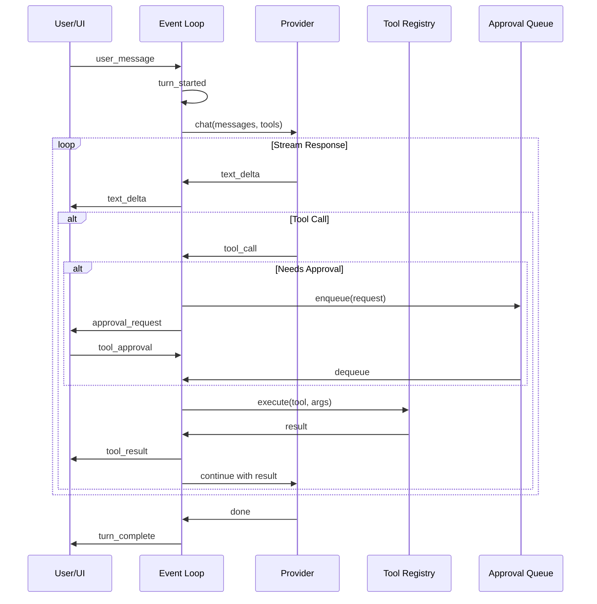

# Unified Multi-Provider Agent Harness

> A generic architecture for building AI coding agents with multi-provider support and multi-agent orchestration

---

## Overview

This document defines a unified harness architecture synthesized from 7 production AI coding agent implementations. The harness provides:

- **Multi-provider support**: Anthropic, OpenAI, Google, Local models
- **Multi-agent orchestration**: Hierarchical, mesh, and swarm topologies
- **Generic event loop**: Provider-agnostic message handling
- **Tool registry**: Extensible tool system
- **Session management**: Persistence and forking

---

## Architecture Diagram

```
┌─────────────────────────────────────────────────────────────────────────────┐
│                           UNIFIED AGENT HARNESS                              │
├─────────────────────────────────────────────────────────────────────────────┤
│                                                                              │
│  ┌─────────────────────────────────────────────────────────────────────┐    │
│  │                         PRESENTATION LAYER                           │    │
│  │  ┌─────────┐  ┌─────────┐  ┌─────────┐  ┌─────────┐                │    │
│  │  │   CLI   │  │   TUI   │  │   Web   │  │   API   │                │    │
│  │  └────┬────┘  └────┬────┘  └────┬────┘  └────┬────┘                │    │
│  │       └───────────┬┴───────────┴────────────┘                       │    │
│  │                   ▼                                                  │    │
│  │          ┌───────────────┐                                          │    │
│  │          │ Message Router│                                          │    │
│  │          └───────┬───────┘                                          │    │
│  └──────────────────┼──────────────────────────────────────────────────┘    │
│                     │                                                        │
│  ┌──────────────────┼──────────────────────────────────────────────────┐    │
│  │                  │           ORCHESTRATION LAYER                     │    │
│  │                  ▼                                                   │    │
│  │         ┌────────────────┐                                          │    │
│  │         │  Orchestrator  │◄─────────┐                               │    │
│  │         │    (Thin)      │          │                               │    │
│  │         └───────┬────────┘          │                               │    │
│  │                 │                   │                               │    │
│  │    ┌────────────┼────────────┐      │                               │    │
│  │    ▼            ▼            ▼      │                               │    │
│  │ ┌──────┐   ┌──────┐    ┌──────┐     │                               │    │
│  │ │Agent │   │Agent │    │Agent │     │  Results                      │    │
│  │ │  A   │   │  B   │    │  C   │─────┘                               │    │
│  │ └──┬───┘   └──┬───┘    └──┬───┘                                     │    │
│  │    │          │           │                                          │    │
│  └────┼──────────┼───────────┼──────────────────────────────────────────┘    │
│       │          │           │                                              │
│  ┌────┼──────────┼───────────┼──────────────────────────────────────────┐    │
│  │    │          │           │           PROVIDER LAYER                  │    │
│  │    ▼          ▼           ▼                                          │    │
│  │ ┌─────────────────────────────┐                                      │    │
│  │ │      Provider Adapter       │                                      │    │
│  │ └─────────────┬───────────────┘                                      │    │
│  │               │                                                       │    │
│  │    ┌──────────┼──────────┬──────────┐                                │    │
│  │    ▼          ▼          ▼          ▼                                │    │
│  │ ┌──────┐ ┌──────┐  ┌──────┐  ┌───────┐                              │    │
│  │ │Claude│ │OpenAI│  │Google│  │ Local │                              │    │
│  │ └──────┘ └──────┘  └──────┘  └───────┘                              │    │
│  └──────────────────────────────────────────────────────────────────────┘    │
│                                                                              │
│  ┌──────────────────────────────────────────────────────────────────────┐    │
│  │                         INFRASTRUCTURE LAYER                          │    │
│  │  ┌─────────┐  ┌─────────┐  ┌─────────┐  ┌─────────┐  ┌─────────┐   │    │
│  │  │  Tools  │  │ Memory  │  │ Session │  │Approval │  │  Hooks  │   │    │
│  │  │Registry │  │  Store  │  │ Manager │  │  Queue  │  │ System  │   │    │
│  │  └─────────┘  └─────────┘  └─────────┘  └─────────┘  └─────────┘   │    │
│  └──────────────────────────────────────────────────────────────────────┘    │
│                                                                              │
└─────────────────────────────────────────────────────────────────────────────┘
```

---

## Core Components

### 1. Message Types

The harness uses a unified message protocol compatible with all providers:

```typescript
// Input messages (User → Agent)
type Operation =
  | { type: "user_message"; content: string; attachments?: Attachment[] }
  | { type: "tool_approval"; requestId: string; approved: boolean; reason?: string }
  | { type: "interrupt" }
  | { type: "undo" }
  | { type: "config_update"; settings: Partial<Settings> };

// Output messages (Agent → User)
type Event =
  | { type: "turn_started"; turnId: string }
  | { type: "turn_complete"; turnId: string; summary: string }
  | { type: "text_delta"; content: string }
  | { type: "text_complete"; content: string }
  | { type: "tool_call"; id: string; name: string; args: unknown }
  | { type: "tool_result"; id: string; result: unknown }
  | { type: "approval_request"; id: string; tool: string; args: unknown; risk: Risk }
  | { type: "error"; code: string; message: string; recoverable: boolean }
  | { type: "status"; state: AgentState };

// Attachment types
type Attachment =
  | { type: "file"; path: string; content?: string }
  | { type: "image"; url: string; base64?: string }
  | { type: "url"; url: string };
```

### 2. Provider Interface

```typescript
interface Provider {
  // Identity
  readonly name: string;
  readonly models: Model[];
  
  // Capabilities
  readonly capabilities: {
    streaming: boolean;
    tools: boolean;
    vision: boolean;
    embeddings: boolean;
    maxContextWindow: number;
  };
  
  // Core operations
  chat(request: ChatRequest): AsyncIterator<ChatChunk>;
  embed(text: string | string[]): Promise<Embedding[]>;
  
  // Lifecycle
  initialize(): Promise<void>;
  shutdown(): Promise<void>;
  healthCheck(): Promise<HealthStatus>;
}

interface ChatRequest {
  model: string;
  messages: Message[];
  tools?: Tool[];
  temperature?: number;
  maxTokens?: number;
  stopSequences?: string[];
}

interface ChatChunk {
  type: "text" | "tool_call" | "tool_result" | "done";
  content?: string;
  toolCall?: ToolCall;
  toolResult?: ToolResult;
  usage?: TokenUsage;
}
```

### 3. Tool Registry

```typescript
interface Tool {
  // Metadata
  name: string;
  description: string;
  category: ToolCategory;
  
  // Schema
  parameters: JSONSchema;
  returns: JSONSchema;
  
  // Execution
  execute(args: unknown, context: ToolContext): Promise<ToolResult>;
  
  // Safety
  riskLevel: "low" | "medium" | "high" | "critical";
  requiresApproval: boolean;
  validate?(args: unknown): ValidationResult;
}

interface ToolRegistry {
  // Management
  register(tool: Tool): void;
  unregister(name: string): void;
  
  // Discovery
  get(name: string): Tool | undefined;
  list(category?: ToolCategory): Tool[];
  search(query: string): Tool[];
  
  // Execution
  execute(name: string, args: unknown, context: ToolContext): Promise<ToolResult>;
  
  // Events
  onRegister(callback: (tool: Tool) => void): void;
  onExecute(callback: (execution: ToolExecution) => void): void;
}

// Built-in tool categories
type ToolCategory =
  | "filesystem"      // read, write, edit, glob, grep
  | "shell"          // bash, terminal
  | "web"            // fetch, browser
  | "code_analysis"  // lsp, ast, symbols
  | "git"            // status, diff, commit
  | "mcp"            // MCP server tools
  | "custom";        // User-defined
```

### 4. Orchestrator

```typescript
interface Orchestrator {
  // Configuration
  readonly topology: Topology;
  readonly maxAgents: number;
  
  // Agent management
  spawn(config: AgentConfig): Promise<Agent>;
  terminate(agentId: string): Promise<void>;
  list(): Agent[];
  
  // Task distribution
  delegate(task: Task, options?: DelegationOptions): Promise<TaskResult>;
  broadcast(message: Message): Promise<void>;
  
  // Coordination
  sync(): Promise<void>;
  checkpoint(): Promise<Checkpoint>;
  restore(checkpoint: Checkpoint): Promise<void>;
}

interface DelegationOptions {
  // Routing
  category?: TaskCategory;         // Category-based routing
  agentId?: string;                // Direct routing
  skills?: string[];               // Required skills
  
  // Execution
  timeout?: number;
  retries?: number;
  parallel?: boolean;
  
  // Context
  context?: unknown;               // Task-specific context
  inheritContext?: boolean;        // Inherit orchestrator context
}

type Topology =
  | "single"              // One agent
  | "hierarchical"        // Coordinator + workers
  | "mesh"               // Peer-to-peer
  | "pipeline"           // Sequential stages
  | "swarm"              // Dynamic coordination
  | "hierarchical-mesh"; // Hybrid
```

### 5. Session Manager

```typescript
interface SessionManager {
  // Lifecycle
  create(config?: SessionConfig): Promise<Session>;
  restore(sessionId: string): Promise<Session>;
  fork(sessionId: string, options?: ForkOptions): Promise<Session>;
  
  // Persistence
  save(session: Session): Promise<void>;
  load(sessionId: string): Promise<Session | null>;
  delete(sessionId: string): Promise<void>;
  list(filter?: SessionFilter): Promise<SessionSummary[]>;
  
  // State
  export(sessionId: string): Promise<SessionExport>;
  import(data: SessionExport): Promise<Session>;
}

interface Session {
  // Identity
  id: string;
  parentId?: string;  // For forks
  created: Date;
  updated: Date;
  
  // State
  messages: Message[];
  context: ContextWindow;
  settings: Settings;
  
  // Agent state
  agents: AgentState[];
  tasks: Task[];
  
  // Approvals
  policies: PolicyAmendment[];
  pendingApprovals: ApprovalRequest[];
  
  // Artifacts
  artifacts: Map<string, Artifact>;
}
```

---

## Event Loop

### Generic Event Loop Pattern

```typescript
class EventLoop {
  private providers: Map<string, Provider>;
  private tools: ToolRegistry;
  private orchestrator: Orchestrator;
  private sessions: SessionManager;
  private approvals: ApprovalQueue;
  
  async run(session: Session): Promise<void> {
    while (!session.terminated) {
      // 1. Collect input events
      const inputs = await this.collectInputs(session);
      
      // 2. Process each input
      for (const input of inputs) {
        await this.processInput(session, input);
      }
      
      // 3. Process pending approvals
      await this.processApprovals(session);
      
      // 4. Yield to allow other operations
      await this.yield();
    }
  }
  
  private async processInput(session: Session, input: Operation): Promise<void> {
    switch (input.type) {
      case "user_message":
        await this.handleUserMessage(session, input);
        break;
      case "tool_approval":
        await this.handleToolApproval(session, input);
        break;
      case "interrupt":
        await this.handleInterrupt(session);
        break;
      // ... other cases
    }
  }
  
  private async handleUserMessage(session: Session, input: UserMessage): Promise<void> {
    // 1. Emit turn started
    this.emit({ type: "turn_started", turnId: generateId() });
    
    // 2. Build messages array
    const messages = this.buildMessages(session, input);
    
    // 3. Get active tools
    const tools = this.tools.list().filter(t => this.shouldIncludeTool(t, session));
    
    // 4. Select provider and model
    const { provider, model } = this.selectProvider(session);
    
    // 5. Stream response
    for await (const chunk of provider.chat({ model, messages, tools })) {
      await this.handleChunk(session, chunk);
    }
    
    // 6. Emit turn complete
    this.emit({ type: "turn_complete", turnId, summary: this.summarize(session) });
  }
  
  private async handleChunk(session: Session, chunk: ChatChunk): Promise<void> {
    switch (chunk.type) {
      case "text":
        this.emit({ type: "text_delta", content: chunk.content });
        break;
        
      case "tool_call":
        await this.handleToolCall(session, chunk.toolCall);
        break;
        
      case "done":
        // Update token usage, etc.
        break;
    }
  }
  
  private async handleToolCall(session: Session, call: ToolCall): Promise<void> {
    const tool = this.tools.get(call.name);
    if (!tool) {
      this.emit({ type: "error", code: "UNKNOWN_TOOL", message: `Unknown tool: ${call.name}` });
      return;
    }
    
    // Check if approval required
    if (tool.requiresApproval || this.requiresApproval(session, tool, call.args)) {
      this.approvals.enqueue({
        id: call.id,
        tool: tool.name,
        args: call.args,
        risk: this.assessRisk(tool, call.args)
      });
      this.emit({ type: "approval_request", id: call.id, tool: tool.name, args: call.args });
      return;
    }
    
    // Execute tool
    await this.executeTool(session, tool, call);
  }
  
  private async executeTool(session: Session, tool: Tool, call: ToolCall): Promise<void> {
    this.emit({ type: "tool_call", id: call.id, name: tool.name, args: call.args });
    
    try {
      const result = await tool.execute(call.args, this.createToolContext(session));
      this.emit({ type: "tool_result", id: call.id, result });
      
      // Add result to context for next LLM call
      session.pendingToolResults.push({ id: call.id, result });
    } catch (error) {
      this.emit({ type: "error", code: "TOOL_FAILED", message: error.message, recoverable: true });
    }
  }
}
```

### Event Loop Sequence Diagram



---

## Multi-Agent Coordination

### Hierarchical Topology

```
                    ┌──────────────┐
                    │ Orchestrator │
                    │   (Thin)     │
                    └──────┬───────┘
                           │
           ┌───────────────┼───────────────┐
           ▼               ▼               ▼
      ┌─────────┐    ┌─────────┐    ┌─────────┐
      │ Worker  │    │ Worker  │    │ Worker  │
      │    A    │    │    B    │    │    C    │
      └─────────┘    └─────────┘    └─────────┘
```

```typescript
class HierarchicalOrchestrator implements Orchestrator {
  private workers: Map<string, Agent> = new Map();
  
  async delegate(task: Task, options?: DelegationOptions): Promise<TaskResult> {
    // 1. Select worker based on category/skills
    const worker = this.selectWorker(task, options);
    
    // 2. Prepare delegation prompt
    const prompt = this.buildDelegationPrompt(task, options);
    
    // 3. Execute with fresh context
    const result = await worker.execute(prompt, {
      freshContext: true,
      returnFormat: "summary"
    });
    
    // 4. Update orchestrator state with summary
    this.updateState(result.summary);
    
    return result;
  }
  
  private selectWorker(task: Task, options?: DelegationOptions): Agent {
    if (options?.agentId) {
      return this.workers.get(options.agentId)!;
    }
    
    if (options?.category) {
      return this.findByCategory(options.category);
    }
    
    if (options?.skills) {
      return this.findBySkills(options.skills);
    }
    
    return this.findBestAvailable(task);
  }
}
```

### Mesh Topology

```
      ┌─────────┐◄───────────►┌─────────┐
      │ Agent A │             │ Agent B │
      └────┬────┘             └────┬────┘
           │                       │
           │    ┌─────────┐        │
           └───►│ Agent C │◄───────┘
                └────┬────┘
                     │
      ┌─────────────┬┴──────────────┐
      ▼             ▼               ▼
┌─────────┐   ┌─────────┐    ┌─────────┐
│ Agent D │◄─►│ Agent E │◄──►│ Agent F │
└─────────┘   └─────────┘    └─────────┘
```

```typescript
class MeshOrchestrator implements Orchestrator {
  private agents: Map<string, Agent> = new Map();
  private connections: Map<string, Set<string>> = new Map();
  
  async broadcast(message: Message): Promise<void> {
    await Promise.all(
      Array.from(this.agents.values()).map(agent =>
        agent.receive(message)
      )
    );
  }
  
  async delegate(task: Task): Promise<TaskResult> {
    // Collaborative delegation - agents negotiate
    const assignments = await this.negotiate(task);
    
    const results = await Promise.all(
      assignments.map(({ agent, subtask }) =>
        agent.execute(subtask)
      )
    );
    
    return this.synthesize(results);
  }
}
```

### Wave-Based Execution

```typescript
class WaveExecutor {
  async execute(tasks: Task[]): Promise<Map<string, TaskResult>> {
    // Build dependency graph
    const graph = this.buildGraph(tasks);
    
    // Topologically sort into waves
    const waves = this.toWaves(graph);
    
    // Execute wave by wave
    const results = new Map<string, TaskResult>();
    
    for (const wave of waves) {
      // Execute all tasks in wave in parallel
      const waveResults = await Promise.all(
        wave.map(task => this.executeTask(task, results))
      );
      
      // Store results
      wave.forEach((task, i) => results.set(task.id, waveResults[i]));
    }
    
    return results;
  }
  
  private toWaves(graph: DependencyGraph): Task[][] {
    const waves: Task[][] = [];
    const completed = new Set<string>();
    
    while (completed.size < graph.size) {
      // Find all tasks with satisfied dependencies
      const wave = Array.from(graph.entries())
        .filter(([id, deps]) => 
          !completed.has(id) && 
          deps.every(d => completed.has(d))
        )
        .map(([id]) => graph.getTask(id));
      
      if (wave.length === 0) {
        throw new Error("Circular dependency detected");
      }
      
      waves.push(wave);
      wave.forEach(t => completed.add(t.id));
    }
    
    return waves;
  }
}
```

---

## Provider Implementations

### Anthropic Provider

```typescript
class AnthropicProvider implements Provider {
  readonly name = "anthropic";
  readonly models = [
    { id: "claude-sonnet-4-20250514", contextWindow: 200_000 },
    { id: "claude-opus-4-20250514", contextWindow: 200_000 },
    { id: "claude-3-5-haiku-20241022", contextWindow: 200_000 },
  ];
  
  async *chat(request: ChatRequest): AsyncIterator<ChatChunk> {
    const response = await this.client.messages.stream({
      model: request.model,
      messages: this.convertMessages(request.messages),
      tools: this.convertTools(request.tools),
      max_tokens: request.maxTokens ?? 8192,
    });
    
    for await (const event of response) {
      yield this.convertEvent(event);
    }
  }
  
  private convertMessages(messages: Message[]): AnthropicMessage[] {
    return messages.map(m => ({
      role: m.role === "user" ? "user" : "assistant",
      content: this.convertContent(m.content)
    }));
  }
}
```

### OpenAI Provider

```typescript
class OpenAIProvider implements Provider {
  readonly name = "openai";
  readonly models = [
    { id: "gpt-4o", contextWindow: 128_000 },
    { id: "gpt-4o-mini", contextWindow: 128_000 },
    { id: "o1", contextWindow: 200_000 },
  ];
  
  async *chat(request: ChatRequest): AsyncIterator<ChatChunk> {
    const stream = await this.client.chat.completions.create({
      model: request.model,
      messages: this.convertMessages(request.messages),
      tools: this.convertTools(request.tools),
      stream: true,
    });
    
    for await (const chunk of stream) {
      yield this.convertChunk(chunk);
    }
  }
}
```

### Local Provider (Ollama)

```typescript
class OllamaProvider implements Provider {
  readonly name = "ollama";
  
  get models(): Model[] {
    // Dynamically discover available models
    return this.cachedModels;
  }
  
  async *chat(request: ChatRequest): AsyncIterator<ChatChunk> {
    const response = await fetch(`${this.baseUrl}/api/chat`, {
      method: "POST",
      body: JSON.stringify({
        model: request.model,
        messages: this.convertMessages(request.messages),
        stream: true,
      }),
    });
    
    const reader = response.body!.getReader();
    const decoder = new TextDecoder();
    
    while (true) {
      const { done, value } = await reader.read();
      if (done) break;
      
      const text = decoder.decode(value);
      for (const line of text.split("\n").filter(Boolean)) {
        yield this.parseChunk(JSON.parse(line));
      }
    }
  }
}
```

---

## Built-in Tools

### File System Tools

```typescript
const filesystemTools: Tool[] = [
  {
    name: "read_file",
    description: "Read the contents of a file",
    category: "filesystem",
    riskLevel: "low",
    requiresApproval: false,
    parameters: {
      type: "object",
      properties: {
        path: { type: "string", description: "File path" },
        offset: { type: "number", description: "Start line (0-indexed)" },
        limit: { type: "number", description: "Number of lines" }
      },
      required: ["path"]
    },
    execute: async (args, ctx) => {
      const content = await fs.readFile(args.path, "utf-8");
      // Apply offset/limit
      return { content };
    }
  },
  {
    name: "write_file",
    description: "Write content to a file",
    category: "filesystem",
    riskLevel: "medium",
    requiresApproval: true,
    parameters: {
      type: "object",
      properties: {
        path: { type: "string" },
        content: { type: "string" }
      },
      required: ["path", "content"]
    },
    execute: async (args, ctx) => {
      await fs.writeFile(args.path, args.content);
      return { success: true };
    }
  },
  {
    name: "edit_file",
    description: "Edit a file using search/replace",
    category: "filesystem",
    riskLevel: "medium",
    requiresApproval: true,
    parameters: {
      type: "object",
      properties: {
        path: { type: "string" },
        oldText: { type: "string" },
        newText: { type: "string" }
      },
      required: ["path", "oldText", "newText"]
    },
    execute: async (args, ctx) => {
      const content = await fs.readFile(args.path, "utf-8");
      const updated = content.replace(args.oldText, args.newText);
      await fs.writeFile(args.path, updated);
      return { success: true };
    }
  }
];
```

### Shell Tools

```typescript
const shellTools: Tool[] = [
  {
    name: "bash",
    description: "Execute a bash command",
    category: "shell",
    riskLevel: "high",
    requiresApproval: true,
    parameters: {
      type: "object",
      properties: {
        command: { type: "string" },
        workdir: { type: "string" },
        timeout: { type: "number" }
      },
      required: ["command"]
    },
    validate: (args) => {
      // Block dangerous commands
      const dangerous = ["rm -rf /", ":(){ :|:& };:", "dd if="];
      if (dangerous.some(d => args.command.includes(d))) {
        return { valid: false, reason: "Command blocked for safety" };
      }
      return { valid: true };
    },
    execute: async (args, ctx) => {
      const result = await exec(args.command, {
        cwd: args.workdir ?? ctx.workdir,
        timeout: args.timeout ?? 120_000
      });
      return {
        stdout: result.stdout,
        stderr: result.stderr,
        exitCode: result.exitCode
      };
    }
  }
];
```

### Code Analysis Tools

```typescript
const codeAnalysisTools: Tool[] = [
  {
    name: "lsp_diagnostics",
    description: "Get LSP diagnostics for a file",
    category: "code_analysis",
    riskLevel: "low",
    requiresApproval: false,
    parameters: {
      type: "object",
      properties: {
        path: { type: "string" },
        severity: { type: "string", enum: ["error", "warning", "all"] }
      },
      required: ["path"]
    },
    execute: async (args, ctx) => {
      const diagnostics = await ctx.lsp.getDiagnostics(args.path);
      return { diagnostics };
    }
  },
  {
    name: "lsp_goto_definition",
    description: "Find definition of a symbol",
    category: "code_analysis",
    riskLevel: "low",
    requiresApproval: false,
    parameters: {
      type: "object",
      properties: {
        path: { type: "string" },
        line: { type: "number" },
        character: { type: "number" }
      },
      required: ["path", "line", "character"]
    },
    execute: async (args, ctx) => {
      const location = await ctx.lsp.gotoDefinition(args);
      return { location };
    }
  }
];
```

---

## Configuration

### Harness Configuration

```typescript
interface HarnessConfig {
  // Provider configuration
  providers: {
    [name: string]: ProviderConfig;
  };
  
  // Default provider/model
  defaultProvider: string;
  defaultModel: string;
  
  // Orchestration
  orchestration: {
    topology: Topology;
    maxAgents: number;
    strategy: "specialized" | "generalist" | "adaptive";
  };
  
  // Session
  session: {
    persistence: "memory" | "file" | "database";
    storagePath?: string;
    autoSave: boolean;
    autoSaveInterval: number;
  };
  
  // Approval
  approval: {
    mode: "ask" | "allow" | "deny";
    defaultPolicies: PolicyAmendment[];
  };
  
  // Tools
  tools: {
    enabled: string[];
    disabled: string[];
    mcpServers: MCPServerConfig[];
  };
  
  // Limits
  limits: {
    maxContextTokens: number;
    maxOutputTokens: number;
    maxToolCalls: number;
    timeout: number;
  };
}
```

### Example Configuration

```yaml
# harness.config.yaml
providers:
  anthropic:
    apiKey: ${ANTHROPIC_API_KEY}
  openai:
    apiKey: ${OPENAI_API_KEY}
  ollama:
    baseUrl: http://localhost:11434

defaultProvider: anthropic
defaultModel: claude-sonnet-4-20250514

orchestration:
  topology: hierarchical
  maxAgents: 8
  strategy: specialized

session:
  persistence: file
  storagePath: .sessions
  autoSave: true
  autoSaveInterval: 60000

approval:
  mode: ask
  defaultPolicies:
    - pattern: "read_file *"
      action: allow
    - pattern: "rm -rf *"
      action: deny

tools:
  enabled:
    - filesystem
    - shell
    - code_analysis
    - git
  mcpServers:
    - name: custom-tools
      command: npx
      args: ["-y", "my-mcp-server"]

limits:
  maxContextTokens: 150000
  maxOutputTokens: 8192
  maxToolCalls: 100
  timeout: 300000
```

---

## Extension Points

### Custom Provider

```typescript
class CustomProvider implements Provider {
  // Implement the Provider interface
}

// Register with harness
harness.registerProvider(new CustomProvider());
```

### Custom Tool

```typescript
const customTool: Tool = {
  name: "my_tool",
  description: "Does something custom",
  // ... full tool definition
};

// Register with harness
harness.tools.register(customTool);
```

### Custom Orchestrator

```typescript
class CustomOrchestrator implements Orchestrator {
  // Implement custom coordination logic
}

// Use with harness
const harness = new AgentHarness({
  orchestrator: new CustomOrchestrator()
});
```

### Hooks System

```typescript
interface Hooks {
  // Lifecycle hooks
  onSessionStart(session: Session): Promise<void>;
  onSessionEnd(session: Session): Promise<void>;
  
  // Message hooks
  onBeforeMessage(message: Message): Promise<Message>;
  onAfterMessage(message: Message, response: Response): Promise<void>;
  
  // Tool hooks
  onBeforeToolCall(tool: Tool, args: unknown): Promise<unknown>;
  onAfterToolCall(tool: Tool, result: ToolResult): Promise<ToolResult>;
  
  // Agent hooks
  onAgentSpawn(agent: Agent): Promise<void>;
  onAgentTerminate(agent: Agent): Promise<void>;
  
  // Learning hooks
  onSuccess(task: Task, result: Result): Promise<void>;
  onFailure(task: Task, error: Error): Promise<void>;
}

// Register hooks
harness.hooks.register({
  onSuccess: async (task, result) => {
    await wisdom.learn(task, result);
  }
});
```

---

## See Also

- [BEST-PRACTICES.md](BEST-PRACTICES.md) - Combined best practices
- [Individual Tool Docs](README.md) - Tool-specific documentation
- [CONCEPTS.md](../CONCEPTS.md) - Core concepts
- [PATTERNS.md](../PATTERNS.md) - Implementation patterns

---

## Implementation Status

| Component | Status | Notes |
|-----------|--------|-------|
| Message Types | ✅ Defined | Universal protocol |
| Provider Interface | ✅ Defined | Multi-provider ready |
| Tool Registry | ✅ Defined | Extensible |
| Event Loop | ✅ Defined | Generic pattern |
| Orchestrators | ✅ Defined | Multiple topologies |
| Session Manager | ✅ Defined | Persistence ready |
| Configuration | ✅ Defined | YAML/JSON support |
| Hooks | ✅ Defined | Extension points |

This is a **reference architecture**. Implementation requires adapting to specific language/runtime requirements.
