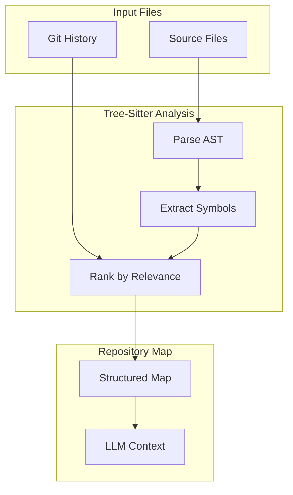
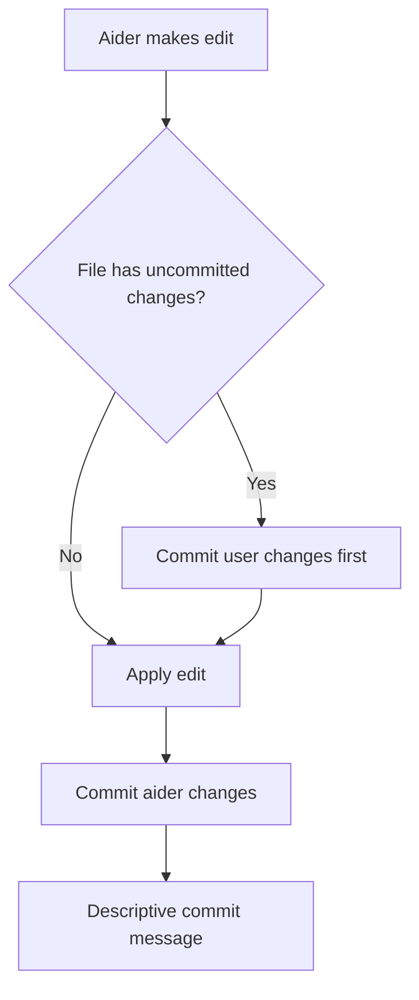

# Aider: AI Pair Programming in Your Terminal

> The most popular open-source AI coding assistant with repository-aware context and multi-model support

---

## Overview

| Attribute | Value |
|-----------|-------|
| Provider | Open Source (Paul Gauthier) |
| Type | CLI Agent |
| Language | Python |
| Source | [github.com/paul-gauthier/aider](https://github.com/paul-gauthier/aider) |
| Stars | 26k+ |
| Multi-Agent | Architect + Editor (two-model) |
| Extension System | Config files, CLI flags, LiteLLM |

Aider is an **AI pair programming** tool that lets you edit code in your local git repository with the help of LLMs. Unlike IDE-integrated tools, Aider runs in your terminal and works with any editor.

### Key Differentiators

| Feature | Description |
|---------|-------------|
| **Repository Map** | Tree-sitter based code analysis for intelligent context |
| **Multi-Model** | 50+ models via LiteLLM (OpenAI, Anthropic, Google, local) |
| **Edit Formats** | Multiple strategies (diff, whole, udiff, architect) |
| **Git Integration** | Auto-commits with descriptive messages |
| **Voice Coding** | Speech-to-code via microphone |
| **Benchmarked** | Top performer on SWE-bench, aider-bench |

---

## Architecture

### System Design

```
┌─────────────────────────────────────────────────────────────────┐
│                      Aider Architecture                          │
├─────────────────────────────────────────────────────────────────┤
│                                                                   │
│  ┌─────────────────────────────────────────────────────────┐    │
│  │                   LLM Providers (LiteLLM)                │    │
│  │  ┌─────────┐  ┌─────────┐  ┌─────────┐  ┌─────────┐    │    │
│  │  │ OpenAI  │  │Anthropic│  │ Google  │  │  Local  │    │    │
│  │  └─────────┘  └─────────┘  └─────────┘  └─────────┘    │    │
│  └─────────────────────────────────────────────────────────┘    │
│                            │                                      │
│                            ▼                                      │
│  ┌─────────────────────────────────────────────────────────┐    │
│  │                    Main Orchestrator                     │    │
│  │  ┌──────────┐  ┌──────────┐  ┌──────────┐  ┌─────────┐ │    │
│  │  │  Coder   │  │ RepoMap  │  │  GitRepo │  │   I/O   │ │    │
│  │  │ Strategy │  │ (context)│  │  (VCS)   │  │ Handler │ │    │
│  │  └──────────┘  └──────────┘  └──────────┘  └─────────┘ │    │
│  └─────────────────────────────────────────────────────────┘    │
│                            │                                      │
│  ┌─────────────────────────┼─────────────────────────────┐      │
│  │           Coder Strategies (Edit Formats)              │      │
│  │  ┌───────┐  ┌───────┐  ┌───────┐  ┌──────────┐       │      │
│  │  │ Diff  │  │ Whole │  │ Udiff │  │ Architect│       │      │
│  │  │Coder  │  │ File  │  │ Coder │  │   Mode   │       │      │
│  │  └───────┘  └───────┘  └───────┘  └──────────┘       │      │
│  └────────────────────────────────────────────────────────┘      │
│                                                                   │
└─────────────────────────────────────────────────────────────────┘
```

### Core Components

| Component | File | Responsibility |
|-----------|------|----------------|
| **Main** | `main.py` | Entry point, CLI parsing, orchestration |
| **Coder** | `coders/base_coder.py` | Base class for all edit strategies |
| **RepoMap** | `repomap.py` | Tree-sitter based repository analysis |
| **GitRepo** | `repo.py` | Git operations, auto-commits |
| **LLM** | `llm.py` | LiteLLM interface for multi-provider support |
| **I/O** | `io.py` | User input/output handling |

### Code Structure

```
aider/
├── main.py              # Entry point
├── coders/              # Edit strategies
│   ├── base_coder.py    # Base Coder class
│   ├── editblock_coder.py  # Diff (search/replace) format
│   ├── wholefile_coder.py  # Whole file replacement
│   └── udiff_coder.py   # Unified diff format
├── repomap.py           # Repository context generation
├── repo.py              # Git integration
├── llm.py               # LLM provider abstraction
├── io.py                # Input/output handling
├── commands.py          # Slash commands
└── prompts.py           # System prompts
```

---

## Repository Map (Key Innovation)

### What is RepoMap?

The Repository Map is Aider's core innovation for providing LLMs with codebase context. It uses **tree-sitter** to analyze code and extract a structured map of:

- Classes and their methods
- Functions and their signatures
- Module structure and imports
- Symbol definitions and references



### How RepoMap Works

1. **Parse**: Tree-sitter parses source files into AST
2. **Extract**: Identify classes, functions, methods, and their signatures
3. **Rank**: Use git history and references to rank symbol importance
4. **Optimize**: Fit maximum context within token budget

### RepoMap Output Example

```text
aider/coders/base_coder.py:
⋮...
│class Coder:
│    abs_fnames = None
⋮...
│    @classmethod
│    def create(self, main_model, edit_format, io, **kwargs):
⋮...
│    def run(self, with_message=None):
⋮...

aider/repomap.py:
⋮...
│class RepoMap:
│    def __init__(self, root, io, ...):
⋮...
│    def get_repo_map(self, chat_files, other_files):
⋮...
```

### Context Window Optimization

| Strategy | Description |
|----------|-------------|
| **Token Budget** | `--map-tokens` controls context size |
| **Relevance Ranking** | Most relevant symbols first |
| **Lazy Refresh** | `--map-refresh auto` updates only when needed |
| **Multiplier** | `--map-multiplier-no-files` expands context when no files specified |

---

## Edit Formats

Aider supports multiple edit formats optimized for different LLMs:

### 1. Diff Format (Default)

Uses search/replace blocks similar to git merge conflict markers:

```text
mathweb/flask/app.py
<<<<<<< SEARCH
from flask import Flask
=======
import math
from flask import Flask
>>>>>>> REPLACE
```

**Best for**: GPT-4, Claude, most capable models

### 2. Whole File Format

Returns complete file contents:

```python
demo.py
```python
def main():
    print("goodbye")
```

**Best for**: Smaller models, simple changes

### 3. Unified Diff Format (udiff)

Standard unified diff format:

```diff
--- a/file.py
+++ b/file.py
@@ -1,3 +1,4 @@
 def main():
-    print("hello")
+    print("goodbye")
```

**Best for**: Models trained on diff data

### 4. Architect Mode (Two-Model)


**Best for**: Reasoning models (o1, o3) that struggle with direct editing

| Role | Purpose | Default Model |
|------|---------|---------------|
| **Architect** | Proposes solution strategy | Main model |
| **Editor** | Translates proposal to edits | gpt-4o-mini or sonnet |

---

## Git Integration

### Auto-Commit Workflow



### Git Features

| Feature | Description |
|---------|-------------|
| **Auto-commits** | Every edit committed automatically |
| **Dirty file handling** | User changes committed separately |
| **Descriptive messages** | LLM-generated commit messages |
| **Undo support** | `/undo` reverts last commit |
| **Diff awareness** | Uses git context for better edits |

### Configuration

```yaml
# .aider.conf.yml
auto-commits: true           # Auto-commit edits (default: true)
dirty-commits: true          # Commit dirty files first (default: true)
attribute-author: true       # Attribute commits to aider
attribute-committer: false   # Set committer to aider
```

---

## Multi-Model Support

### Supported Providers (via LiteLLM)

| Provider | Models | Configuration |
|----------|--------|---------------|
| **OpenAI** | gpt-4o, gpt-4-turbo, o1, o3 | `--model gpt-4o` |
| **Anthropic** | claude-3.5-sonnet, claude-3-opus | `--model sonnet` |
| **Google** | gemini-2.0-flash, gemini-pro | `--model gemini/gemini-2.0-flash` |
| **DeepSeek** | deepseek-chat, deepseek-coder | `--model deepseek` |
| **OpenRouter** | 100+ models | `--model openrouter/...` |
| **Local** | Ollama, LM Studio | `--model ollama/llama3` |
| **Azure** | Azure OpenAI | `--model azure/deployment-name` |

### Model Configuration

```bash
# Command line
aider --model sonnet --api-key anthropic=sk-xxx

# Environment variables
export ANTHROPIC_API_KEY=sk-xxx
aider --model sonnet

# Config file (.aider.conf.yml)
model: anthropic/claude-3.5-sonnet
anthropic-api-key: sk-xxx
```

### Model-Specific Settings

```yaml
# .aider.model.settings.yml
- name: gpt-4o
  edit_format: diff
  use_repo_map: true
  weak_model_name: gpt-4o-mini

- name: claude-3.5-sonnet
  edit_format: diff
  use_repo_map: true
  editor_model_name: claude-3-haiku

- name: deepseek/deepseek-chat
  edit_format: diff
  use_repo_map: true
  extra_params:
    max_tokens: 8192
```

---

## Chat Modes

| Mode | Command | Purpose |
|------|---------|---------|
| **code** | `/chat-mode code` | Edit files directly (default) |
| **ask** | `/chat-mode ask` | Discuss code without editing |
| **architect** | `/chat-mode architect` | Two-model proposal + edit |
| **help** | `/chat-mode help` | Get help about Aider |

---

## Customization Points

Based on comprehensive research, Aider provides **10 major customization categories**:

### 1. Configuration Files

| File | Location | Purpose |
|------|----------|---------|
| `.aider.conf.yml` | Home / Git root / Current dir | Main YAML configuration |
| `.env` | Home / Git root / Current dir | API keys and env vars |
| `.aider.model.settings.yml` | Same locations | Model-specific settings |
| `.aider.model.metadata.json` | Same locations | Token limits, costs |
| `.aider.input.history` | Current dir | Command history |
| `.aider.chat.history.md` | Current dir | Chat transcript |

**Loading order**: Home → Git root → Current dir (later overrides earlier)

### 2. CLI Options (100+ Flags)

```bash
# Model selection
--model <model>              # Main model
--weak-model <model>         # Commit message model
--editor-model <model>       # Editor model (architect mode)
--edit-format <format>       # diff, whole, udiff

# Context management
--map-tokens <n>             # Repo map token budget
--map-refresh <mode>         # auto, always, files, manual
--max-chat-history-tokens <n>

# Git options
--auto-commits / --no-auto-commits
--dirty-commits / --no-dirty-commits
--auto-lint / --no-auto-lint
--auto-test / --no-auto-test

# Integration
--lint-cmd <cmd>             # Linter command
--test-cmd <cmd>             # Test command
--watch-files                # Watch mode
--browser                    # Browser UI
```

### 3. Model Configuration

**Custom endpoints**:
```yaml
# .aider.conf.yml
openai-api-base: https://my-proxy.com/v1
openai-api-key: my-key
model: gpt-4o
```

**Model aliases**:
```yaml
alias:
  - mymodel:openrouter/anthropic/claude-3.5-sonnet
```

### 4. Edit Format Selection

| Format | When to Use | Configuration |
|--------|-------------|---------------|
| `diff` | Most models, accurate edits | `--edit-format diff` |
| `whole` | Simple changes, small files | `--edit-format whole` |
| `udiff` | Diff-trained models | `--edit-format udiff` |
| `architect` | Reasoning models (o1) | `--architect` |

### 5. Repository Map Settings

```yaml
# .aider.conf.yml
map-tokens: 2048             # Token budget for repo map
map-refresh: auto            # When to refresh (auto/always/files/manual)
map-multiplier-no-files: 2   # Expand context when no files selected
```

### 6. Git Configuration

```yaml
# .aider.conf.yml
auto-commits: true
dirty-commits: true
attribute-author: true
attribute-committer: false
commit-prompt: "Generate a concise commit message"
```

### 7. Lint & Test Integration

```bash
# Lint command (auto-fix loop)
aider --lint-cmd "ruff check --fix"

# Test command (auto-fix loop)
aider --test-cmd "pytest tests/"

# Both (fix lint, then run tests)
aider --auto-lint --auto-test --lint-cmd "ruff" --test-cmd "pytest"
```

**Auto-fix loop**:
1. Make edit → 2. Run lint → 3. If fail, ask LLM to fix → 4. Repeat

### 8. Voice Coding

```bash
# Install dependencies
pip install aider-chat[voice]  # or: brew install portaudio

# Enable voice
aider --voice-language en

# In session
/voice  # Start voice input
```

### 9. Browser UI

```bash
# Launch browser interface
aider --browser

# With specific port
aider --browser --browser-port 8080
```

### 10. Watch Mode

```bash
# Watch for file changes and AI comments
aider --watch-files

# In watched files, add comments like:
# AI: refactor this function to use async/await
```

### Customization Summary

| Point | Configuration | Shareable |
|-------|---------------|-----------|
| **Config Files** | `.aider.conf.yml`, `.env` | Yes |
| **Model Settings** | `.aider.model.settings.yml` | Yes |
| **CLI Flags** | `--flag value` | N/A |
| **Edit Formats** | `--edit-format <fmt>` | Yes |
| **Repo Map** | `--map-tokens <n>` | Yes |
| **Git** | `--auto-commits` | Yes |
| **Lint/Test** | `--lint-cmd`, `--test-cmd` | Yes |
| **Voice** | `--voice-language` | N/A |
| **Browser** | `--browser` | N/A |
| **Watch** | `--watch-files` | N/A |

---

## Slash Commands

| Command | Description |
|---------|-------------|
| `/add <file>` | Add file to chat context |
| `/drop <file>` | Remove file from context |
| `/ls` | List files in context |
| `/clear` | Clear chat history |
| `/undo` | Undo last commit |
| `/diff` | Show current diff |
| `/commit` | Commit with message |
| `/run <cmd>` | Run shell command |
| `/test` | Run test command |
| `/lint` | Run lint command |
| `/voice` | Start voice input |
| `/help` | Show help |
| `/quit` | Exit aider |

---

## Benchmarks

Aider maintains comprehensive benchmarks:

### SWE-bench Performance

| Model | Score | Edit Format |
|-------|-------|-------------|
| Claude 3.5 Sonnet | 49.0% | diff |
| GPT-4o | 44.2% | diff |
| DeepSeek v3 | 42.8% | diff |
| GPT-4 Turbo | 38.1% | diff |

### Aider-bench (Edit Accuracy)

Tests model's ability to follow edit format instructions:

| Model | Accuracy |
|-------|----------|
| Claude 3.5 Sonnet | 95%+ |
| GPT-4o | 93%+ |
| GPT-4 Turbo | 89%+ |

---

## Comparison Summary

### vs. Other Tools

| Feature | Aider | Claude Code | Codex | OpenCode |
|---------|-------|-------------|-------|----------|
| Open Source | **Yes** | No | Yes | Yes |
| Multi-Provider | **Yes (50+)** | No | No | Yes |
| Repository Map | **Yes** | No | No | No |
| Voice Coding | **Yes** | No | No | No |
| Auto-Commits | **Yes** | Checkpoint | No | No |
| Edit Formats | **4** | 1 | 1 | 1 |
| Architect Mode | **Yes** | Subagents | No | No |
| Benchmarked | **Yes** | No | No | No |

### When to Use Aider

| Use Case | Recommendation |
|----------|----------------|
| Multi-provider flexibility | **Recommended** |
| Voice coding | **Recommended** |
| Repository-aware context | **Recommended** |
| Auto-commit workflows | **Recommended** |
| VSCode/IDE integration | Use Cursor/Continue |
| Real-time collaboration | Use Cursor |

---

## Integration Patterns

### Editor Integration

Aider works alongside any editor - edit in your editor, chat in terminal:

```bash
# Terminal 1: Run aider
aider

# Terminal 2: Edit with vim/vscode/etc
vim myfile.py

# In aider, /add the file to sync changes
```

### CI/CD Integration

```bash
# Automated code review
aider --yes --message "Review and fix lint errors" --lint-cmd "ruff check"

# Automated refactoring
aider --yes --message "Update deprecated APIs" --auto-commits
```

### Scripting

```python
# Python API (experimental)
from aider.coders import Coder
from aider.models import Model

model = Model("gpt-4o")
coder = Coder.create(main_model=model, fnames=["file.py"])
coder.run("Add docstrings to all functions")
```

---

## Resources

| Resource | URL |
|----------|-----|
| Documentation | https://aider.chat |
| GitHub | https://github.com/paul-gauthier/aider |
| Discord | https://discord.gg/aider |
| Benchmarks | https://aider.chat/docs/leaderboards |
| Blog | https://aider.chat/blog |

---

## See Also

- [../README.md](../README.md) - Tools overview
- [../BEST-PRACTICES.md](../BEST-PRACTICES.md) - Combined best practices
- [../UNIFIED-HARNESS.md](../UNIFIED-HARNESS.md) - Multi-provider harness
