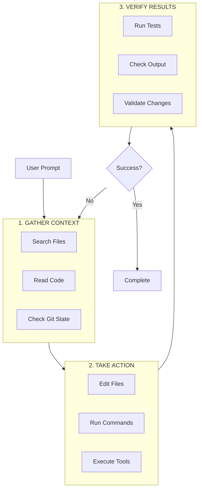
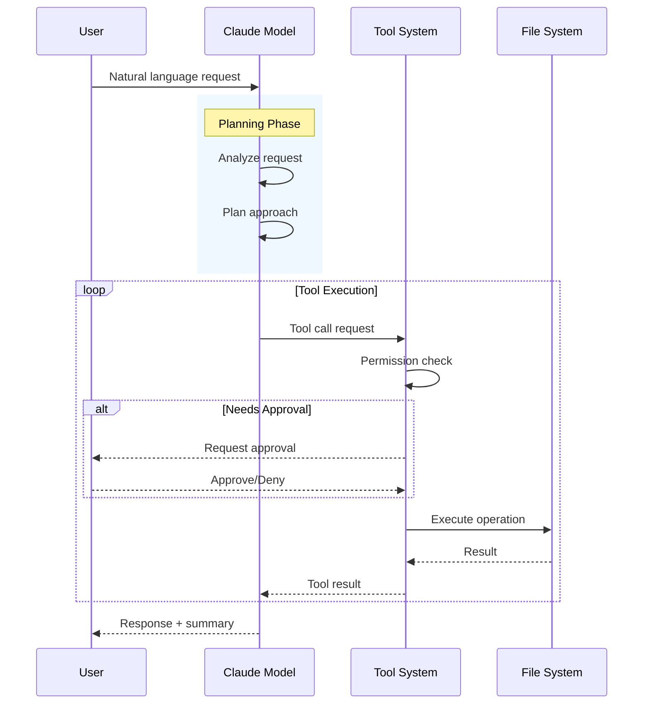
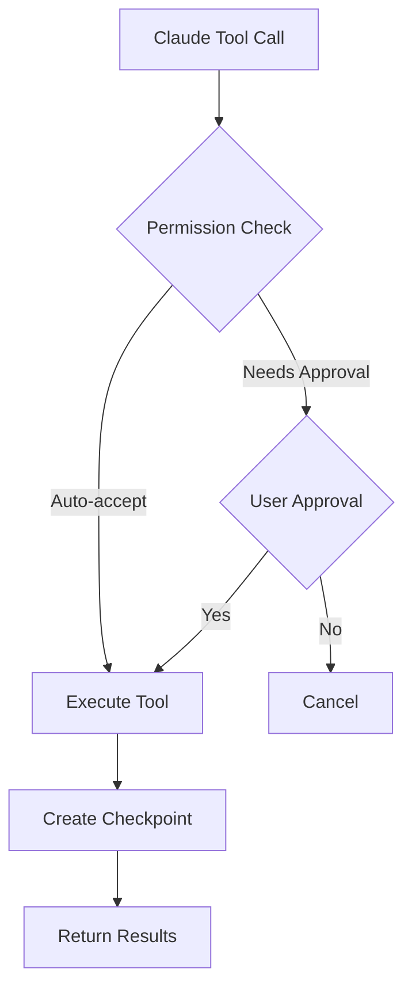
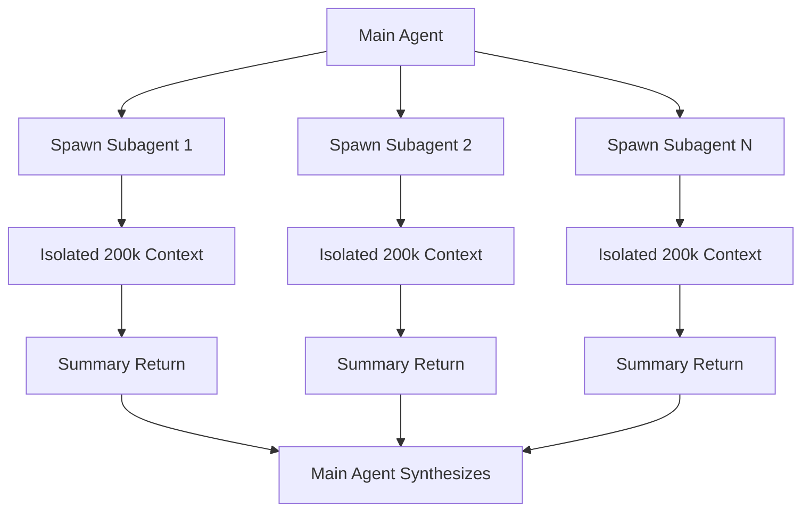

# Claude Code: Agentic Coding Assistant

> Anthropic's official CLI for Claude with tool orchestration and MCP integration

---

## Overview

| Attribute | Value |
|-----------|-------|
| Provider | Anthropic |
| Type | CLI Agent |
| Language | TypeScript/Node.js |
| Source | Proprietary (Anthropic) |
| Multi-Agent | Subagent Delegation |
| Extension System | MCP, Skills, Hooks |

Claude Code is an **agentic coding assistant** that runs as a CLI tool in the terminal. It acts as an **agentic harness** around Claude AI models, providing tools, context management, and execution environment.

---

## Architecture

### System Design

```
┌─────────────────────────────────────────────────────────────────┐
│                     Claude Code Architecture                      │
├─────────────────────────────────────────────────────────────────┤
│                                                                   │
│  ┌─────────────────────────────────────────────────────────┐    │
│  │                  Claude AI Models                        │    │
│  │  ┌─────────┐  ┌─────────┐  ┌─────────┐                  │    │
│  │  │  Haiku  │  │ Sonnet  │  │  Opus   │                  │    │
│  │  │ (Fast)  │  │(Balanced│  │(Complex)│                  │    │
│  │  └─────────┘  └─────────┘  └─────────┘                  │    │
│  └─────────────────────────────────────────────────────────┘    │
│                            │                                      │
│                            ▼                                      │
│  ┌─────────────────────────────────────────────────────────┐    │
│  │                   Agentic Harness                        │    │
│  │  ┌──────────┐  ┌──────────┐  ┌──────────┐  ┌─────────┐ │    │
│  │  │   Tool   │  │ Context  │  │ Session  │  │Permission│ │    │
│  │  │ Registry │  │ Manager  │  │  State   │  │ System  │ │    │
│  │  └──────────┘  └──────────┘  └──────────┘  └─────────┘ │    │
│  └─────────────────────────────────────────────────────────┘    │
│                            │                                      │
│  ┌─────────────────────────┼─────────────────────────────┐      │
│  │           Extension Layer                              │      │
│  │  ┌───────┐  ┌───────┐  ┌───────┐  ┌──────────┐       │      │
│  │  │Skills │  │  MCP  │  │ Hooks │  │Subagents │       │      │
│  │  └───────┘  └───────┘  └───────┘  └──────────┘       │      │
│  └────────────────────────────────────────────────────────┘      │
│                                                                   │
└─────────────────────────────────────────────────────────────────┘
```

### Core Components

| Component | Purpose |
|-----------|---------|
| **Claude AI Models** | Reasoning engine (Haiku/Sonnet/Opus) |
| **Tool Registry** | Built-in tools (file ops, search, exec, web) |
| **Context Manager** | Automatic compaction, prioritization |
| **Session State** | Checkpoints, conversation history |
| **Permission System** | Approval flows, trust levels |

### Built-in Tools (4 Categories)

| Category | Tools | Purpose |
|----------|-------|---------|
| **File Operations** | Read, Edit, Create, Rename | File manipulation |
| **Search** | Glob, Grep, LSP | Codebase exploration |
| **Execution** | Bash, Git, Test runners | Command execution |
| **Web** | Search, Fetch, Docs | External resources |

---

## Event Loop

### The Agentic Loop (Three-Phase)



### Loop Characteristics

| Characteristic | Description |
|----------------|-------------|
| **Adaptive** | Phases blend; Claude decides each step |
| **Interruptible** | User can interrupt at any point |
| **Autonomous** | Chains dozens of actions, self-correcting |
| **Tool-driven** | Every phase uses tools |

### Message Flow



---

## Tool Execution Flow

### Permission System



### Permission Modes

| Mode | File Edits | Shell Commands | Use Case |
|------|-----------|----------------|----------|
| **Default** | Ask | Ask | Standard safety |
| **Auto-accept edits** | Auto | Ask | Trusted file ops |
| **Plan mode** | Deny | Deny | Read-only analysis |

### Checkpoint System

| Feature | Description |
|---------|-------------|
| **Before Edit** | Snapshot current file contents |
| **Local to Session** | Separate from git |
| **Rewind** | Press `Esc` twice to undo |
| **Limitation** | Can't checkpoint DB/API changes |

---

## Multi-Agent Capabilities

### Subagent Delegation



### Delegation Benefits

| Benefit | Description |
|---------|-------------|
| **Isolated Context** | Each subagent gets fresh 200k window |
| **No Bloat** | Subagent work doesn't consume main context |
| **Summary Return** | Only final results returned to main |
| **Parallel Potential** | Multiple subagents can run concurrently |

---

## Extension System

### Four Extension Layers

```
┌──────────────────────────────────────┐
│       Core Tools (built-in)          │
├──────────────────────────────────────┤
│    Skills (on-demand workflows)      │
├──────────────────────────────────────┤
│    MCP (external services)           │
├──────────────────────────────────────┤
│    Hooks (automation)                │
├──────────────────────────────────────┤
│    Subagents (delegation)            │
└──────────────────────────────────────┘
```

### Skills System

| Aspect | Description |
|--------|-------------|
| **Loading** | Lazy (descriptions visible, content on-demand) |
| **Invocation** | Slash commands (`/skill-name`) |
| **Location** | `~/.claude/commands/` |
| **Purpose** | Complex multi-step workflows |

### MCP Integration

| Feature | Description |
|---------|-------------|
| **Protocol** | Model Context Protocol (JSON-RPC) |
| **Servers** | External services connected via MCP |
| **Tools** | Each MCP server provides tools |
| **Config** | `~/.claude/settings.json` |

### Hook System

| Hook Type | Trigger | Use Case |
|-----------|---------|----------|
| `pre-edit` | Before file modification | Validation |
| `post-edit` | After file modification | Formatting |
| `pre-command` | Before shell execution | Safety check |
| `post-command` | After shell execution | Logging |
| `pre-task` | Before task start | Setup |
| `post-task` | After task completion | Cleanup |

---

## Session Management

### Session Properties

| Property | Description |
|----------|-------------|
| **Ephemeral** | No persistent memory between sessions |
| **Directory-scoped** | Sessions tied to working directory |
| **Resumable** | `claude --continue` or `--resume` |
| **Forkable** | `--fork-session` creates branch |

### CLAUDE.md Configuration

| Purpose | Description |
|---------|-------------|
| **Persistent Instructions** | Loaded every session |
| **Project Context** | Project-specific rules |
| **Custom Commands** | Define slash commands |
| **Location** | Project root or `~/.claude/` |

---

## Context Window Management

### Automatic Strategies

| Strategy | Description |
|----------|-------------|
| **Compaction** | Clears old tool outputs, summarizes |
| **Preservation Priority** | User requests > code > instructions |
| **Lazy Loading** | Skills loaded on-demand |
| **Subagent Isolation** | Heavy work in separate contexts |

### Priority Order

1. User's explicit requests
2. Code snippets and file contents
3. Detailed instructions
4. Tool outputs (summarized)
5. Conversation history (oldest removed first)

---

## Integration Patterns

### CLI Usage

```bash
# Start session
claude

# Continue previous session
claude --continue

# Plan mode (read-only)
claude --plan

# With specific model
claude --model opus

# Fork from session
claude --fork-session <session-id>
```

### Common Workflows

| Workflow | Commands |
|----------|----------|
| **Code Review** | Read files → Analyze → Report |
| **Bug Fix** | Search → Identify → Edit → Test |
| **Feature** | Plan → Implement → Test → Document |
| **Refactor** | Analyze → Edit → Verify |

---

## Comparison Summary

### vs. Other Tools

| Feature | Claude Code | OpenCode | Kata |
|---------|-------------|----------|------|
| Provider Lock | Anthropic only | Multi-provider | Anthropic only |
| Open Source | No | Yes | Yes |
| Multi-Agent | Subagents | 2 modes | Phase-based |
| Extension System | MCP + Skills + Hooks | Plugins | Skills |
| Context Management | Automatic | Manual | Artifacts |

### When to Use Claude Code

| Use Case | Recommendation |
|----------|----------------|
| Anthropic-only workflows | **Recommended** |
| MCP ecosystem integration | **Recommended** |
| Simple single-agent tasks | **Recommended** |
| Multi-provider needs | Use OpenCode |
| Complex orchestration | Use Kata/GSD |

---

## Resources

| Resource | URL |
|----------|-----|
| Documentation | https://docs.anthropic.com/claude-code |
| MCP Specification | https://modelcontextprotocol.io |
| GitHub (plugins) | https://github.com/anthropics/claude-code |

---

## See Also

- [../README.md](../README.md) - Tools overview
- [diagrams.md](diagrams.md) - Detailed architecture diagrams
- [examples.md](examples.md) - Usage examples
- [../BEST-PRACTICES.md](../BEST-PRACTICES.md) - Integration patterns
