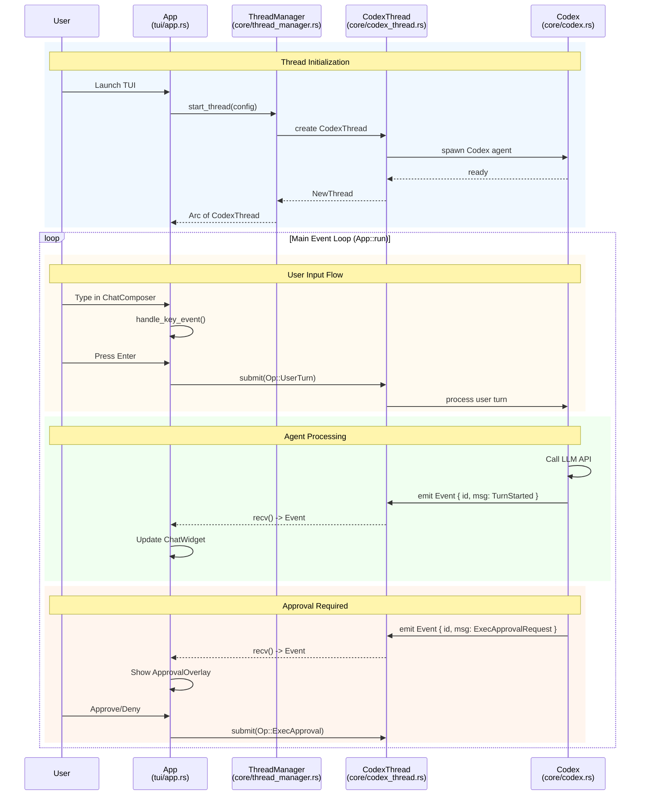
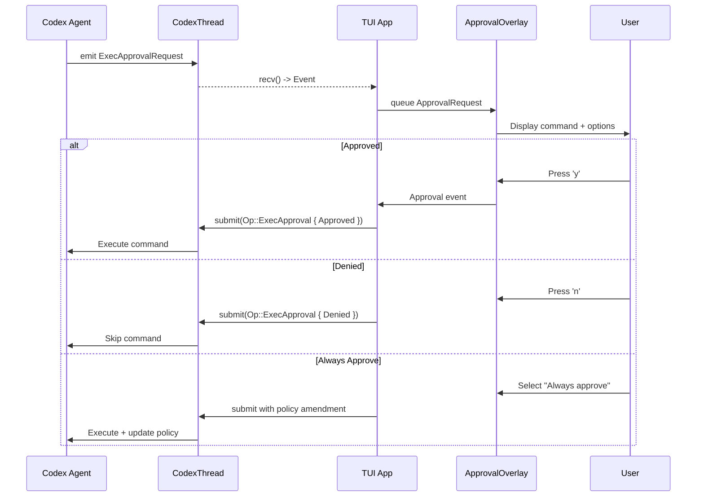
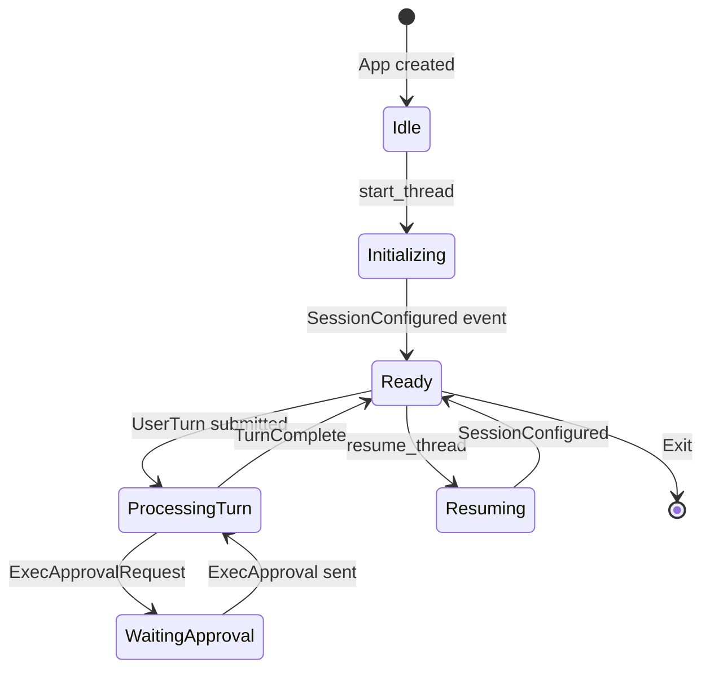
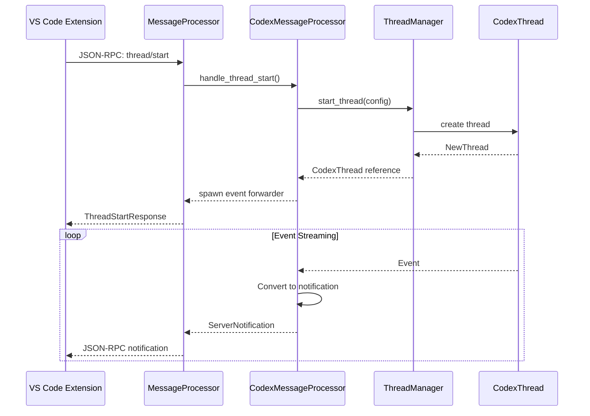

# Codex: OpenAI's Rust TUI Agent

> The original AI coding agent with sophisticated TUI and channel-based architecture

---

## Overview

| Attribute | Value |
|-----------|-------|
| Provider | OpenAI |
| Type | CLI/TUI Agent |
| Source | [github.com/openai/codex](https://github.com/openai/codex) |
| Language | Rust |
| TUI Framework | Ratatui |
| Multi-Agent | Single thread per session |

Codex is **OpenAI's original AI coding agent** built in Rust. It features a sophisticated Terminal User Interface (TUI) built with Ratatui and a channel-based communication architecture that provides the foundation for modern AI coding assistants.

---

## Architecture

### System Design

```
┌─────────────────────────────────────────────────────────────────┐
│                       Codex Architecture                         │
├─────────────────────────────────────────────────────────────────┤
│                                                                   │
│  ┌─────────────────────────────────────────────────────────┐    │
│  │                   TUI Layer (codex-rs/tui)               │    │
│  │  ┌─────────┐  ┌──────────┐  ┌────────────┐  ┌────────┐ │    │
│  │  │   App   │  │ChatWidget│  │ChatComposer│  │Approval│ │    │
│  │  │ struct  │  │          │  │            │  │Overlay │ │    │
│  │  └─────────┘  └──────────┘  └────────────┘  └────────┘ │    │
│  └─────────────────────────────────────────────────────────┘    │
│                            │                                      │
│                     submit(Op) / recv(Event)                      │
│                            │                                      │
│  ┌─────────────────────────────────────────────────────────┐    │
│  │                  Core Layer (codex-rs/core)              │    │
│  │  ┌───────────────┐  ┌───────────────┐  ┌─────────────┐ │    │
│  │  │ ThreadManager │  │  CodexThread  │  │    Codex    │ │    │
│  │  │  (orchestrates│  │   (per-session│  │   (agent    │ │    │
│  │  │   threads)    │  │    channel)   │  │    logic)   │ │    │
│  │  └───────────────┘  └───────────────┘  └─────────────┘ │    │
│  └─────────────────────────────────────────────────────────┘    │
│                            │                                      │
│  ┌─────────────────────────────────────────────────────────┐    │
│  │              Protocol Layer (codex-rs/protocol)          │    │
│  │  ┌───────────┐  ┌───────────┐  ┌───────────────────┐   │    │
│  │  │  Op enum  │  │EventMsg   │  │Event { id, msg }  │   │    │
│  │  │(user→agent│  │(agent→user│  │   (wrapper)       │   │    │
│  │  └───────────┘  └───────────┘  └───────────────────┘   │    │
│  └─────────────────────────────────────────────────────────┘    │
│                            │                                      │
│  ┌─────────────────────────────────────────────────────────┐    │
│  │           App Server (codex-rs/app-server)               │    │
│  │  ┌─────────────────┐  ┌─────────────────────────────┐  │    │
│  │  │MessageProcessor │  │ CodexMessageProcessor       │  │    │
│  │  │  (JSON-RPC for  │  │   (handles VS Code, etc.)   │  │    │
│  │  │   external)     │  │                             │  │    │
│  │  └─────────────────┘  └─────────────────────────────┘  │    │
│  └─────────────────────────────────────────────────────────┘    │
│                                                                   │
└─────────────────────────────────────────────────────────────────┘
```

### Key Insight

**TUI communicates directly with ThreadManager, NOT through MessageProcessor.**

```
CORRECT:  TUI App → ThreadManager → CodexThread → Codex
WRONG:    TUI App → MessageProcessor → ThreadManager
```

MessageProcessor is only for external JSON-RPC clients (VS Code, etc.).

---

## Event Loop

### Main Communication Flow



### Event Loop Pattern

```rust
loop {
    select! {
        event = codex_thread.recv() => handle_event(event),
        input = terminal.read() => handle_input(input),
        _ = tick.tick() => handle_tick(),
    }
}
```

---

## Message Types

### Op Enum (User → Agent)

```rust
pub enum Op {
    /// Abort current task
    Interrupt,
    
    /// User submits a message/turn
    UserTurn {
        items: Vec<UserInput>,
        cwd: PathBuf,
        model: Option<String>,
    },
    
    /// Response to exec approval request
    ExecApproval {
        id: String,
        decision: ReviewDecision,
    },
    
    /// Response to patch approval request  
    ApplyPatchApproval {
        id: String,
        decision: ReviewDecision,
    },
    
    /// Undo last action
    Undo,
    
    /// Run user shell command (! prefix)
    RunUserShellCommand { command: String },
}
```

### EventMsg Enum (Agent → User)

```rust
pub enum EventMsg {
    /// Error during execution
    Error(ErrorEvent),
    
    /// Session configured (first event)
    SessionConfigured(SessionConfiguredEvent),
    
    /// Turn started
    TurnStarted(TurnStartedEvent),
    
    /// Turn completed
    TurnComplete(TurnCompleteEvent),
    
    /// Agent message (text response)
    AgentMessage(AgentMessageEvent),
    
    /// Command execution started
    ExecCommandBegin(ExecCommandBeginEvent),
    
    /// Command execution ended
    ExecCommandEnd(ExecCommandEndEvent),
    
    /// Approval request for command
    ExecApprovalRequest(ExecApprovalRequestEvent),
    
    /// Approval request for file patch
    ApplyPatchApprovalRequest(ApplyPatchApprovalRequestEvent),
}
```

### Event Wrapper

```rust
pub struct Event {
    pub id: String,
    pub msg: EventMsg,
}
```

---

## Approval System

### Queue-Based Approval



### ApprovalOverlay Structure

```rust
pub struct ApprovalOverlay {
    current_request: Option<ApprovalRequest>,
    current_variant: Option<ApprovalVariant>,
    queue: Vec<ApprovalRequest>,
    app_event_tx: AppEventSender,
}
```

---

## State Machine

### Thread States



### State Descriptions

| State | Description | Allowed Operations |
|-------|-------------|-------------------|
| Created | Thread initialized | Start |
| Ready | Waiting for input | UserTurn, Configure |
| Processing | Working on turn | Interrupt |
| WaitingApproval | Blocked on approval | ExecApproval |
| Error | Recoverable error | Retry, Abort |
| Terminated | Thread finished | None |

---

## Thread Management

### ThreadManager

```rust
struct ThreadManager {
    threads: HashMap<ThreadId, CodexThread>,
    active_thread: Option<ThreadId>,
}
```

### Thread Lifecycle

```
start_thread(config) → NewThread event → Ready state
                    ↓
              Session active
                    ↓
              ProcessingTurn ←→ WaitingApproval
                    ↓
                  Exit
```

### Thread Configuration

| Option | Purpose |
|--------|---------|
| `model` | LLM model to use |
| `system_prompt` | Initial instructions |
| `tools` | Available tool set |
| `timeout` | Maximum turn duration |
| `max_tokens` | Output token limit |

---

## External Client Support

### JSON-RPC for VS Code



---

## Key Architectural Patterns

### 1. Direct Channel Communication

```
App (TUI) ──submit(Op)──> CodexThread ──> Codex (Agent)
    <──────recv()─────── Event stream <──
```

**Benefits**: Reduces latency, simplifies debugging, maintains type safety.

### 2. Operation/Event Model

| Direction | Type | Examples |
|-----------|------|----------|
| User → Agent | `Op` enum | UserTurn, ExecApproval, Interrupt |
| Agent → User | `EventMsg` enum | TurnStarted, TurnComplete, ExecApprovalRequest |

### 3. Queue-Based Approval

Prevents UI overwhelm, ensures sequential user decisions.

### 4. Thread Isolation

Each thread has independent state, resources, and history.

---

## File Locations

| Component | File Path |
|-----------|-----------|
| App struct | `codex-rs/tui/src/app.rs` |
| ChatWidget | `codex-rs/tui/src/chatwidget.rs` |
| ChatComposer | `codex-rs/tui/src/bottom_pane/chat_composer.rs` |
| ApprovalOverlay | `codex-rs/tui/src/bottom_pane/approval_overlay.rs` |
| AppEvent | `codex-rs/tui/src/app_event.rs` |
| ThreadManager | `codex-rs/core/src/thread_manager.rs` |
| CodexThread | `codex-rs/core/src/codex_thread.rs` |
| Codex | `codex-rs/core/src/codex.rs` |
| Op enum | `codex-rs/protocol/src/protocol.rs` |
| EventMsg enum | `codex-rs/protocol/src/protocol.rs` |
| MessageProcessor | `codex-rs/app-server/src/message_processor.rs` |

---

## Comparison Summary

### vs. Other Tools

| Feature | Codex | Claude Code | OpenCode |
|---------|-------|-------------|----------|
| Language | Rust | TypeScript | TypeScript |
| TUI Framework | Ratatui | - | @clack/prompts |
| Communication | Direct channels | MCP | Client/Server |
| Provider | OpenAI only | Anthropic only | Multi-provider |
| Open Source | Yes | Partial | Yes |
| Multi-Agent | Single thread | Subagents | Built-in agents |

### When to Use Codex

| Use Case | Recommendation |
|----------|----------------|
| OpenAI-only workflows | **Recommended** |
| Rust integration | **Recommended** |
| TUI-focused development | **Recommended** |
| Learning agent architecture | **Highly Recommended** |
| Multi-provider needs | Use OpenCode |

---

## Resources

| Resource | URL |
|----------|-----|
| GitHub | https://github.com/openai/codex |
| Protocol Types | `codex-rs/protocol/src/protocol.rs` |
| TUI Implementation | `codex-rs/tui/` |
| Core Implementation | `codex-rs/core/` |

---

## See Also

- [../README.md](../README.md) - Tools overview
- [diagrams.md](diagrams.md) - Detailed architecture diagrams
- [examples.md](examples.md) - Usage examples
- [../../CONCEPTS.md](../../CONCEPTS.md) - Core patterns from Codex study
- [../../architecture-diagram.md](../../architecture-diagram.md) - Original detailed diagrams
