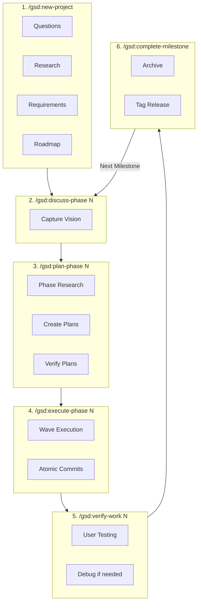
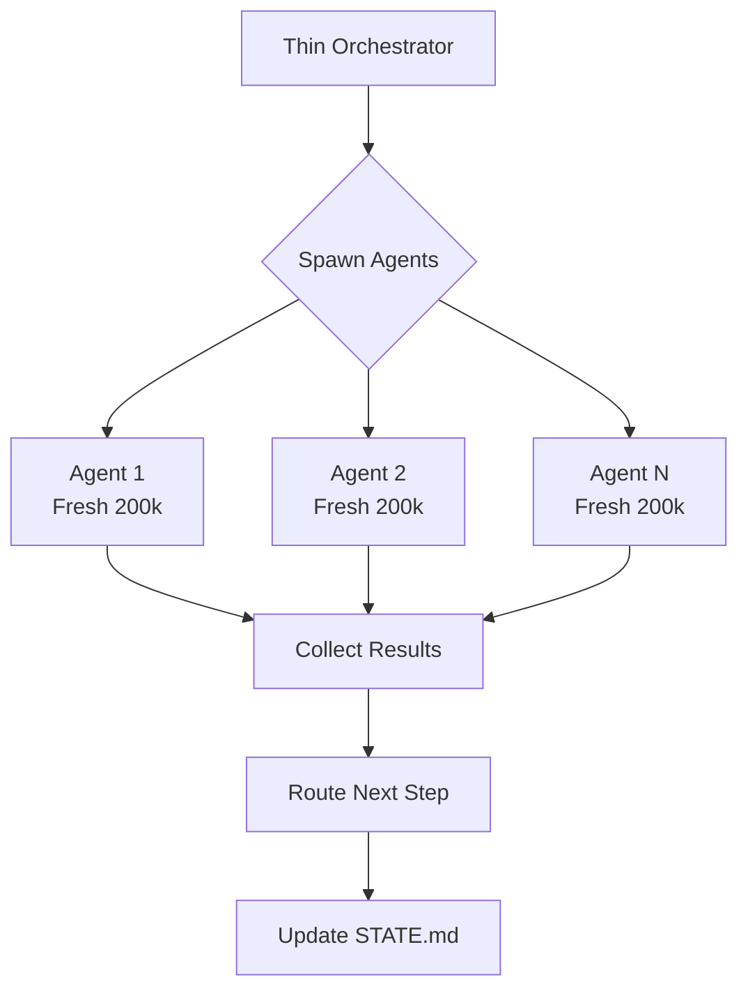
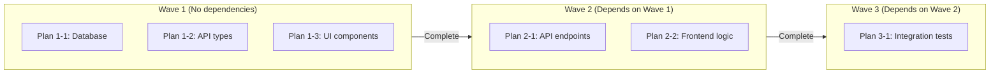
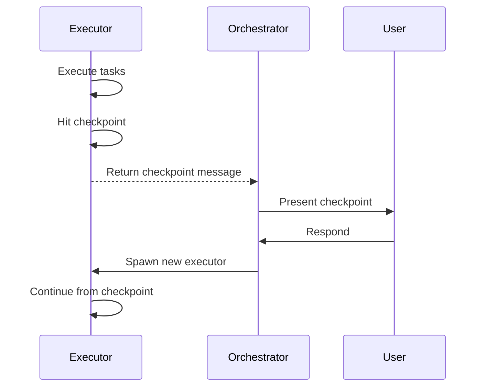

# Get-Shit-Done (GSD): Meta-Prompting Framework

> Context engineering and spec-driven development for solo developers

---

## Overview

| Attribute | Value |
|-----------|-------|
| Type | Meta-Prompting Framework |
| Source | [github.com/glittercowboy/get-shit-done](https://github.com/glittercowboy/get-shit-done) |
| Runtimes | Claude Code, OpenCode, Gemini CLI |
| License | MIT |
| Target | Solo developers |
| Install | `npx get-shit-done-cc` |

Get-Shit-Done (GSD) is a **meta-prompting, context engineering, and spec-driven development system** designed for Claude Code, OpenCode, and Gemini CLI. It solves the **context rot problem** - quality degradation as the context window fills.

---

## Architecture

### System Design

```
┌─────────────────────────────────────────────────────────────────┐
│                       GSD Architecture                           │
├─────────────────────────────────────────────────────────────────┤
│                                                                   │
│  ┌─────────────────────────────────────────────────────────┐    │
│  │              User Commands Layer                         │    │
│  │  /gsd:new-project  /gsd:plan-phase  /gsd:execute-phase  │    │
│  │  /gsd:verify-work  /gsd:quick  /gsd:complete-milestone  │    │
│  └─────────────────────────────────────────────────────────┘    │
│                            │                                      │
│                            ▼                                      │
│  ┌─────────────────────────────────────────────────────────┐    │
│  │         Thin Orchestrators (30-40% context)              │    │
│  │  ┌───────────┐  ┌───────────┐  ┌───────────┐           │    │
│  │  │ Coordinate│  │   Spawn   │  │  Collect  │           │    │
│  │  │ Workflow  │  │  Agents   │  │  Results  │           │    │
│  │  └───────────┘  └───────────┘  └───────────┘           │    │
│  └─────────────────────────────────────────────────────────┘    │
│                            │                                      │
│                            ▼                                      │
│  ┌─────────────────────────────────────────────────────────┐    │
│  │         Specialized Agents (Fresh 200k each)             │    │
│  │  ┌─────────┐  ┌─────────┐  ┌─────────┐  ┌─────────┐    │    │
│  │  │ planner │  │executor │  │verifier │  │debugger │    │    │
│  │  └─────────┘  └─────────┘  └─────────┘  └─────────┘    │    │
│  │  ┌─────────┐  ┌─────────┐  ┌─────────┐  ┌─────────┐    │    │
│  │  │research-│  │ codebase│  │integra- │  │ road-   │    │    │
│  │  │   ers   │  │  mapper │  │  tion   │  │ mapper  │    │    │
│  │  └─────────┘  └─────────┘  └─────────┘  └─────────┘    │    │
│  └─────────────────────────────────────────────────────────┘    │
│                            │                                      │
│                            ▼                                      │
│  ┌─────────────────────────────────────────────────────────┐    │
│  │              Artifacts (.planning/ directory)            │    │
│  │  PROJECT.md  ROADMAP.md  STATE.md  PLAN.md  SUMMARY.md  │    │
│  └─────────────────────────────────────────────────────────┘    │
│                                                                   │
└─────────────────────────────────────────────────────────────────┘
```

### Key Principle: Context Engineering

| Problem | Solution |
|---------|----------|
| Context rot | Plans sized to stay under 50% context |
| Quality degradation | Fresh 200k context per executor |
| Main context overflow | Heavy work in subagent contexts |

---

## 6-Step Development Cycle

### Primary Workflow



---

## Multi-Agent System

### 11 Specialized Agents

| Agent | Purpose | Tools |
|-------|---------|-------|
| `gsd-planner` | Creates executable plans | Read, Write, Bash, WebFetch, Context7 |
| `gsd-executor` | Implements tasks | Read, Write, Edit, Bash, Grep, Glob |
| `gsd-verifier` | Confirms deliverables | Read, Bash, Grep, Glob |
| `gsd-plan-checker` | Validates plans | Read, Bash, Grep |
| `gsd-phase-researcher` | Implementation approaches | Read, Write, WebFetch, Context7 |
| `gsd-project-researcher` | Domain research (4 parallel) | Read, Write, WebFetch, Context7 |
| `gsd-roadmapper` | Creates phase structure | Read, Write, Bash |
| `gsd-debugger` | Systematic debugging | Read, Write, Edit, Bash, Grep, Glob |
| `gsd-codebase-mapper` | Analyzes existing code | Read, Bash, Grep, Glob |
| `gsd-integration-checker` | Validates integrations | Read, Bash, Grep |
| `gsd-research-synthesizer` | Consolidates findings | Read, Write, Bash |

### Orchestration Pattern



---

## Wave-Based Execution

### Dependency Analysis



### Execution Configuration

| Setting | Default | Description |
|---------|---------|-------------|
| `parallel_plans` | true | Enable wave parallelization |
| `max_concurrent` | 3 | Max parallel executors |
| `min_plans_parallel` | 2 | Minimum plans for parallel |

---

## Checkpoint System

### Checkpoint Types

| Type | Usage | Example |
|------|-------|---------|
| `checkpoint:human-verify` | 90% of checkpoints | "Visit localhost:3000 and confirm layout" |
| `checkpoint:decision` | User choice needed | "Choose: Auth0, Clerk, or custom JWT" |
| `checkpoint:secret` | Sensitive data | "Enter your Stripe API key" |

### Checkpoint Flow



### Checkpoint Philosophy

| Principle | Description |
|-----------|-------------|
| **Automation-first** | Claude automates everything it can |
| **Human judgment only** | Checkpoints for things AI can't verify |
| **Never CLI commands** | Don't ask user to run commands |

---

## Artifact System

### .planning/ Directory Structure

```
.planning/
├── PROJECT.md              # Project vision (always loaded)
├── REQUIREMENTS.md         # Scoped requirements
├── ROADMAP.md              # Phase structure
├── STATE.md                # Living memory, decisions, blockers
├── config.json             # Workflow preferences
├── research/               # Domain research (4 parallel)
├── codebase/               # Brownfield analysis (optional)
├── {phase}-CONTEXT.md      # User's implementation vision
├── {phase}-RESEARCH.md     # Phase-specific research
├── {phase}-{N}-PLAN.md     # Executable task plans
├── {phase}-{N}-SUMMARY.md  # Execution summaries
├── {phase}-VERIFICATION.md # Automated verification
├── {phase}-UAT.md          # User acceptance results
└── quick/                  # Ad-hoc tasks
    └── 001-task-name/
        ├── PLAN.md
        └── SUMMARY.md
```

### STATE.md Example

```markdown
## Current Position
Phase: 3 (Authentication)
Plan: 2 (JWT implementation)
Status: executing

## Accumulated Decisions
- Using jose library (not jsonwebtoken - CommonJS issues)
- Refresh tokens stored in httpOnly cookies
- Access tokens in memory only

## Blockers
- None

## Alignment Status
✓ On track with roadmap
```

---

## Model Profiles

| Profile | Planning | Execution | Verification |
|---------|----------|-----------|--------------|
| `quality` | Opus | Opus | Sonnet |
| `balanced` | Opus | Sonnet | Sonnet |
| `budget` | Sonnet | Sonnet | Haiku |

---

## Git Integration

### Atomic Commits

```bash
# Format: {type}({phase}-{plan}): {description}
abc123f docs(08-02): complete user registration plan
def456g feat(08-02): add email confirmation flow
hij789k feat(08-02): implement password hashing
```

### Co-Author Attribution

```
Co-Authored-By: Claude Opus 4.5 <noreply@anthropic.com>
```

### Branching Strategies

| Strategy | Template | Use Case |
|----------|----------|----------|
| `none` | Direct to main | Solo development |
| `phase` | `gsd/phase-{N}-{slug}` | Phase isolation |
| `milestone` | `gsd/{milestone}-{slug}` | Milestone releases |

---

## Multi-Runtime Support

### Installation

```bash
# Claude Code (default)
npx get-shit-done-cc

# OpenCode
npx get-shit-done-cc --opencode

# Gemini CLI
npx get-shit-done-cc --gemini

# All runtimes
npx get-shit-done-cc --all --global
```

### Runtime Paths

| Runtime | Path |
|---------|------|
| Claude Code | `~/.claude/commands/gsd/` |
| OpenCode | `~/.config/opencode/` |
| Gemini CLI | `~/.gemini/` |

---

## Comparison Summary

### vs. Other Frameworks

| Feature | GSD | Kata | Claude Code |
|---------|-----|------|-------------|
| Target User | Solo dev | Teams | General |
| Approach | Task decomposition | Spec-driven phases | Single agent |
| Context Strategy | Fresh 200k per agent | Fresh 200k per agent | Shared |
| Checkpoint Focus | Automation-first | XML-structured | Manual |
| Git Integration | Atomic commits | Atomic commits | Manual |
| Multi-Runtime | Yes (3 runtimes) | Claude Code only | N/A |

### When to Use GSD

| Use Case | Recommendation |
|----------|----------------|
| Solo development | **Highly Recommended** |
| Context rot issues | **Highly Recommended** |
| Multi-runtime needs | **Recommended** |
| Quick ad-hoc tasks | Use `/gsd:quick` |
| Team collaboration | Consider Kata |
| Simple tasks | Use vanilla runtime |

---

## Core Philosophy

| Principle | Description |
|-----------|-------------|
| **Plans ARE prompts** | PLAN.md is executable, not documentation |
| **Context engineering** | Quality constraint through structure |
| **Solo developer focus** | No enterprise overhead |
| **Automation-first** | Human judgment only when needed |
| **Atomic commits** | Git bisect finds exact failing task |

---

## Customization Points

Based on comprehensive analysis, GSD provides **5 major customization categories**:

### 1. Context Engineering

#### Phase Context (CONTEXT.md)

Capture implementation decisions before planning:

```markdown
<decisions>
## Implementation Decisions

### Layout Approach
- Card-based grid (not timeline)
- Infinite scroll (not pagination)

### Claude's Discretion
Areas where user said "you decide"
</decisions>
```

**Command**: `/gsd:discuss-phase N` captures your vision before planning.

#### Project Context Files

| File | Purpose | Loaded |
|------|---------|--------|
| `PROJECT.md` | Project vision | Always |
| `STATE.md` | Living memory, decisions, blockers | Per-session |
| `REQUIREMENTS.md` | Scoped v1/v2 requirements | On demand |
| `research/` | Domain research findings | On demand |
| `{phase}-CONTEXT.md` | User's implementation vision | Per-phase |

#### Codebase Context

Run `/gsd:map-codebase` to analyze existing codebases:
- `CONVENTIONS.md` - Coding patterns
- `STRUCTURE.md` - File organization
- `ARCHITECTURE.md` - System design
- `STACK.md` - Technology choices

### 2. Workflow Configuration

**Location**: `.planning/config.json`

```json
{
  "mode": "yolo",           // "yolo" | "interactive"
  "depth": "standard",      // "quick" | "standard" | "comprehensive"
  "parallelization": true,
  "workflow": {
    "research": true,       // Toggle research phase
    "plan_check": true,     // Toggle plan verification
    "verifier": true        // Toggle execution verification
  },
  "git": {
    "branching_strategy": "phase",  // "none" | "phase" | "milestone"
    "phase_branch_template": "gsd/phase-{phase}-{slug}"
  }
}
```

**Configure via**: `/gsd:settings`

**Per-command overrides**:
```bash
/gsd:plan-phase --skip-research
/gsd:plan-phase --skip-verify
```

### 3. Model Profiles

| Profile | Planning | Execution | Verification |
|---------|----------|-----------|--------------|
| `quality` | Opus | Opus | Sonnet |
| `balanced` | Opus | Sonnet | Sonnet |
| `budget` | Sonnet | Sonnet | Haiku |

**Set profile**: `/gsd:set-profile quality`

### 4. Task Decomposition

#### Task Types

```xml
<task type="auto">                        <!-- Fully autonomous -->
<task type="checkpoint:human-verify">     <!-- User verification -->
<task type="checkpoint:decision">         <!-- User choice needed -->
<task type="checkpoint:human-action">     <!-- Manual action (rare) -->
```

#### Scope Settings

| Depth | Plans/Phase | Tasks/Plan |
|-------|-------------|------------|
| Quick | 1-3 | 2-3 |
| Standard | 3-5 | 2-3 |
| Comprehensive | 5-10 | 2-3 |

#### TDD Integration

```yaml
---
type: tdd  # Dedicated TDD plan
---
```

### 5. Agent Configuration

#### Agent Frontmatter

```yaml
---
name: gsd-planner
description: Creates executable phase plans
tools: Read, Write, Bash, Glob, Grep, WebFetch, mcp__context7__*
color: green
---
```

#### Available Agents (11)

| Agent | Role | Tools |
|-------|------|-------|
| `gsd-planner` | Creates plans | Read, Write, Bash, WebFetch, Context7 |
| `gsd-executor` | Implements tasks | Read, Write, Edit, Bash, Grep, Glob |
| `gsd-verifier` | Confirms deliverables | Read, Bash, Grep, Glob |
| `gsd-debugger` | Systematic debugging | Read, Write, Edit, Bash, Grep, Glob |
| `gsd-phase-researcher` | Implementation research | WebFetch, Context7 |
| `gsd-project-researcher` | Domain research (4 parallel) | WebFetch, Context7 |
| `gsd-codebase-mapper` | Analyzes existing code | Read, Bash, Grep, Glob |

#### Deviation Rules

The executor handles deviations automatically:
- **RULE 1**: Auto-fix bugs immediately
- **RULE 2**: Auto-add missing critical functionality
- **RULE 3**: Auto-fix blocking issues
- **RULE 4**: Ask about architectural changes (STOP)

### Customization Summary

| Point | Method | Location |
|-------|--------|----------|
| Phase Context | CONTEXT.md | `.planning/{phase}-CONTEXT.md` |
| Project Context | Markdown files | `.planning/PROJECT.md`, `STATE.md` |
| Workflow | JSON config | `.planning/config.json` |
| Model Profile | Command | `/gsd:set-profile` |
| Task Types | XML attributes | `type="checkpoint:*"` |
| Agents | Markdown frontmatter | `agents/*.md` |
| Git Strategy | JSON config | `git.branching_strategy` |
| Templates | Markdown files | `templates/*.md` |

---

## Resources

| Resource | URL |
|----------|-----|
| GitHub | https://github.com/glittercowboy/get-shit-done |
| Installation | `npx get-shit-done-cc` |

---

## See Also

- [../README.md](../README.md) - Tools overview
- [diagrams.md](diagrams.md) - Detailed architecture diagrams
- [examples.md](examples.md) - Usage examples
- [../BEST-PRACTICES.md](../BEST-PRACTICES.md) - Integration patterns
