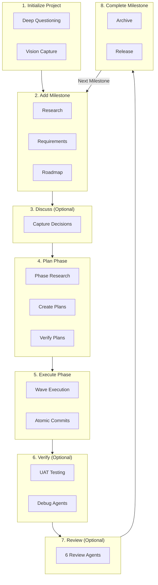
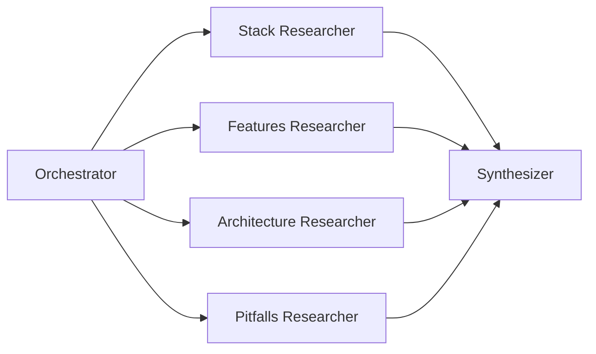
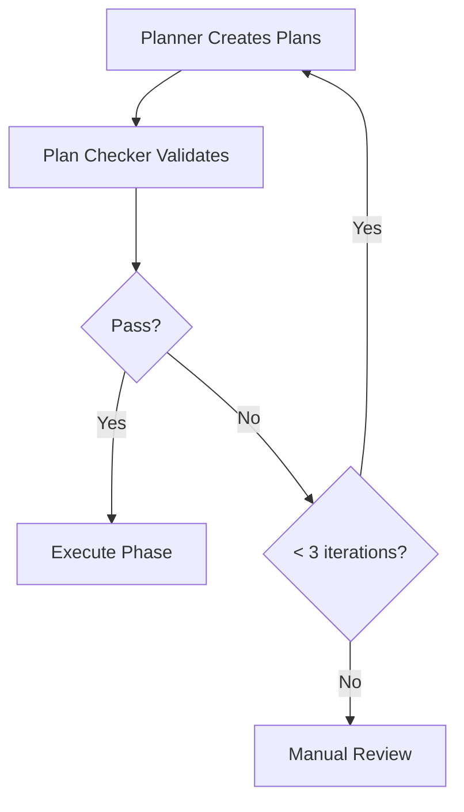
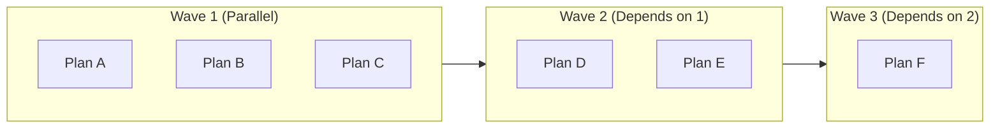
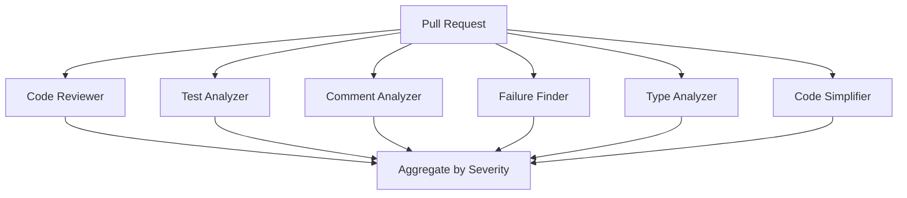

# Kata: Spec-Driven Multi-Agent Orchestration

> Choreographed patterns for Claude Code, practiced until perfected

---

## Overview

| Attribute | Value |
|-----------|-------|
| Name | Kata (型 - /ˈkɑːtɑː/) |
| Type | Multi-Agent Orchestrator |
| Source | [github.com/gannonh/kata](https://github.com/gannonh/kata) |
| Website | [kata.sh](https://kata.sh) |
| License | MIT |
| Runtime | Claude Code |
| Latest | v1.4.0 |

Kata is a **multi-agent orchestration framework for spec-driven development**, designed specifically for Claude Code. The name comes from martial arts, meaning "a choreographed pattern practiced repeatedly until perfected."

---

## Architecture

### Core Design Pattern

```
┌─────────────────────────────────────────────────────────────────┐
│                      Kata Architecture                           │
├─────────────────────────────────────────────────────────────────┤
│                                                                   │
│  ┌─────────────────────────────────────────────────────────┐    │
│  │              User Input Layer                            │    │
│  │  ┌──────────────────┐  ┌───────────────────────────┐    │    │
│  │  │ Natural Language │  │ Slash Commands            │    │    │
│  │  │ "Start project"  │  │ /kata:new-project         │    │    │
│  │  └──────────────────┘  └───────────────────────────┘    │    │
│  └─────────────────────────────────────────────────────────┘    │
│                            │                                      │
│                            ▼                                      │
│  ┌─────────────────────────────────────────────────────────┐    │
│  │         Skills (Thin Orchestrators) - 27+ Skills         │    │
│  │  ┌─────────────┐  ┌─────────────┐  ┌─────────────┐      │    │
│  │  │  starting-  │  │  planning-  │  │  executing- │      │    │
│  │  │  projects   │  │   phases    │  │   phases    │      │    │
│  │  └─────────────┘  └─────────────┘  └─────────────┘      │    │
│  └─────────────────────────────────────────────────────────┘    │
│                            │                                      │
│                            ▼                                      │
│  ┌─────────────────────────────────────────────────────────┐    │
│  │         Agents (Specialized Workers) - 19+ Agents        │    │
│  │  ┌─────────┐  ┌─────────┐  ┌─────────┐  ┌─────────┐    │    │
│  │  │ planner │  │executor │  │verifier │  │debugger │    │    │
│  │  │ Fresh   │  │ Fresh   │  │ Fresh   │  │ Fresh   │    │    │
│  │  │ 200k    │  │ 200k    │  │ 200k    │  │ 200k    │    │    │
│  │  └─────────┘  └─────────┘  └─────────┘  └─────────┘    │    │
│  └─────────────────────────────────────────────────────────┘    │
│                            │                                      │
│                            ▼                                      │
│  ┌─────────────────────────────────────────────────────────┐    │
│  │              Artifacts (.planning/ directory)            │    │
│  │  PROJECT.md  ROADMAP.md  STATE.md  PLAN.md  SUMMARY.md  │    │
│  └─────────────────────────────────────────────────────────┘    │
│                                                                   │
└─────────────────────────────────────────────────────────────────┘
```

### Key Principle: Thin Orchestrators

| Component | Context Usage | Purpose |
|-----------|---------------|---------|
| Orchestrator | 30-40% | Coordinate, don't execute |
| Subagents | Fresh 200k each | Execute heavy work |
| **Result** | Full phase execution without context overflow |

---

## 8-Phase Development Lifecycle

### Phase Flow



> **Interactive**: Click on diagram nodes to jump to detailed sections (requires Mermaid v10+ with `securityLevel: 'loose'`)

### Phase Details

| Phase | Command | Agents Spawned |
|-------|---------|----------------|
| Initialize | `/kata:new-project` | 4 parallel researchers |
| Milestone | `/kata:add-milestone` | Roadmapper |
| Discuss | `/kata:discuss` | None (conversation) |
| Plan | `/kata:plan-phase N` | Researcher, Planner, Checker |
| Execute | `/kata:execute-phase N` | Executors (parallel waves) |
| Verify | `/kata:verify-work N` | Verifier, Debugger |
| Review | `/kata:review-pr` | 6 review agents |
| Complete | `/kata:complete-milestone` | None (automation) |

---

## Multi-Agent Orchestration

### Agent Types (19+)

| Agent | Role | Context |
|-------|------|---------|
| `kata-roadmapper` | Milestone planning | Standard |
| `kata-project-researcher` | Domain research (4 parallel) | Fresh 200k each |
| `kata-phase-researcher` | Phase-specific research | Fresh 200k |
| `kata-planner` | Creates executable plans | Standard |
| `kata-plan-checker` | Validates plans (loops) | Standard |
| `kata-executor` | Implements tasks | Fresh 200k per plan |
| `kata-verifier` | Confirms deliverables | Standard |
| `kata-debugger` | Fixes failures | Fresh 200k |
| `kata-code-reviewer` | Code quality | Fresh 200k |
| `kata-test-analyzer` | Test coverage | Fresh 200k |
| `kata-failure-finder` | Error handling | Fresh 200k |
| `kata-type-analyzer` | Type design | Fresh 200k |
| `kata-code-simplifier` | Maintainability | Fresh 200k |
| `kata-comment-analyzer` | Documentation | Fresh 200k |

### Orchestration Patterns

#### 1. Parallel Research (4 Agents)



#### 2. Verification Loop (3 Iterations Max)



#### 3. Wave Execution



#### 4. PR Review Swarm (6 Parallel)



---

## Artifact System

### .planning/ Directory Structure

```
.planning/
├── PROJECT.md              # Project vision (always loaded)
├── REQUIREMENTS.md         # Scoped v1/v2 requirements
├── ROADMAP.md              # Phase structure
├── STATE.md                # Session memory, decisions
├── config.json             # Workflow preferences
├── research/               # Domain research
├── {phase}-CONTEXT.md      # Implementation vision
├── {phase}-RESEARCH.md     # Phase-specific research
├── {phase}-{N}-PLAN.md     # Executable task plans (XML)
├── {phase}-{N}-SUMMARY.md  # Execution summaries
├── {phase}-VERIFICATION.md # Automated verification
└── {phase}-UAT.md          # User acceptance results
```

### Context File Loading

| File | When Loaded | Purpose |
|------|-------------|---------|
| `PROJECT.md` | Always | Vision, requirements |
| `REQUIREMENTS.md` | Planning + Execution | Traceability IDs |
| `ROADMAP.md` | Navigation | Phase structure |
| `STATE.md` | Always | Living memory |
| `PLAN.md` | Execution only | Atomic tasks |
| `SUMMARY.md` | Post-execution | Results |

---

## XML Prompt Formatting

### Plan Structure

```xml
<plan>
  <task id="01-02-01">
    <description>Implement email confirmation flow</description>
    <verification>User receives confirmation email</verification>
    <depends_on>01-01-03</depends_on>
  </task>
  <task id="01-02-02">
    <description>Add password reset endpoint</description>
    <verification>POST /auth/reset returns 200</verification>
  </task>
</plan>
```

### Benefits of XML

| Benefit | Description |
|---------|-------------|
| **Precision** | No ambiguity in instructions |
| **Verification** | Built-in success criteria |
| **Anti-drift** | Prevents agent wandering |
| **Claude-optimized** | Leverages attention mechanism |

---

## Model Profiles

| Profile | Planning | Execution | Verification |
|---------|----------|-----------|--------------|
| `quality` | Opus | Opus | Sonnet |
| `balanced` | Opus | Sonnet | Sonnet |
| `budget` | Sonnet | Sonnet | Haiku |

---

## Git Integration

### Atomic Commits

```bash
# One commit per task
abc123f docs(08-02): complete user registration plan
def456g feat(08-02): add email confirmation flow
hij789k feat(08-02): implement password hashing
```

### Commit Convention

| Type | Purpose |
|------|---------|
| `feat` | New feature |
| `fix` | Bug fix |
| `test` | Test addition |
| `refactor` | Code refactoring |
| `docs` | Documentation |
| `chore` | Maintenance |

---

## Comparison Summary

### vs. Other Orchestrators

| Feature | Kata | Get-Shit-Done | Claude Code |
|---------|------|---------------|-------------|
| Approach | Spec-driven phases | Task decomposition | Single agent |
| Agent Count | ~10 specialized | ~11 specialized | 1 + subagents |
| Context Strategy | Fresh 200k per agent | Fresh 200k per agent | Shared |
| Git Integration | Atomic commits | Atomic commits | Manual |
| GitHub Integration | Deep (Issues→PRs→Releases) | Optional | None |

### When to Use Kata

| Use Case | Recommendation |
|----------|----------------|
| Spec-driven team projects | **Highly Recommended** |
| Phase-based development | **Highly Recommended** |
| GitHub-integrated workflows | **Recommended** |
| Quick ad-hoc tasks | Use `/kata:quick` |
| Simple single-agent tasks | Use vanilla Claude Code |

---

## Customization Points

Kata provides **7 major customization categories** for extending its spec-driven multi-agent orchestration.

### Summary Table

| Category | Location | Description |
|----------|----------|-------------|
| **Phase System** | 8 phases | Customize workflow stages (init, plan, execute, verify, review) |
| **Workflow Config** | `.planning/config.json` | Mode, depth, parallelization, model profiles |
| **Agent Configuration** | Skills directory | 19+ agent types with fresh 200k context |
| **XML Templates** | Plan files | Structured task definitions with verification |
| **Context Management** | `.planning/` directory | Artifacts, research, state persistence |
| **Git Integration** | Atomic commits | Conventional commits, branch strategies |
| **Spec Format** | PROJECT.md, REQUIREMENTS.md | Vision capture, requirement IDs |

### 1. Phase System Configuration

Kata's 8-phase workflow is fully customizable:

| Phase | Command | Customization Options |
|-------|---------|----------------------|
| 1. Initialize | `/kata:new-project` | Question depth, vision format |
| 2. Milestone | `/kata:add-milestone` | Scope, requirements structure |
| 3. Discuss | `/kata:discuss` | Decision capture format |
| 4. Plan | `/kata:plan-phase N` | Research depth, plan structure |
| 5. Execute | `/kata:execute-phase N` | Wave parallelization, commit strategy |
| 6. Verify | `/kata:verify-work N` | Verification criteria, debug depth |
| 7. Review | `/kata:review-pr` | Review agents selection (6 types) |
| 8. Complete | `/kata:complete-milestone` | Archive strategy, release notes |

**Skip/Modify Phases:**
- Use `/kata:quick` for simple tasks (skips full workflow)
- Phases 3, 6, 7 are optional
- Configure phase behavior in `config.json`

### 2. Workflow Configuration

**Location:** `.planning/config.json`

```json
{
  "mode": "spec-driven",
  "research_depth": "deep",
  "parallelization": {
    "max_parallel_agents": 4,
    "wave_timeout_minutes": 30
  },
  "model_profile": "balanced",
  "verification": {
    "max_iterations": 3,
    "auto_debug": true
  },
  "git": {
    "atomic_commits": true,
    "conventional_commits": true,
    "auto_branch": true
  }
}
```

**Model Profiles:**
| Profile | Planning | Execution | Verification |
|---------|----------|-----------|--------------|
| `quality` | Opus | Opus | Sonnet |
| `balanced` | Opus | Sonnet | Sonnet |
| `budget` | Sonnet | Sonnet | Haiku |

### 3. Agent Configuration

Kata spawns specialized agents with fresh 200k context windows:

| Agent Type | Role | Customization |
|------------|------|---------------|
| `kata-project-researcher` | Domain research | Research scope, sources |
| `kata-phase-researcher` | Phase-specific research | Focus areas |
| `kata-planner` | Creates plans | Plan template, task structure |
| `kata-plan-checker` | Validates plans | Validation rules, iteration limit |
| `kata-executor` | Implements tasks | Commit style, verification |
| `kata-verifier` | Confirms deliverables | Success criteria |
| `kata-debugger` | Fixes failures | Debug strategy |
| `kata-code-reviewer` | Code quality | Review focus |
| `kata-test-analyzer` | Test coverage | Coverage thresholds |
| `kata-failure-finder` | Error handling | Error categories |
| `kata-type-analyzer` | Type design | Type strictness |
| `kata-code-simplifier` | Maintainability | Complexity thresholds |
| `kata-comment-analyzer` | Documentation | Comment standards |

### 4. XML Template System

Kata uses XML for precise, anti-drift task definitions:

**Plan Template:**
```xml
<plan phase="01" name="authentication">
  <task id="01-01-01">
    <description>Implement user registration endpoint</description>
    <files>
      <file>src/auth/register.ts</file>
      <file>src/auth/register.test.ts</file>
    </files>
    <verification>
      <criterion>POST /auth/register returns 201 for valid input</criterion>
      <criterion>Returns 400 for invalid email format</criterion>
    </verification>
    <depends_on></depends_on>
  </task>
  
  <task id="01-01-02">
    <description>Add email confirmation flow</description>
    <verification>
      <criterion>User receives confirmation email</criterion>
      <criterion>Clicking link activates account</criterion>
    </verification>
    <depends_on>01-01-01</depends_on>
  </task>
</plan>
```

**Custom XML Tags:**
| Tag | Purpose |
|-----|---------|
| `<plan>` | Container with phase and name |
| `<task>` | Individual work unit with ID |
| `<description>` | What to implement |
| `<files>` | Target files |
| `<verification>` | Success criteria |
| `<depends_on>` | Task dependencies |
| `<notes>` | Additional context |

### 5. Context Management

**Artifact Directory Structure:**
```
.planning/
├── PROJECT.md              # Vision (always loaded)
├── REQUIREMENTS.md         # Scoped requirements with IDs
├── ROADMAP.md              # Phase structure
├── STATE.md                # Living session memory
├── config.json             # Workflow preferences
├── research/               # Domain research artifacts
│   ├── stack.md
│   ├── architecture.md
│   └── pitfalls.md
├── {phase}-CONTEXT.md      # Implementation vision per phase
├── {phase}-RESEARCH.md     # Phase-specific research
├── {phase}-{N}-PLAN.md     # Executable task plans
├── {phase}-{N}-SUMMARY.md  # Execution summaries
├── {phase}-VERIFICATION.md # Automated verification results
└── {phase}-UAT.md          # User acceptance results
```

**Context Loading Rules:**
| File | When Loaded | Purpose |
|------|-------------|---------|
| `PROJECT.md` | Always | Core vision anchor |
| `REQUIREMENTS.md` | Planning + Execution | Traceability |
| `STATE.md` | Always | Living memory |
| `{phase}-CONTEXT.md` | Phase execution | Implementation decisions |
| `{phase}-PLAN.md` | Execution only | Current tasks |

### 6. Git Integration

**Commit Configuration:**
```json
{
  "git": {
    "atomic_commits": true,
    "conventional_commits": true,
    "commit_types": ["feat", "fix", "test", "refactor", "docs", "chore"],
    "scope_format": "phase-task",
    "auto_branch": true,
    "branch_pattern": "kata/{milestone}-{phase}"
  }
}
```

**Commit Format:**
```bash
# Conventional commit with phase-task scope
feat(08-02): implement email confirmation flow

- Add confirmation token generation
- Create email template
- Add verification endpoint

Closes #123
```

**Branch Strategy:**
| Branch | Purpose |
|--------|---------|
| `main` | Production |
| `kata/{milestone}` | Milestone work |
| `kata/{milestone}-{phase}` | Phase work |

### 7. Spec Format Customization

**PROJECT.md Template:**
```markdown
# Project Vision

## Overview
[High-level description]

## Goals
- [ ] Goal 1
- [ ] Goal 2

## Non-Goals
- Explicitly out of scope

## Technical Constraints
- Language: TypeScript
- Framework: Next.js
- Database: PostgreSQL

## Success Criteria
- Measurable outcomes
```

**REQUIREMENTS.md Template:**
```markdown
# Requirements

## V1 Scope
| ID | Requirement | Priority | Status |
|----|-------------|----------|--------|
| R-001 | User registration | Must | Pending |
| R-002 | Email verification | Must | Pending |
| R-003 | Password reset | Should | Pending |

## V2 Scope (Future)
| ID | Requirement | Priority |
|----|-------------|----------|
| R-010 | OAuth integration | Must |
```

### Quick Reference

| What to Customize | Where |
|-------------------|-------|
| Workflow behavior | `.planning/config.json` |
| Model selection | `config.json` → `model_profile` |
| Agent behavior | Skill files |
| Task structure | XML plan templates |
| Git strategy | `config.json` → `git` |
| Research depth | `config.json` → `research_depth` |
| Verification rules | `config.json` → `verification` |
| Context files | `.planning/` directory |

---

## Resources

| Resource | URL |
|----------|-----|
| Website | https://kata.sh |
| GitHub | https://github.com/gannonh/kata |
| Agent Skills Standard | https://agentskills.io |
| Documentation | https://kata.sh/docs |

---

## See Also

- [../README.md](../README.md) - Tools overview
- [diagrams.md](diagrams.md) - Detailed architecture diagrams
- [examples.md](examples.md) - Usage examples
- [../BEST-PRACTICES.md](../BEST-PRACTICES.md) - Integration patterns
