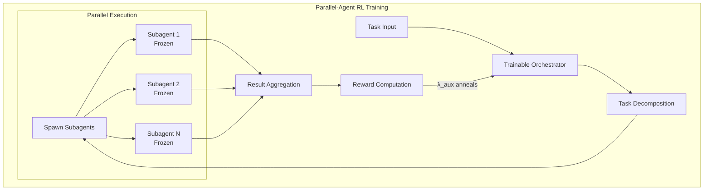
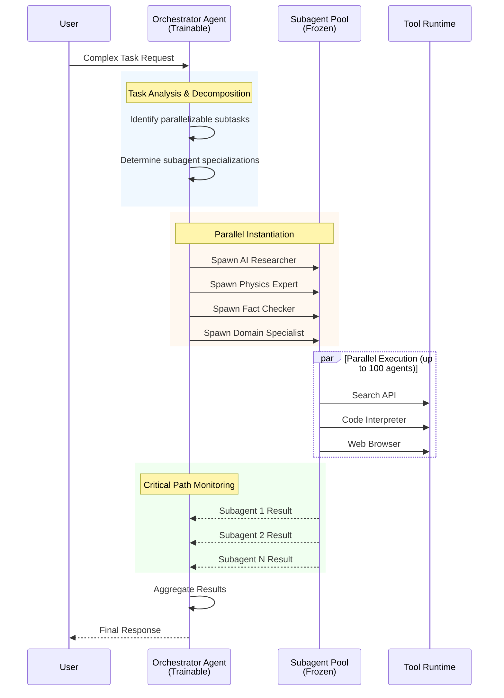
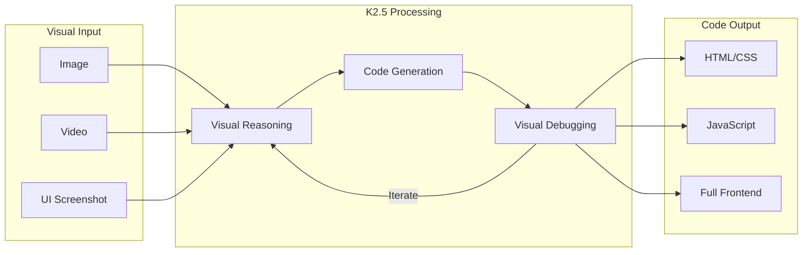

# Kimi K2.5: Visual Agentic Intelligence

> The most powerful open-source model with native agent swarm capabilities

---

## Overview

| Attribute | Value |
|-----------|-------|
| Provider | Moonshot AI |
| Model Type | Native Multimodal MoE |
| Parameters | 1.04T total, 32B active |
| Context | 256k tokens |
| License | MIT (Open Source) |
| Website | [kimi.com](https://kimi.com) |
| API | [platform.moonshot.ai](https://platform.moonshot.ai) |

Kimi K2.5 represents a paradigm shift from single-agent scaling to self-directed swarm orchestration. It can autonomously create and coordinate up to **100 sub-agents** executing **1,500+ tool calls** in parallel.

---

## Architecture

### Model Design

```
┌─────────────────────────────────────────────────────────────┐
│                    Kimi K2.5 Architecture                    │
├─────────────────────────────────────────────────────────────┤
│                                                              │
│  ┌──────────────────────────────────────────────────────┐   │
│  │              Native Multimodal MoE                     │   │
│  │  ┌─────────┐  ┌─────────┐  ┌─────────┐  ┌─────────┐  │   │
│  │  │ Expert 1│  │ Expert 2│  │ Expert 3│  │Expert N │  │   │
│  │  │ (Vision)│  │ (Code)  │  │ (Text)  │  │(Domain) │  │   │
│  │  └────┬────┘  └────┬────┘  └────┬────┘  └────┬────┘  │   │
│  │       └────────────┼────────────┼────────────┘       │   │
│  │                    ▼                                  │   │
│  │             ┌──────────────┐                          │   │
│  │             │  Router MoE  │ (32B active)             │   │
│  │             └──────────────┘                          │   │
│  └──────────────────────────────────────────────────────┘   │
│                           │                                  │
│                           ▼                                  │
│  ┌──────────────────────────────────────────────────────┐   │
│  │               Agent Swarm Layer                        │   │
│  │                                                        │   │
│  │  ┌────────────────────────────────────────────────┐   │   │
│  │  │         Trainable Orchestrator Agent           │   │   │
│  │  │  - Task decomposition                          │   │   │
│  │  │  - Subagent instantiation                      │   │   │
│  │  │  - Critical path monitoring                    │   │   │
│  │  └────────────────────────────────────────────────┘   │   │
│  │                         │                              │   │
│  │     ┌───────────────────┼───────────────────┐         │   │
│  │     ▼                   ▼                   ▼         │   │
│  │ ┌────────┐         ┌────────┐         ┌────────┐     │   │
│  │ │Subagent│  ...    │Subagent│  ...    │Subagent│     │   │
│  │ │   1    │ (up to  │   50   │ (up to  │  100   │     │   │
│  │ │(Frozen)│  100)   │(Frozen)│  100)   │(Frozen)│     │   │
│  │ └────────┘         └────────┘         └────────┘     │   │
│  └──────────────────────────────────────────────────────┘   │
│                                                              │
└─────────────────────────────────────────────────────────────┘
```

### Key Specifications

| Component | Specification |
|-----------|---------------|
| Total Parameters | 1.04 trillion |
| Active Parameters | 32 billion per inference |
| Training Data | ~15T mixed vision/text tokens |
| Context Window | 256k tokens |
| Inference Settings | temp=1.0, top_p=0.95 |
| Quantization | Native INT4 (2× speed) |

---

## Operational Modes

| Mode | Description | Use Case |
|------|-------------|----------|
| **K2.5 Instant** | Fast responses | Quick queries |
| **K2.5 Thinking** | Extended reasoning (96k budget) | Complex problems |
| **K2.5 Agent** | Single-agent tool use | Standard tasks |
| **K2.5 Agent Swarm** | Multi-agent parallel (Beta) | Complex workflows |

---

## Agent Swarm Technology

### Parallel-Agent Reinforcement Learning (PARL)

The revolutionary training methodology that enables self-directed swarm orchestration:



### Reward Function

```
R_t = λ_aux(e) · r_parallel + (1 - λ_aux(e)) · (I[success] · Q(τ))
     \_________________/      \________________________________/
      Instantiation reward           Task-level outcome
```

| Variable | Description | Training Behavior |
|----------|-------------|-------------------|
| λ_aux(e) | Annealing factor | 0.1 → 0.0 over training |
| r_parallel | Parallelism reward | Encourages agent spawning early |
| Q(τ) | Task quality | Becomes primary focus later |

### Critical Steps Metric

```
CriticalSteps = Σ(S_main(t) + max_i S_sub,i(t))
```

| Term | Meaning |
|------|---------|
| S_main(t) | Orchestration overhead |
| max_i S_sub,i(t) | Slowest subagent at stage t |

This latency-oriented metric forces truly parallel strategies to emerge.

---

## Event Loop Architecture

### Sequence Diagram



### Performance Gains

| Metric | Single Agent | Agent Swarm | Improvement |
|--------|--------------|-------------|-------------|
| Critical Steps | Baseline | 3-4.5× fewer | 3-4.5× |
| Wall-Clock Time | Baseline | Up to 4.5× faster | 4.5× |
| Runtime | Baseline | 80% reduction | 80% |
| Tool Calls | ~300 max | 1,500+ coordinated | 5× |

---

## Coding Capabilities

### Kimi Code

Terminal-based coding assistant with IDE integration:

| Feature | Description |
|---------|-------------|
| Terminal | Native terminal operation |
| IDE Support | VSCode, Cursor, Zed |
| Visual Inputs | Images and video support |
| Skill Migration | Auto-discovers MCPs |
| Open Source | Fully open-sourced |

### Coding with Vision



### Unique Capabilities

| Capability | Description |
|------------|-------------|
| Image-to-Code | Generate UI from screenshots |
| Video-to-Code | Reconstruct websites from video |
| Visual Debugging | Autonomous inspection and iteration |
| Puzzle Solving | Reason over images, mark solutions |
| Rich Animations | Scroll-triggered effects, interactions |

---

## Benchmark Performance

### vs. Competitors

| Benchmark | Kimi K2.5 | Claude Opus 4.5 | GPT-5.2 | DeepSeek-V3.2 |
|-----------|-----------|-----------------|---------|---------------|
| HLE (w/ tools) | **50.2%** | Lower | - | Lower |
| Cost (HLE) | **Baseline** | 76% higher | - | - |
| Speed (Swarm) | **4.5× faster** | N/A | N/A | N/A |
| AI Office | **+59.3%** vs K2 | - | - | - |

### Swarm Mode Configuration

| Benchmark | Main Agent Steps | Subagent Steps |
|-----------|------------------|----------------|
| BrowseComp | 15 max | 100 max |
| WideSearch | 100 max | 100 max |

---

## Integration

### API Usage

```python
from moonshot import Kimi

client = Kimi(api_key="your-key")

# K2.5 Agent Swarm
response = client.chat.completions.create(
    model="kimi-k2.5-agent-swarm",
    messages=[{"role": "user", "content": "Complex multi-step task..."}],
    temperature=1.0,
    top_p=0.95,
    max_tokens=256000
)
```

### Kimi Code CLI

```bash
# Install
npm install -g kimi-code

# Run in terminal
kimi-code

# With visual input
kimi-code --image screenshot.png
kimi-code --video demo.mp4
```

---

## Key Innovations

| Innovation | Impact |
|------------|--------|
| **PARL Training** | First model to self-direct 100-agent swarms |
| **Critical Steps** | Novel latency-oriented evaluation metric |
| **Native Multimodal** | Vision-text joint pretraining at 15T scale |
| **Coding with Vision** | Autonomous visual debugging |
| **Open Source AGI** | Most powerful open-weight model (MIT) |

---

## Customization Points

Based on comprehensive analysis, Kimi K2 provides **6 major customization categories**:

### 1. PARL Configuration (Training-level)

For researchers fine-tuning or extending Kimi K2:

```
R_t = λ_aux(e) · r_parallel + (1 - λ_aux(e)) · (I[success] · Q(τ))
```

| Parameter | Default | Description |
|-----------|---------|-------------|
| λ_aux start | 0.1 | Initial parallelism reward weight |
| λ_aux end | 0.0 | Final value (task success dominates) |
| r_parallel | Variable | Instantiation reward |
| Q(τ) | Variable | Task-level outcome quality |

**Customization**: Adjust annealing schedule to balance exploration vs exploitation.

### 2. Agent Swarm Configuration

```python
# Swarm configuration via API
swarm_config = {
    "max_agents": 100,           # 1-100 agents
    "max_main_steps": 100,       # Orchestrator steps
    "max_subagent_steps": 100,   # Per-subagent steps
    "context_strategy": "discard-all"  # Memory management
}
```

| Swarm Mode | Max Main Steps | Max Subagent Steps | Use Case |
|------------|----------------|-------------------|----------|
| BrowseComp | 15 | 100 | Web browsing |
| WideSearch | 100 | 100 | Broad search |
| Custom | Configurable | Configurable | Domain-specific |

### 3. Tool Registration

Register custom tools via API:

```python
tools = [
    {
        "type": "function",
        "function": {
            "name": "custom_search",
            "description": "Search custom database",
            "parameters": {
                "type": "object",
                "properties": {
                    "query": {"type": "string"},
                    "limit": {"type": "number"}
                },
                "required": ["query"]
            }
        }
    }
]

response = client.chat.completions.create(
    model="kimi-k2.5-agent",
    messages=messages,
    tools=tools
)
```

**Built-in tool categories**: Search, Code interpreter, Web browser, Office productivity, Vision

**Limits**: Up to 1,500 coordinated tool calls per task

### 4. Orchestrator Configuration

```python
# API parameters for orchestrator tuning
response = client.chat.completions.create(
    model="kimi-k2.5-agent-swarm",
    messages=messages,
    temperature=1.0,      # 0.0-2.0 (Thinking: 1.0, Instant: 0.6)
    top_p=0.95,           # 0.0-1.0 nucleus sampling
    max_tokens=256000,    # Up to 256K context
    extra_body={
        "thinking": {"type": "enabled"},  # or "disabled" for Instant
        "max_steps": 100
    }
)
```

| Parameter | Thinking Mode | Instant Mode |
|-----------|---------------|--------------|
| temperature | 1.0 | 0.6 |
| max_tokens | 96K (reasoning budget) | 64K |
| thinking | enabled | disabled |

### 5. API Customization

**OpenAI-compatible endpoint**:

```python
import openai

client = openai.OpenAI(
    api_key="YOUR_API_KEY",
    base_url="https://api.moonshot.cn/v1"  # or platform.moonshot.ai
)
```

**Model variants**:

| Model | Use Case |
|-------|----------|
| `kimi-k2.5` | General multimodal |
| `kimi-k2.5-thinking` | Complex reasoning (96K thinking budget) |
| `kimi-k2.5-instant` | Fast responses |
| `kimi-k2.5-agent` | Single-agent tool use |
| `kimi-k2.5-agent-swarm` | Multi-agent parallel (Beta) |

**Multimodal input**:
```python
messages = [
    {
        "role": "user",
        "content": [
            {"type": "text", "text": "Analyze this"},
            {"type": "image_url", "image_url": {"url": "data:image/png;base64,..."}}
        ]
    }
]
```

### 6. Critical Steps Optimization (GPO)

For fine-tuning with Guided Pivotal Optimization:

```
1. Generate reasoning trajectory
2. Identify critical step (highest advantage)
3. Reset to critical step
4. Sample new rollouts from that point
5. Prioritize learning on those rollouts
```

| Parameter | Description |
|-----------|-------------|
| Critical step threshold | Advantage function cutoff |
| Rollout samples | Number from critical point |
| Learning priority | Weight for pivotal moments |

### Customization Summary

| Point | Method | Use Case |
|-------|--------|----------|
| PARL | Training config | Fine-tuning swarm behavior |
| Swarm Config | API params | Adjust agent count, steps |
| Tools | API registration | Add custom capabilities |
| Orchestrator | API params | Tune reasoning behavior |
| Model Selection | Model ID | Balance speed vs capability |
| GPO | Training | Optimize critical path learning |

### Self-Hosting Options

For on-premise deployment:
- **vLLM**: Standard inference server
- **SGLang**: Optimized for long contexts
- **KTransformers**: Native INT4 quantization (2× speed)

---

## Comparison Summary

### vs. Claude Code / OpenCode

| Feature | Kimi K2.5 | Claude Code | OpenCode |
|---------|-----------|-------------|----------|
| Multi-Agent | 100 agents | Task delegation | 2 modes |
| Orchestration | Self-directed PARL | Manual | Manual |
| Parallelism | Native | Sequential | Sequential |
| Visual Coding | Native | Via tools | Via tools |
| Open Source | Yes (MIT) | No | Yes (MIT) |

### When to Use Kimi K2.5

| Use Case | Recommendation |
|----------|----------------|
| Complex parallel workflows | **Highly Recommended** |
| Visual debugging | **Highly Recommended** |
| Video-to-code | **Highly Recommended** |
| Cost-sensitive | **Recommended** |
| Simple single-agent tasks | Use simpler model |

---

## Resources

| Resource | URL |
|----------|-----|
| Website | https://kimi.com |
| API | https://platform.moonshot.ai |
| Kimi Code | https://kimi.com/code |
| Blog | https://kimi.com/blog/kimi-k2-5.html |
| Agent Swarm | https://kimi.com/agent-swarm |

---

## See Also

- [../README.md](../README.md) - Tools overview
- [diagrams.md](diagrams.md) - Detailed architecture diagrams
- [examples.md](examples.md) - Usage examples
- [../BEST-PRACTICES.md](../BEST-PRACTICES.md) - Integration patterns
