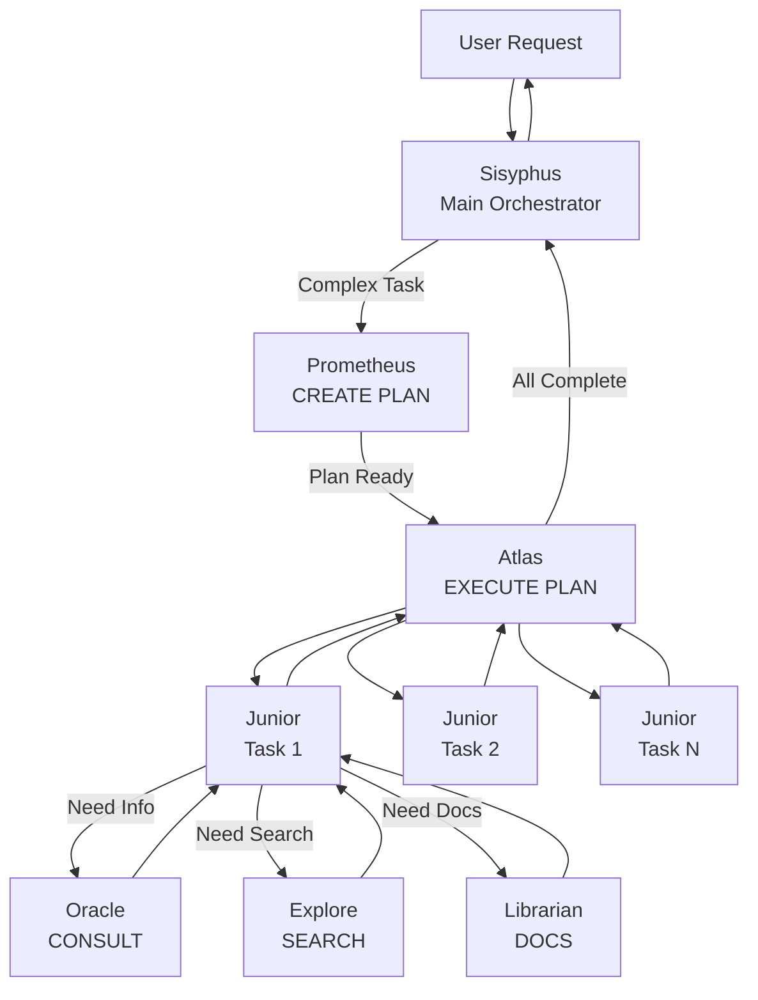
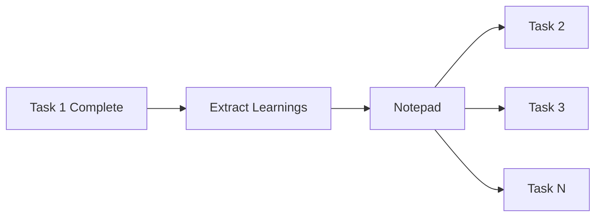

# Oh-My-OpenCode: Multi-Agent Orchestration Framework

> Batteries-included plugin transforming OpenCode into a coordinated development team

---

## Overview

| Attribute | Value |
|-----------|-------|
| Type | OpenCode Plugin/Framework |
| Source | [github.com/code-yeongyu/oh-my-opencode](https://github.com/code-yeongyu/oh-my-opencode) |
| Stars | 3.1k+ |
| License | MIT |
| Version | v3.1.2 |
| Runtime | OpenCode |

Oh-My-OpenCode is a **batteries-included plugin** for OpenCode that transforms it into a **multi-agent orchestration system** with specialized AI agents, advanced tooling, and production-ready workflows.

**Core Philosophy**: "Separation of Planning and Execution" - inspired by how real development teams work, not how a single developer works.

---

## Architecture

### Three-Layer Orchestration

```
┌─────────────────────────────────────────────────────────────────┐
│                Oh-My-OpenCode Architecture                       │
├─────────────────────────────────────────────────────────────────┤
│                                                                   │
│  ┌─────────────────────────────────────────────────────────┐    │
│  │              Planning Layer (READ-ONLY)                  │    │
│  │  ┌────────────┐  ┌────────────┐  ┌────────────┐         │    │
│  │  │ Prometheus │  │   Metis    │  │   Momus    │         │    │
│  │  │  (Planner) │  │(Consultant)│  │ (Reviewer) │         │    │
│  │  │ Opus 4.5   │  │  Opus 4.5  │  │  GPT-5.2   │         │    │
│  │  └────────────┘  └────────────┘  └────────────┘         │    │
│  └─────────────────────────────────────────────────────────┘    │
│                            │                                      │
│                            ▼                                      │
│  ┌─────────────────────────────────────────────────────────┐    │
│  │              Execution Layer (ORCHESTRATION)             │    │
│  │  ┌────────────────────────────────────────────────────┐ │    │
│  │  │                    Atlas                            │ │    │
│  │  │    Orchestrator - Coordinates Worker Agents         │ │    │
│  │  │    Claude Opus 4.5 (cannot write code directly)     │ │    │
│  │  └────────────────────────────────────────────────────┘ │    │
│  └─────────────────────────────────────────────────────────┘    │
│                            │                                      │
│                            ▼                                      │
│  ┌─────────────────────────────────────────────────────────┐    │
│  │              Worker Layer (EXECUTION)                    │    │
│  │  ┌─────────┐  ┌─────────┐  ┌─────────┐  ┌─────────┐    │    │
│  │  │ Junior  │  │ Oracle  │  │ Explore │  │Librarian│    │    │
│  │  │Sonnet4.5│  │ GPT-5.2 │  │  Grok   │  │BigPickle│    │    │
│  │  │Executor │  │Consult  │  │ Search  │  │  Docs   │    │    │
│  │  └─────────┘  └─────────┘  └─────────┘  └─────────┘    │    │
│  └─────────────────────────────────────────────────────────┘    │
│                                                                   │
└─────────────────────────────────────────────────────────────────┘
```

### Extension Components

| Component | Count | Purpose |
|-----------|-------|---------|
| **Lifecycle Hooks** | 32+ | Intercept/modify OpenCode behavior |
| **Custom Tools** | 20+ | Delegation, LSP, AST-grep, sessions |
| **Specialized Agents** | 10 | Different models and permissions |
| **Built-in Skills** | 3 | Playwright, Git-master, Frontend-UI-UX |
| **Built-in MCPs** | 3 | Websearch, Context7, Grep.app |
| **Commands** | 6 | Ralph-loop, Ultrawork, Refactor |

---

## Agent System

### Specialized Agents

| Agent | Model | Purpose | Restrictions |
|-------|-------|---------|--------------|
| **Sisyphus** | Claude Opus 4.5 | Main orchestrator (32k thinking) | Full access |
| **Prometheus** | Claude Opus 4.5 | Strategic planner | READ-ONLY (markdown only) |
| **Atlas** | Claude Opus 4.5 | Plan executor | Cannot write code (delegates) |
| **Oracle** | GPT-5.2 | Architecture, debugging | READ-ONLY consultation |
| **Librarian** | Big Pickle | Multi-repo analysis, docs | Cannot write/edit/delegate |
| **Explore** | Grok Code | Fast codebase grep | Cannot write/edit/delegate |
| **Sisyphus-Junior** | Claude Sonnet 4.5 | Task executor (workhorse) | Cannot delegate |
| **Metis** | Claude Opus 4.5 | Pre-planning consultant | READ-ONLY |
| **Momus** | GPT-5.2 | Plan reviewer | READ-ONLY |

### Agent Workflow



---

## Category-Based Delegation

### Revolutionary Approach

Instead of hardcoding model names (which creates distributional bias), Oh-My-OpenCode uses **semantic categories** that describe intent.

### Built-in Categories

| Category | Model | Use Case |
|----------|-------|----------|
| `visual-engineering` | Gemini 3 Pro | Frontend, UI/UX, design, styling |
| `ultrabrain` | GPT-5.2 Codex | Deep logic, complex architecture |
| `artistry` | Gemini 3 Pro (max) | Highly creative tasks |
| `quick` | Claude Haiku 4.5 | Trivial single-file changes |
| `unspecified-low` | Claude Sonnet 4.5 | General tasks, low effort |
| `unspecified-high` | Claude Opus 4.5 (max) | General tasks, high effort |
| `writing` | Gemini 3 Flash | Documentation, prose |

### Delegation Pattern

```typescript
// Category selects optimal model
delegate_task(
  category="visual-engineering",
  load_skills=["frontend-ui-ux"],
  prompt="Build responsive navbar with animations"
)

// Background execution
delegate_task(
  category="ultrabrain",
  run_in_background=true,
  prompt="Design authentication architecture"
)
```

### Custom Categories

```json
{
  "categories": {
    "unity-game-dev": {
      "model": "openai/gpt-5.2",
      "temperature": 0.3,
      "prompt_append": "You are a Unity game development expert..."
    }
  }
}
```

---

## Event Loop Hooks

### 6 Interception Points

| Hook Point | When | Purpose |
|------------|------|---------|
| `chat.message` | User submits | Keyword detection, auto-commands |
| `experimental.chat.messages.transform` | Before API | Context injection |
| `event` | Session lifecycle | Error recovery, notifications |
| `tool.execute.before` | Before tool | Block/modify, inject context |
| `tool.execute.after` | After tool | Add warnings, modify output |
| `config` | Config requests | Dynamic configuration |

### Critical Hooks

#### Context Injection
| Hook | Purpose |
|------|---------|
| `directory-agents-injector` | Auto-injects AGENTS.md |
| `directory-readme-injector` | Auto-injects README.md |
| `rules-injector` | Injects rules from `.claude/rules/` |
| `compaction-context-injector` | Preserves context during compaction |

#### Productivity
| Hook | Purpose |
|------|---------|
| `keyword-detector` | Detects `ultrawork`, `search`, `analyze` |
| `think-mode` | Auto-detects extended thinking needs |
| `ralph-loop` | Self-referential loop continuation |
| `todo-continuation-enforcer` | Forces completion before stopping |

#### Quality & Safety
| Hook | Purpose |
|------|---------|
| `comment-checker` | Reminds to reduce excessive comments |
| `thinking-block-validator` | Validates thinking blocks |
| `edit-error-recovery` | Recovers from edit failures |
| `session-recovery` | Recovers from session errors |

---

## Wisdom Accumulation

### Learning System

After each task, the orchestrator extracts learnings and passes them to ALL subsequent agents.

```
.sisyphus/notepads/{plan-name}/
├── learnings.md      # Patterns, conventions, successful approaches
├── decisions.md      # Architectural choices and rationales
├── issues.md         # Problems, blockers, gotchas
├── verification.md   # Test results, validation outcomes
└── problems.md       # Unresolved issues, technical debt
```

### Knowledge Flow



---

## Background Execution

### Parallel Agents

```typescript
// Launch multiple agents in parallel
delegate_task(category="ultrabrain", background=true, prompt="Task A")
delegate_task(category="visual-engineering", background=true, prompt="Task B")
delegate_task(category="general", background=true, prompt="Task C")

// All run simultaneously in tmux panes

// Retrieve when needed
background_output(task_id="bg_abc123")
```

### Tmux Integration

Visual multi-agent execution with separate panes:

```
┌─────────────────┬─────────────────┐
│   Task A        │    Task B       │
│   (Ultrabrain)  │  (Visual-Eng)   │
├─────────────────┼─────────────────┤
│   Task C        │    Main         │
│   (General)     │   (Sisyphus)    │
└─────────────────┴─────────────────┘
```

---

## Special Features

### Ultrawork Mode

The "magic word" that activates full orchestration intensity.

```
Just include `ultrawork` (or `ulw`) in your prompt.

That's it. All features activate automatically:
- Parallel agents
- Background tasks
- Deep exploration
- Relentless execution until completion
```

### Ralph Loop

Self-referential development loop that runs until task completion.

```bash
/ralph-loop "Build a REST API with authentication"
/ralph-loop "Refactor the payment module" --max-iterations=50
```

**Behavior**:
- Agent works continuously toward goal
- Detects `<promise>DONE</promise>` for completion
- Auto-continues if agent stops without completion
- Ends when: completion, max iterations (100), or `/cancel-ralph`

### Todo Continuation Enforcer

Forces agents to complete all tasks before stopping:

```
[SYSTEM REMINDER - TODO CONTINUATION]

You have incomplete todos! Complete ALL before responding:
- [ ] Implement user service ← IN PROGRESS
- [ ] Add validation
- [ ] Write tests

DO NOT respond until all todos are marked completed.
```

---

## Skills System

### Built-in Skills

| Skill | Trigger | Description |
|-------|---------|-------------|
| **playwright** | Browser tasks | Browser automation via MCP |
| **frontend-ui-ux** | UI/UX tasks | Designer-developer persona |
| **git-master** | commit, rebase | Atomic commits, history rewriting |

### Skill Architecture

```yaml
---
description: Browser automation skill
mcp:
  playwright:
    command: npx
    args: ["-y", "@anthropic-ai/mcp-playwright"]
---

# Skill instructions here...
```

### Loading Locations

| Location | Scope |
|----------|-------|
| `.opencode/skills/*/SKILL.md` | Project |
| `~/.config/opencode/skills/*/SKILL.md` | User |
| `.claude/skills/*/SKILL.md` | Claude Code compat |
| `~/.claude/skills/*/SKILL.md` | Claude Code user |

---

## Claude Code Compatibility

Full compatibility layer for Claude Code configurations:

| Type | Locations |
|------|-----------|
| **Commands** | `~/.claude/commands/`, `.claude/commands/` |
| **Skills** | `~/.claude/skills/*/SKILL.md` |
| **Agents** | `~/.claude/agents/*.md` |
| **MCPs** | `~/.claude/.mcp.json`, `.mcp.json` |
| **Hooks** | `~/.claude/settings.json` |

---

## Comparison Summary

### vs. Other Frameworks

| Feature | Oh-My-OpenCode | Kata | GSD | Claude Code |
|---------|----------------|------|-----|-------------|
| Agent Count | 10 specialized | ~10 | ~11 | 1 + subagents |
| Orchestration | 3-layer (Plan/Execute/Work) | Phase-based | Task decomposition | Manual |
| Category System | Semantic categories | Model profiles | Model profiles | N/A |
| Background Exec | Tmux + parallel | Wave-based | Wave-based | Sequential |
| Wisdom Accumulation | Notepads | Artifacts | STATE.md | None |
| Claude Code Compat | Full | N/A | N/A | Native |

### When to Use Oh-My-OpenCode

| Use Case | Recommendation |
|----------|----------------|
| Multi-provider orchestration | **Highly Recommended** |
| Complex parallel workflows | **Highly Recommended** |
| Category-based delegation | **Highly Recommended** |
| Claude Code migration | **Recommended** |
| Simple single-agent tasks | Use vanilla OpenCode |

---

## Commands Reference

| Command | Purpose |
|---------|---------|
| `/ralph-loop` | Self-referential development loop |
| `/ulw-loop` | Ultrawork mode loop |
| `/refactor` | Intelligent refactoring with LSP/AST |
| `/init-deep` | Initialize hierarchical AGENTS.md |
| `/start-work` | Start Sisyphus work session |
| `/cancel-ralph` | Cancel active Ralph Loop |

---

## Resources

| Resource | URL |
|----------|-----|
| GitHub | https://github.com/code-yeongyu/oh-my-opencode |
| OpenCode | https://github.com/sst/opencode |
| Documentation | https://oh-my-opencode.dev/docs |

---

## See Also

- [../README.md](../README.md) - Tools overview
- [diagrams.md](diagrams.md) - Detailed architecture diagrams
- [examples.md](examples.md) - Usage examples
- [../BEST-PRACTICES.md](../BEST-PRACTICES.md) - Integration patterns
