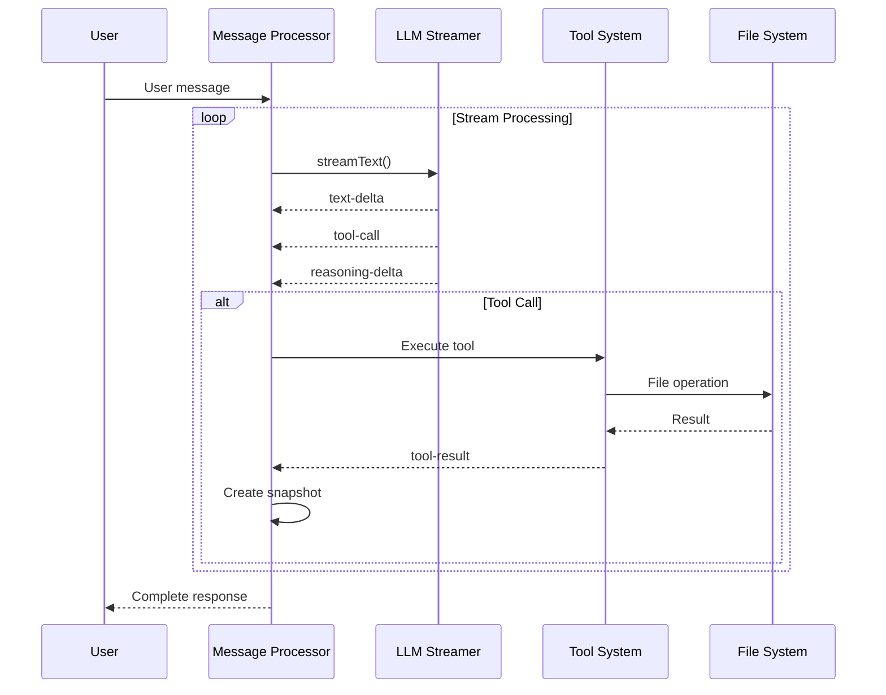
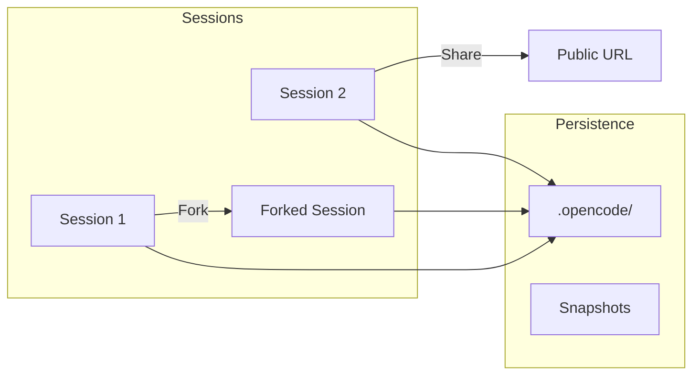

# OpenCode: Model-Agnostic AI Coding Agent

> Open source alternative to Claude Code with multi-provider support

---

## Overview

| Attribute | Value |
|-----------|-------|
| Type | CLI/TUI/Desktop Agent |
| Source | [github.com/anomalyco/opencode](https://github.com/anomalyco/opencode) |
| Stars | 60,000+ |
| License | MIT |
| Language | TypeScript (Bun runtime) |
| Providers | 20+ (Claude, OpenAI, Google, Local, etc.) |

OpenCode is an **open-source AI coding agent** built for the terminal, created by Anomaly. It's positioned as a **model-agnostic alternative** to Claude Code with multi-provider support.

---

## Architecture

### System Design

```
┌─────────────────────────────────────────────────────────────────┐
│                     OpenCode Architecture                        │
├─────────────────────────────────────────────────────────────────┤
│                                                                   │
│  ┌─────────────────────────────────────────────────────────┐    │
│  │                 Multi-Provider Layer                     │    │
│  │  ┌────────┐ ┌────────┐ ┌────────┐ ┌────────┐ ┌───────┐ │    │
│  │  │Anthropic│ │ OpenAI │ │ Google │ │ Azure  │ │ Local │ │    │
│  │  └────────┘ └────────┘ └────────┘ └────────┘ └───────┘ │    │
│  │  ┌────────┐ ┌────────┐ ┌────────┐ ┌────────┐ ┌───────┐ │    │
│  │  │ Groq   │ │Mistral │ │ xAI    │ │Bedrock │ │ +10   │ │    │
│  │  └────────┘ └────────┘ └────────┘ └────────┘ └───────┘ │    │
│  └─────────────────────────────────────────────────────────┘    │
│                            │                                      │
│                            ▼                                      │
│  ┌─────────────────────────────────────────────────────────┐    │
│  │                   Core Engine                            │    │
│  │  ┌──────────┐  ┌──────────┐  ┌──────────┐              │    │
│  │  │  Session │  │ Message  │  │   LLM    │              │    │
│  │  │ Manager  │  │Processor │  │ Streamer │              │    │
│  │  └──────────┘  └──────────┘  └──────────┘              │    │
│  └─────────────────────────────────────────────────────────┘    │
│                            │                                      │
│  ┌─────────────────────────┼─────────────────────────────┐      │
│  │                 Agent Layer                            │      │
│  │  ┌───────┐  ┌───────┐  ┌───────┐  ┌─────────┐        │      │
│  │  │ build │  │ plan  │  │general│  │ explore │        │      │
│  │  └───────┘  └───────┘  └───────┘  └─────────┘        │      │
│  └────────────────────────────────────────────────────────┘      │
│                            │                                      │
│  ┌─────────────────────────┼─────────────────────────────┐      │
│  │                 Tool Layer                             │      │
│  │  bash  edit  read  write  glob  grep  websearch  ...  │      │
│  └────────────────────────────────────────────────────────┘      │
│                                                                   │
└─────────────────────────────────────────────────────────────────┘
```

### Core Components

| Component | Purpose |
|-----------|---------|
| **Session Manager** | Persistent sessions with forking/sharing |
| **Message Processor** | Stream processing with retry logic |
| **LLM Streamer** | Vercel AI SDK integration |
| **Agent System** | Multiple specialized agents |
| **Tool System** | Extensible tool execution |
| **Bus System** | Event-driven communication |

---

## Event Loop

### Stream Processing Loop



### Event Loop Implementation

```typescript
// Simplified event loop pattern
export namespace EventLoop {
  export async function wait() {
    return new Promise<void>((resolve) => {
      const check = () => {
        const handles = process._getActiveHandles()
        const requests = process._getActiveRequests()
        if (handles.length === 0 && requests.length === 0) {
          resolve()
        } else {
          setImmediate(check)
        }
      }
      check()
    })
  }
}
```

### Stream Event Types

| Event Type | Description |
|------------|-------------|
| `text-delta` | Incremental text output |
| `tool-call` | Tool invocation request |
| `tool-result` | Tool execution result |
| `reasoning-delta` | Extended thinking output |
| `error` | Error event |

---

## Agent System

### Built-in Agents

| Agent | Mode | Purpose | Tool Access |
|-------|------|---------|-------------|
| `build` | primary | Default coding agent | Full |
| `plan` | primary | Read-only analysis | Deny edit tools |
| `general` | subagent | Parallel task execution | Deny todos |
| `explore` | subagent | Fast codebase exploration | Read-only |
| `compaction` | hidden | Context compression | Internal |
| `title` | hidden | Session title generation | Internal |
| `summary` | hidden | Session summarization | Internal |

### Agent Configuration

```typescript
Agent.Info = z.object({
  name: z.string(),
  description: z.string().optional(),
  mode: z.enum(["subagent", "primary", "all"]),
  native: z.boolean().optional(),
  hidden: z.boolean().optional(),
  topP: z.number().optional(),
  temperature: z.number().optional(),
  permission: PermissionNext.Ruleset,
  model: z.object({
    modelID: z.string(),
    providerID: z.string(),
  }).optional(),
  steps: z.number().int().positive().optional(),
})
```

---

## Provider Support

### 20+ Providers

| Provider | SDK Package | Notes |
|----------|-------------|-------|
| **Anthropic** | `@ai-sdk/anthropic` | Extended thinking beta |
| **OpenAI** | `@ai-sdk/openai` | GPT-4, GPT-5 |
| **Google** | `@ai-sdk/google` | Gemini models |
| **Google Vertex** | `@ai-sdk/google-vertex` | Vertex AI |
| **Azure** | `@ai-sdk/azure` | Azure OpenAI |
| **Amazon Bedrock** | `@ai-sdk/amazon-bedrock` | AWS Bedrock |
| **xAI** | `@ai-sdk/xai` | Grok models |
| **Mistral** | `@ai-sdk/mistral` | Mistral models |
| **Groq** | `@ai-sdk/groq` | Fast inference |
| **DeepInfra** | `@ai-sdk/deepinfra` | Various models |
| **Cerebras** | `@ai-sdk/cerebras` | Fast inference |
| **Cohere** | `@ai-sdk/cohere` | Command models |
| **Together AI** | `@ai-sdk/togetherai` | Open source models |
| **Perplexity** | `@ai-sdk/perplexity` | Perplexity models |
| **OpenRouter** | `@openrouter/ai-sdk-provider` | Multi-provider gateway |
| **GitHub Copilot** | Custom SDK | GPT-4/5 via Copilot |
| **GitLab** | `@gitlab/gitlab-ai-provider` | GitLab Duo |
| **Vercel** | `@ai-sdk/vercel` | Vercel AI |
| **OpenAI Compatible** | `@ai-sdk/openai-compatible` | Local (Ollama, LM Studio) |

---

## Session Management

### Session Features



### Session Properties

| Property | Description |
|----------|-------------|
| **Forking** | Fork from any message point |
| **Parent-child** | Nested session support |
| **Sharing** | Built-in URL sharing |
| **Snapshots** | Git-like file snapshots |
| **Persistence** | File-based JSON storage |

### Session Schema

```typescript
Session.Info = z.object({
  id: Identifier.schema("session"),
  slug: z.string(),
  projectID: z.string(),
  directory: z.string(),
  parentID: Identifier.schema("session").optional(),
  summary: z.object({
    additions: z.number(),
    deletions: z.number(),
    files: z.number(),
    diffs: Snapshot.FileDiff.array().optional(),
  }).optional(),
  share: z.object({ url: z.string() }).optional(),
  title: z.string(),
  version: z.string(),
})
```

---

## Tool System

### Available Tools

| Tool | Purpose |
|------|---------|
| `bash` | Execute shell commands |
| `edit` | Edit files with diffs |
| `read` | Read file contents |
| `write` | Write files |
| `glob` | Find files by pattern |
| `grep` | Search file contents |
| `list` | List directory contents |
| `codesearch` | Search GitHub code |
| `websearch` | Web search |
| `webfetch` | Fetch web content |
| `todoread/write` | Task management |
| `apply_patch` | Apply git patches |
| `batch` | Batch operations |

### Permission System

| Level | Description |
|-------|-------------|
| `allow` | Auto-execute |
| `deny` | Block execution |
| `ask` | Request approval |

### Doom Loop Detection

OpenCode detects when the same tool is called 3+ times with identical input, preventing infinite loops.

---

## Desktop Application

### Cross-Platform Support

| Platform | Formats |
|----------|---------|
| macOS | Apple Silicon, Intel |
| Windows | Installer |
| Linux | .deb, .rpm, AppImage |

### Desktop Features

| Feature | Description |
|---------|-------------|
| Native UI | Solid.js-based interface |
| Multi-session | Tab-based session management |
| File browser | Integrated file navigation |
| Settings | GUI configuration |

---

## Technology Stack

| Component | Technology |
|-----------|------------|
| Runtime | Bun |
| Language | TypeScript |
| AI SDK | Vercel AI SDK |
| Validation | Zod schemas |
| CLI | Yargs |
| TUI | @clack/prompts |
| Desktop | Solid.js |
| Storage | File-based JSON |
| MCP | @modelcontextprotocol/sdk |
| ACP | @agentclientprotocol/sdk |

---

## Comparison Summary

### vs. Claude Code

| Feature | OpenCode | Claude Code |
|---------|----------|-------------|
| **License** | MIT (Open Source) | Proprietary |
| **Models** | 20+ providers | Anthropic only |
| **Local models** | Yes | No |
| **Multi-session** | Forking, sharing | Single session |
| **Desktop app** | Yes (Beta) | CLI only |
| **Plugins** | Hook system | MCP + Skills |
| **Self-hosted** | Yes | No |
| **Cost** | Free (OSS) | Paid API |

### When to Use OpenCode

| Use Case | Recommendation |
|----------|----------------|
| Multi-provider needs | **Highly Recommended** |
| Self-hosting requirements | **Highly Recommended** |
| Local model usage | **Highly Recommended** |
| Cost optimization | **Recommended** |
| Anthropic-only with MCP | Use Claude Code |

---

## CLI Usage

```bash
# Install
npm install -g opencode

# Start session
opencode

# With specific provider
opencode --provider openai

# With specific model
opencode --model gpt-4

# Continue session
opencode --continue

# Plan mode
opencode --agent plan
```

---

## Resources

| Resource | URL |
|----------|-----|
| GitHub | https://github.com/anomalyco/opencode |
| Documentation | https://opencode.ai/docs |
| Discord | https://discord.gg/opencode |
| Desktop Download | https://opencode.ai/download |

---

## See Also

- [../README.md](../README.md) - Tools overview
- [diagrams.md](diagrams.md) - Detailed architecture diagrams
- [examples.md](examples.md) - Usage examples
- [../BEST-PRACTICES.md](../BEST-PRACTICES.md) - Integration patterns
